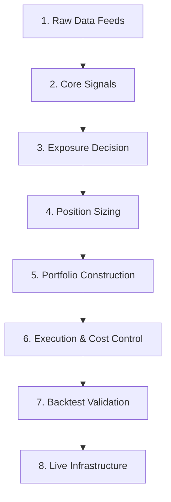

# Systematic 0DTE Trading System Design & Rationale

This document presents the complete 0DTE (Zero Days to Expiration) option trading system, aligned with the **8-Part Systematic Trading System Mental Model** and updated with specific user inputs, paper rationales, and agent recommendations.

Each component specifies:
1. **Research-Backed Elements**: Rules and settings derived directly from our ingested papers.
2. **User Configuration**: Updated inputs based on user decisions.
3. **Agent Recommendations**: Explanations of how this fits the wiki's overall knowledge base.
4. **Gaps & Annotations**: Remaining blanks left for future execution details.

---

## The 8-Part Systematic System Map

---

### Part 1: Raw Data Feeds
* **Research-Backed Elements**: 
  - High-frequency intraday prices (SPY and SPX) and real-time bid-ask quotes/sizes for the options chains (SPXW and SPY) at specific timestamps (9:28 AM, 9:35 AM, 10:00 AM ET).
  - A news API aggregation feed covering global macroeconomic and geopolitical news from the past 24 hours and the past 7 days.
  - Option volume flow indicators (to calculate intraday order imbalance and dealer positioning).
* **User Configuration**:
  - Live trading will be executed on **Interactive Brokers (IBKR)**.
  - Target trading instrument is **SPY** (S&P 500 ETF options) due to a **$1,000 account size** constraint and XSP's high bid-ask spread costs.
* **Default Research Parameters (Baseline)**:
  - **Historical Options Data Provider**: **OptionsDX** (Standard historical EOD and intraday SPY options CSV data).
  - **News API Data Feed**: **NewsAPI.org** (To fetch headlines and summaries for the past 24h/7d).

---

### Part 2: Core Signals & LLM Hybrid Filtering

* **Research-Backed Elements & Paper Methodology**:
  - **Sub-System A (Directional)**: A 5-minute Opening Range Breakout (ORB) window (9:30–9:35 AM ET). The signal triggers when the price decisively crosses the 5-minute High (Call) or Low (Put).
  - **Sub-System B (Volatility/VRP)**: A 10:00 AM ET evaluation using a Logistic Classification Model.

* **Market-Maker Volatility Attenuation Logic (Microstructure Signal)**:
  - *Economic Rationale*: Option market makers carry positive net gamma and hedge counter-cyclically. When they hold **Positive Net Gamma**, they dampen index volatility (attenuation), causing breakouts to fail. When they hold **Negative Net Gamma**, they hedge pro-cyclically, amplifying trends.
  - **Regime & Conditional Rules**:
    1. **Positive Net Gamma (Volatility Attenuation)**:
       - **Sub-System A (Directional ORB)**: **Disable or reduce size** by 50% (breakout is likely to fail).
       - **Sub-System B (Capped-Risk Put Ratio Spread)**: **Enable or increase size** (range-bound market).
    2. **Negative Net Gamma (Volatility Amplification)**:
       - **Sub-System A (Directional ORB)**: **Enable or increase size** (MM hedging amplifies trend).
       - **Sub-System B (Capped-Risk Put Ratio Spread)**: **Disable or reduce size** (high tail risk).

* **LLM Hybrid Sentiment Filtering Layer (Gatekeeper)**:
  - Both sub-systems are subject to a qualitative filter run by an LLM before execution.
  - **Inputs to LLM**: News headlines from the past 24 hours, news summaries from the past 7 days, and current market volatility indices (VIX/VXV).
  - **LLM Assessment**: The LLM evaluates if the market is entering a high-tail-risk regime (e.g. sudden geopolitical escalations, unscheduled central bank statements, systemic banking panics) that is not yet fully reflected in historical quantitative models.
  - **Output (Gatekeeper)**: The LLM outputs a binary "Go / No-Go" decision or a qualitative risk score. If a "No-Go" is issued, all trade executions for the day are blocked, regardless of quantitative signals.

* **Default Research Parameters (Baseline)**:
  - **SPY Implied Moments Formula (Proxy)**:
    - *Implied Variance Proxy* = $IV_{ATM}^2$ (At-the-Money implied volatility squared).
    - *Implied Skewness Proxy* = $IV_{25D\_Put} - IV_{25D\_Call}$ (Difference in implied volatilities of 25-delta options).
  - **Market-Maker Net Gamma Proxy**: **Net Option Volume Imbalance (NOVI)**.
    - $NOVI = \text{Customer Buy Volume} - \text{Customer Sell Volume}$ (specifically for ATM Call/Put options). If NOVI is highly negative, it implies customers are net sellers, meaning Market Makers are net long options (Positive Net Gamma).
  - **LLM Prompts & News-Scoring Rules**:
    - *Prompt*: "Classify the risk level of the following news headlines for a short-volatility strategy from 1 (lowest risk) to 10 (highest risk/panic). If score >= 7, output No-Go."

---

### Part 3: Exposure Decision
* **Research-Backed Elements & Paper Methodology**:
  - **Sub-System A (Directional Breakout)**: SPY 0DTE vertical debit spreads ($2 strike width). Limit risk strictly to the net debit paid.
  - **Sub-System B (Volatility Selling)**: SPY 0DTE **Capped-Risk Put Ratio Spread**.
* **User Configuration**:
  - **Moneyness Grid**: For Sub-System B, options are selected from a grid of moneyness ranging from **0.98 to 1.02 in 0.001 increments** (10:00 AM ET entry). This locks the physical distance (e.g. 2% below current index price) consistently across days, preventing the selected strikes from drifting closer to the market like Delta-based rules do.
  - **Capped-Risk Ratio Spread Structure**:
    - **Buy 1 Put** at near-ATM (Moneyness = 1.000 or 0.995).
    - **Sell 2 Puts** at far-OTM (Moneyness = 0.990 or 0.985).
    - **Buy 1 Put** at deep-OTM (e.g. Strike = $10-$20 below the Short Put Strike) to serve as a **low-cost protective wing** to satisfy IBKR margin requirements and cap tail losses.
* **Default Research Parameters (Baseline)**:
  - **Specific strikes selection**:
    - Sub-System A: Buy 40-Delta / Sell 20-Delta vertical spread ($2 width).
    - Sub-System B: Buy 1 Put at 30-Delta / Sell 2 Puts at 15-Delta / Buy 1 Put at 5-Delta.

---

### Part 4: Position Sizing
* **User Configuration**:
  - The system will use **Constant Risk Sizing (Fixed Fraction of Equity)**.
* **Default Research Parameters (Baseline)**:
  - **Risk fraction**: **2% of total account equity per trade** ($20 maximum risk on a $1,000 account balance). This protects the account from ruin under repeated losses.

---

### Part 5: Portfolio Construction
* **User Configuration**:
  - The system will use **Risk Parity based on Tail Risk (Expected Shortfall)**.
* **Default Research Parameters (Baseline)**:
  - **Capital Allocation Weights**: **70% Sub-System A (Directional ORB) / 30% Sub-System B (Capped-Risk Ratio)**. This allocates approximately $700 of purchasing power to debit spreads and $300 to the ratio spread, matching their relative tail risk contributions.

---

### Part 6: Execution and Cost Control
* **Research-Backed Elements & Paper Methodology**:
  - *How it works in the paper*: The paper does not assume we can capture the spread. It assumes a "taker" execution model where we pay the **half-spread per option leg**, plus a **0.5 basis point fee and slippage charge** scaled by the underlying price.
* **Default Research Parameters (Baseline)**:
  - **Limit Order Pricing Protocol**: Place a limit order at the **Mid-Price** ($\frac{\text{Bid} + \text{Ask}}{2}$). If unfilled after 30 seconds, cancel and resubmit at the new mid-price, capped at 1 tick ($0.01) of slippage from the initial mid-price.

---

### Part 7: Backtest Validation Protocol
* **User Configuration (Acceptance Thresholds)**:
  - **Sharpe Ratio**: Must be strictly greater than the **S&P 500 Buy & Hold** Sharpe ratio over the same period.
  - **Max Drawdown**: Must be strictly less than the **S&P 500** Maximum Drawdown over the same period.
* **Research-Backed Elements**:
  - Separate reporting of mid-quote PNL and implementable PNL. Use chronological splits with minimum 252-day training windows.

---

### Part 8: Live Monitoring & Infrastructure
* **User Configuration**:
  - Execution broker is **Interactive Brokers (IBKR)**.
  - **Strict Time Stop Exit**: To avoid the $50,000 physical assignment and settlement risk of SPY options on a $1,000 account, all open options must be closed via automated market orders at **3:45 PM ET (15 minutes before the close)**.
* **Default Research Parameters (Baseline)**:
  - **Execution API Library**: **`ib_insync` (Python)**.
  - **Hosting Infrastructure**: Hosted on the local Windows desktop environment.

---

## Research Focus: SPY Option Traps & $1,000 Portfolio Constraints

All parameters and numbers pulled directly from the papers must be audited and researched specifically for **SPY** because the papers were written for high-liquidity **SPX / SPY** index options.

### Direct Paper Parameters in Use:
1. **VIX Range 15–25**: Pulled from SPY ORB paper (for Sub-System A & B filter).
2. **Macro Event Exclusions**: FOMC, CPI, NFP, Fed Chair speeches (from SPY ORB paper).
3. **ORB Timing**: 9:30–9:35 AM ET entry signal; 3:30 PM ET hard exit stop (from SPY ORB paper).
4. **Breakout-to-Strike Gap ($0.96 - $2.00)**: Pulled from SPY ORB paper (for Sub-System A).
5. **Volatility Entry Time (10:00 AM ET) & Hard Stop Exit (4:00 PM ET)**: Pulled from 0DTE Trading Rules (for Sub-System B, modified to 3:45 PM ET close for SPY).
6. **Moneyness Grid (0.98 to 1.02 with 0.001 increments)**: Pulled from 0DTE Trading Rules (for Sub-System B).
7. **Cost Friction Assumptions**: Half-spread + 0.5 bp (from 0DTE Trading Rules).

---

## Experimental Variable Definitions

To conduct rigorous quantitative research on this trading system, the baseline parameters are structured as follows:

* **Independent Variables (ตัวแปรต้น)**:
  - Activation of the **LLM Hybrid Sentiment Filtering Layer** (On vs. Off).
  - Activation of the **Market-Maker Volatility Attenuation Logic** (On vs. Off).
  - The threshold VIX filter range (varying between 15-25, 10-20, or 20-30).
  - The target risk fraction parameter (varying between 2%, 3%, or 5%).
* **Dependent Variables (ตัวแปรตาม)**:
  - Portfolio Sharpe Ratio (OOS).
  - Maximum Drawdown (OOS).
  - Portfolio Expected Shortfall (ES 95% / ES 99%).
  - Net cumulative PNL after bid-ask spreads and slippage.
* **Control Variables (ตัวแปรควบคุม)**:
  - S&P 500 Index Buy & Hold benchmark performance.
  - Option leg execution cost assumption (half-spread + 0.5 bp).
  - SPY 0DTE contract expiration cycles and multiplier (100).
  - 3:45 PM ET strict automated market-order time stop.
  - Interactive Brokers margin rules for defined-risk spreads.

---

## References & Sources
- [0DTE Options Concept](file:///d:/Fogust/Workspace/LLM%20Wiki/LLM%20Wiki/wiki/concepts/zero-dte-options.md)
- [0DTE Trading Rules Paper Summary](file:///d:/Fogust/Workspace/LLM%20Wiki/LLM%20Wiki/wiki/sources/0dte-trading-rules.md)
- [Regime-Conditional Alpha SPY 0DTE ORB Summary](file:///d:/Fogust/Workspace/LLM%20Wiki/LLM%20Wiki/wiki/sources/regime-conditional-alpha-spy-0dte-orb.md)
- [Position Sizing](file:///d:/Fogust/Workspace/LLM%20Wiki/LLM%20Wiki/wiki/concepts/position-sizing.md)
- [Portfolio Optimization](file:///d:/Fogust/Workspace/LLM%20Wiki/LLM%20Wiki/wiki/concepts/portfolio-optimization.md)
- [Backtest Validation Protocol](file:///d:/Fogust/Workspace/LLM%20Wiki/LLM%20Wiki/wiki/concepts/backtest-validation-protocol.md)
- [svi-implied-volatility-curve.md](file:///d:/Fogust/Workspace/LLM%20Wiki/LLM%20Wiki/wiki/concepts/svi-implied-volatility-curve.md)
- [risk-neutral-distribution.md](file:///d:/Fogust/Workspace/LLM%20Wiki/LLM%20Wiki/wiki/concepts/risk-neutral-distribution.md)
- [volatility-attenuation.md](file:///d:/Fogust/Workspace/LLM%20Wiki/LLM%20Wiki/wiki/concepts/volatility-attenuation.md)
- [market-maker-net-gamma.md](file:///d:/Fogust/Workspace/LLM%20Wiki/LLM%20Wiki/wiki/concepts/market-maker-net-gamma.md)
- [The Market For 0DTE Options Summary](file:///d:/Fogust/Workspace/LLM%20Wiki/LLM%20Wiki/wiki/sources/market-for-zero-dte-options-liquidity-providers-volatility-attenuation.md)
