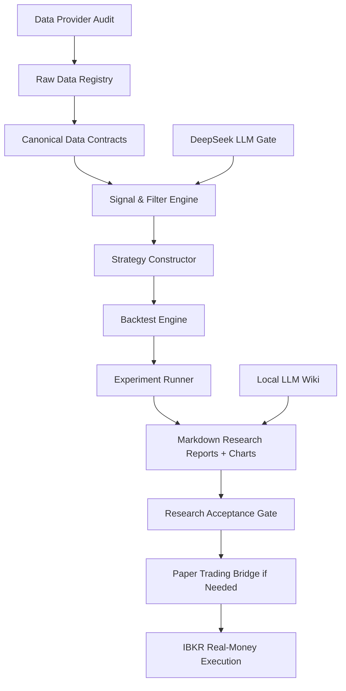

# PROJECT_BRAIN.md

## 1. Project Definition
- **Project Name**: SPY 0DTE - Higanbana.
- **Project Path**: `D:\Fogust\Workspace\Investment\Project\SPY 0DTE - Higanbana`
- **Purpose**: Build a research-first SPY 0DTE options trading system that produces cashflow-style portfolio reports, prioritizes survival, and aims to outperform SPY/S&P 500 buy-and-hold on risk-adjusted and drawdown-adjusted terms.
- **Primary Users**: The trader/researcher, AI research agents, and later an IBKR-connected execution agent.
- **Problem Solved**: Replace the unusable Bybit/BTC strategy path with a US-accessible SPY 0DTE workflow that can be researched rigorously before deployment.
- **Desired Outcome**:
  - A local research system that ingests SPY intraday data, SPY 0DTE option quotes, VIX/VXV, macro calendar, and news/LLM inputs.
  - A reproducible experiment engine for the 10 experiments in `backtest_experiments_plan.md`.
  - Markdown research reports in Thai that present evidence, charts, metrics, conclusions, failure conditions, and next hypotheses.
  - A later IBKR execution system that only opens trades under the conditions proven best by experiments, never opens positions without user approval, and always protects 3:45 PM ET forced close.

## 2. User Decisions Captured From Grill Session
### Objective
- Main objective: create portfolio cashflow reports and a practical trading system.
- Optimization priority: survival first, then efficiency better than buy-and-hold.
- Trading frequency: only under the best conditions found by experiments.
- If evidence is inconclusive or fails: revise hypothesis, diagnose why, create a new measurable hypothesis, and retest.
- 2026-07-02 grill update: the immediate priority is to find and validate a real edge before paper trading. Paper trading comes after research becomes coherent enough to justify operational validation.
- The next planning posture is **Risk-first**: identify what can make the current evidence misleading, weak, or non-generalizable before adding more system surface area.

### Account And Capital
- Starting account: **$1,000**.
- Additional capital: may add up to another **$1,000**, and may add regularly each month later.
- User does not want psychologically arbitrary daily/weekly/monthly loss caps. Risk limits should be derived from experiments and system design.
- Practical ruin boundary: user can tolerate the account going to zero in theory, but the designed system should target drawdown below SPY/S&P 500 buy-and-hold.
- If no valid trade fits the account, do **not** force a trade. Follow system rules.

### Universe And Strategy Scope
- Universe: **SPY only**.
- Sub-System A and B are both part of the research scope.
- Do not discard Sub-System B merely because it is harder; it may diversify risk.
- If Sub-System B is not feasible for the starting account, revisit sizing/capital/paper-trading constraints rather than silently deleting it.
- Do not simplify live scope to debit spreads only unless research later justifies that decision.
- Sub-System A remains worth studying despite weak current OOS evidence because the user believes it may contain a long-term edge if the hypothesis is stated logically and can later be falsified by clear contradictory evidence, not merely by fitted headline metrics.
- Sub-System B remains in scope and should be researched more carefully. Future Sub-System B experiments may use a larger test portfolio/account size to evaluate whether the structure itself has merit before deciding the true minimum viable account size.

### Research Standards
- Every hypothesis must end with a clear conclusion:
  - ผ่าน
  - ไม่ผ่าน
  - ยังสรุปไม่ได้
- Every report must include:
  - hypothesis,
  - evidence,
  - conclusion,
  - supporting metrics,
  - why the conclusion could fail in the future,
  - what evidence would overturn the conclusion,
  - if failed: diagnosis, revised hypothesis, and new success criteria.
- Minimum statistical confidence target:
  - Do **not** treat `N >= 500` as a fixed universal acceptance rule.
  - Required sample length must be computed from MinTRL / PSR / power analysis for the tested return distribution and Sharpe null threshold.
  - `N >= 500` remains a rough prior warning level only until experiment-specific MinTRL is computed.
  - Preferred full confidence may still require much more data when skewness, kurtosis, serial correlation, or a high Sharpe null threshold increases MinTRL.
  - Sub-System B needs especially careful sample adequacy because rare tail losses and negative skew can increase the required track record.
- Sharpe reporting must not rely on the point Sharpe alone. Every experiment that reports Sharpe must also report sample length, MinTRL, PSR, power notes where available, and `under-sampled` / `underpowered` labels when required.
- Any parameter/filter search must preserve a search log and trial count. If the final report selects the best observed Sharpe from multiple trials, report Deflated Sharpe Ratio (DSR) or an explicit DSR blocker if the search log is incomplete.
- Filter-heavy experiments must report how many active trades remain after each filter. If the filter reduces the sample below MinTRL, the result may be diagnostic but must not be treated as acceptance-grade evidence.
- Every backtest report must include a big-day dependency check: remove the most extreme 5% winning/losing close days or trades and report whether Sharpe, drawdown, and conclusion survive.
- Every option backtest must separate `mid_pnl` from `implementable_pnl`. Implementable PnL must include bid/ask spread treatment and per-leg fees/slippage assumptions; mid PnL is a comparison control, not deployable evidence.
- Moneyness-grid experiments must explicitly choose and disclose the strike mapping method for real option chains: nearest discrete strike rounding, interpolation, or another justified method. Do not silently treat continuous moneyness grid points as tradable strikes.
- OOS discipline:
  - Reference/pre-break period: `2019-01-01` to `2022-05-10`.
  - Primary in-sample/training: `2022-05-11` to `2023-12-31`.
  - Out-of-sample: `2024-01-01` to current available data.
  - Do not tune on OOS after viewing results.
- Chronological discipline:
  - Do not use random K-fold or shuffled validation for time-series strategy evidence.
  - Use chronological split, expanding window, rolling window, or purged/embargoed validation where appropriate.
  - Any model feature, scaler, threshold, prompt selection, or allocation parameter must be fit only on information available before the decision timestamp.
- Post-2022-only edge is acceptable if:
  - the post-May-11-2022 hypothesis is pre-registered,
  - structural break is tested,
  - post-2022 OOS remains profitable.
- Regime restriction is acceptable if research shows the system only works in certain conditions.
- Data expansion must consider market-regime coverage, not only calendar coverage or trade count. At minimum, future evidence planning should track volatility/macro regimes, trend or momentum regimes where practical, major historical subperiods, economic surprise environments where data exists, and market-maker gamma/liquidity regimes if source data can support them.

### Data Decisions
- Historical options data is not available yet.
- User prefers free data first, but is willing to pay for a cost-effective provider.
- Data-provider guidance required:
  - free sources should be audited first,
  - paid sources should be recommended only when necessary and cost-effective.
- Baseline data need:
  - SPY underlying 1-minute bars for the full day.
  - SPY option-chain snapshots at 9:35 AM ET and 10:00 AM ET.
  - SPY option quote snapshot at 3:45 PM ET.
  - 30-minute option quote/volume intervals if needed for stop-loss checks and NOVI.
  - Bid/ask required; mid-only data is not enough for deployable conclusions.
- Preferred provider candidates:
  - OptionsDX if snapshot-based data is enough.
  - ThetaData if intraday option OHLCV/30-minute checks are needed.
  - ORATS/CBOE DataShop are likely too expensive for the current stage unless justified.
- VIX/VXV source is selected for first research filters: official Cboe VIX and VIX3M history CSVs, with VIX3M close mapped to the project `vxv_close` field.
- Databento is now a low-commitment pay-as-you-go candidate; estimate cost before any download.
- User approved continuing already-scoped paid research/API usage without asking for per-run approval as long as cumulative total cost remains below $125. This currently covers SPY-only Databento research pulls and approved OpenRouter/DeepSeek experiment usage. The current controlling guard is user-reported actual provider usage when available; conservative known-estimate totals must still be logged as trace/warning evidence. As of 2026-07-03, user-reported Databento usage is about `$105`, leaving about `$20` under the current `$125` guard. Cap extensions are allowed only by real payment on the existing Databento account; multi-account signup-credit harvesting is prohibited. Still estimate/log cost first where the provider supports it, reuse cache when applicable, and stop if user-reported actual provider usage would reach or exceed $125, if no actual-usage basis is available and known committed estimate would reach or exceed $125, if a new paid provider is introduced, if the symbol universe changes beyond SPY, or if the task would move into broker/order-transmission work.
- User allows additional already-scoped Databento data acquisition if it is justified by a MinTRL/regime/sample-size plan and remains inside the active cost guard. If Databento is insufficient, research cheaper or more suitable alternative providers before recommending a purchase.
- New data acquisition must answer a named inference or regime gap, not merely add calendar months. The priority is to reach experiment-specific MinTRL/PSR requirements across relevant market regimes, including volatility, macro-event, trend, major subperiod, and gamma/liquidity regimes where data supports them.
- Missing Greeks/gamma/open-interest inputs are not a reason to silently cancel gamma/NOVI-related research forever. The next data-source review should explicitly investigate feasible sources for Greeks, implied volatility, open interest, option-chain snapshots, and market-maker net-gamma proxies, then recommend whether to buy, approximate, defer, or drop the gamma-family experiments.
- Databento official documentation indicates OPRA `statistics` can provide aggregated open interest, while Databento does not provide vendor-calculated IV/Greeks. The preferred near-term path is a tiny OPRA statistics/OI cost/schema probe, followed by a self-computed IV/Greeks feasibility review using bid/ask, underlying price, time-to-expiry, and rate assumptions.
- Risk-first data planning artifact: `docs\RISK_FIRST_DATA_PLAN.md` now records the current decision that broad calendar acquisition remains paused. Automated Risk-first audit artifacts now exist at `reports\risk_first_data_audit.json` and `.md`, generated by `scripts\audit_risk_first_data.py`. The audit shows current Sub-System A evidence remains blocked: 90 trades, observed Sharpe proxy `0.092203`, MinTRL about 285 observations against Null Sharpe `0`, observed Sharpe below Null Sharpe `0.5`, no reference/pre-break trades, no high-VIX trade coverage, partial trend-history gaps, and no vendor Greeks/open-interest fields in current normalized quotes. OPRA statistics/OI metadata probe artifacts exist at `reports\data_cost\databento_opra_statistics_oi_probe_2024_01_03.json`, `.md`, `_schema.json`, and `_schema.md`; the controlled full-day download/import probe exists at `reports\data_cost\databento_opra_statistics_oi_download_probe_2024_01_03.json` and `.md`, with raw DBN at `data\raw\spy_0dte\databento\opra_statistics_oi_probe_2024_01_03\2024-01-03_full_utc_day_statistics.dbn.zst`. The download probe found 541,311 `statistics` records, 180,279 `OPEN_INTEREST` records, `stat_type` values including `OPEN_INTEREST`, and `ts_recv` index range `2024-01-03 11:30:00.425311070+00:00` to `2024-01-03 22:30:20.507486600+00:00`. `reports\greeks_oi_feasibility_audit.md` confirms the OI timestamp/symbol mapping and self-computed IV/Delta/Gamma path is feasible with caveats. `reports\greeks_oi_enrichment_probe_report.md` then proves a local derived enrichment path for 2024-01-03: 3,488 quote rows, 3,488 prior SPY-bar joins, 3,488 exact-symbol prior OI joins, and 1,750 rows with computed IV/Delta/Gamma; 1,738 rows remain blocked because mid price is outside the Black-Scholes bracket. `docs\GAMMA_AGGREGATION_VALIDATION_POLICY.md` defines the required proxy formulas, moneyness buckets, scaling, validation gates, and forbidden claims. `reports\diagnostics\gamma_aggregation_diagnostic_summary.json` now runs that aggregation policy on the 2024-01-03 enriched probe: timestamp discipline and search-log gates pass, but coverage fails because computed Greeks are only 1,750 / 3,488 rows (`0.50172`) versus the 70% policy threshold, stability fails because only one date/regime is available, and economic-sign validation is blocked because realized-volatility/PnL comparisons require multiple dates. Gamma-family strategy use remains diagnostic-only and blocked by policy gates.
- Macro calendar official source plan v1, capture dry-run/live tool, raw archive audit, raw-to-CSV converter, canonical importer, and coverage auditor exist. The 2022-2026 official-source backfill is imported to canonical `macro_event` JSONL and passes the macro coverage audit for required event-type presence.
- News source selection v1, GDELT capture dry-run tool, candidate-day capture command planner, single-snapshot and directory offline importers, and coverage auditor exist with GDELT as the primary free archive candidate; successful real GDELT snapshot capture/archive is still pending after small 2026-06-30 live probes returned HTTP 429.

### LLM / AI Gate
- LLM gate is mandatory before live, and all LLM-related behavior must be tested before live.
- LLM does not need to output only Go/No-Go; it may evaluate:
  - volatility condition,
  - directional bias,
  - tail-risk condition,
  - strategy suitability.
- If LLM says No-Go and quantitative signal says Go, LLM can block the trade.
- Claude CLI is no longer the preferred path.
- Planned LLM provider: **DeepSeek via OpenRouter**.
- User created the project API key in the local user environment variable `HIGANBANA_OPENROUTER_API`; never store the key value in project files.
- Preferred primary model: **DeepSeek V4 flash thinking** via OpenRouter, using model id `deepseek/deepseek-v4-flash`.
- LLM gate research should include prompt-variant experiments before relying on a single production prompt.
- LLM research should not claim it can prove prevention of unseen black swans through ordinary historical backtests. Tail-risk blocking can be explored, but the more testable near-term LLM role is to estimate market sentiment, likely market impact, volatility relevance, and stability of those assessments.
- LLM prompt experiments should include stability measurement, including repeated assessment of the same case such as 5 calls per prompt/case where cost allows, and report dispersion/consensus rather than relying on a single call.
- A separate LLM research branch may test price-input prompts for dynamic entry/exit assistance, but this must be treated as a separate hypothesis with strict chronological controls and must not be mixed into the news/sentiment gate without an ablation plan.
- LLM gate research must control LLM training-data contamination. For historical news from 2022-2024, assume current LLMs may have memorized later outcomes unless proven otherwise.
- Preferred controls for historical LLM tests are point-in-time model checkpoints or model versions with documented training cutoffs. If unavailable, mask/anonymize unique entities, dates, event names, and company identifiers where possible, then test whether the model still reasons from the text rather than event memory.
- LLM prompts and reports must record model id, known/claimed training cutoff if available, document timestamps, retrieval/fetch window, masking policy, and whether the input could contain post-event leakage.
- Batch API may be used for speed/cost where appropriate.
- Store LLM prompt, input, output, model id, timestamp, and decision for future prompt research.
- Remove old Claude/old threshold assumptions unless reintroduced by design.

### Execution Policy
- Make backtest/execution assumptions as realistic as practical.
- Entry:
  - Market order at entry is prohibited.
  - Default entry is limit order at mid-price.
  - May retry at mid +/- 1 tick if designed and tested.
  - If not filled after allowed retry protocol, skip.
- Exit:
  - Normal exit may use limit order logic.
  - 3:45 PM ET forced close uses market order, no exception.
- IBKR failure plan:
  - Place backup GTT/GTD closing orders immediately after opening positions when feasible.
  - Heartbeat monitor every 30 seconds, stricter after 3:30 PM ET.
  - At 3:40 PM ET send normal closing limit orders.
  - At 3:43 PM ET if unfilled, cancel limit and send market close.
  - At 3:45 PM ET backup server-side orders should close if still open.
  - Emergency alerts: email baseline; SMS/Twilio optional later.
  - Manual fallback: IBKR Mobile, Client Portal, IBKR Trade Desk.

### IBKR And Paper Trading
- User has an IBKR account.
- Options permission is still pending.
- Account type: **cash**.
- Because options permission is not ready, paper trading may become necessary despite earlier preference for real money.
- Project stance updated:
  - Backtest research first.
  - If IBKR options permission or real-money feasibility is not ready, use paper trading as a temporary operational bridge.
  - Paper trading is not an edge-validation substitute; it validates wiring, order ticket behavior, close logic, alerts, and operator workflow.
- IBKR may be connected for data only if it is the best data source, but order transmission remains blocked until research and permission gates pass.
- Before live transmit, no manual confirmation click is required if all gates and approvals are satisfied. Until then, no auto-open.

### Reporting
- Report language: Thai, simple and clear, with English only for necessary technical terms.
- Report style: standard research format, not a loose executive summary.
- Each experiment report should include charts and metrics.
- Reports should be per-experiment, with a later final research review.
- After each completed experiment, write an easy-to-read Thai research log using `RESEARCH_LOG_FORMAT.md`, save it under `research_log`, name it with the running-number convention `NNN-higanbana-clear-topic-slug.md` such as `001-higanbana-orb-baseline-real-data.md`, and push it to `https://github.com/Tusgof/Yuehua_Research_log`.
- Required metrics include at least:
  - cashflow / daily PnL,
  - equity curve,
  - drawdown curve,
  - Sharpe,
  - Sortino,
  - max drawdown,
  - ES95 / ES99,
  - worst-day loss,
  - win rate,
  - payoff ratio,
  - trade count,
  - cost drag,
  - benchmark comparison.

### Automation
- Final goal: morning pipeline can be run automatically or by the user waking up and asking the agent to run it.
- User may or may not be present at market open; automation should support scheduled runs.
- System must not open positions automatically before live approval and gate completion.
- Alerts: email is acceptable baseline.

### Hard Boundaries
- SPY only.
- Entry market orders are prohibited.
- Undefined-risk/naked short structures are prohibited.
- No position held past 3:45 PM ET.
- Trade sizing, contract count, and simultaneous positions should be determined by experiment/risk design.
- Macro/news handling follows the designed system rules.

## 3. In Scope
- SPY 0DTE options research.
- Sub-System A: ORB directional debit vertical spreads.
- Sub-System B: capped-risk put ratio spread with protective wing.
- Historical backtesting with realistic fills/costs.
- Data provider evaluation and cost-benefit recommendation.
- VIX/VXV, macro, and news/LLM filters.
- DeepSeek-based LLM analysis layer.
- Markdown research reports with charts and metrics.
- Paper-trading operational bridge if IBKR permission/live feasibility requires it.
- Later real-money IBKR execution after research and operational gates.

## 4. Out Of Scope
- BTC/Bybit/CoinGlass/crypto logic.
- Entry market orders.
- Undefined-risk option selling.
- Auto-open live positions before gates and approvals.
- Treating paper trading as proof of edge.
- Using OOS results to tune parameters.
- IBKR credential storage in project files.

## 5. Success Criteria
### Research-Usable When:
- Schemas exist for SPY bars, SPY option quotes, VIX/VXV, macro events, news items, LLM assessments, strategy intents, option legs, fills, trades, daily PnL, experiment manifests, and reports.
- Data registry records provider, coverage, schema version, and raw hash.
- At least one small fixture can validate end-to-end from data -> signal -> strategy intent -> report.

### Strategy-Accepted When:
- Experiments in `backtest_experiments_plan.md` are run or explicitly deferred.
- Reports produce clear conclusions: ผ่าน / ไม่ผ่าน / ยังสรุปไม่ได้.
- OOS Sharpe is greater than same-period SPY/S&P 500 buy-and-hold.
- Max drawdown is lower than same-period SPY/S&P 500 buy-and-hold.
- Minimum target evidence meets experiment-specific MinTRL / PSR / power requirements where possible; `N >= 500` is only a rough prior threshold, not a universal acceptance rule.
- Results include post-2022 OOS analysis.
- Results include implementable PnL after bid/ask and slippage.
- Results include tail-risk metrics and failure-mode analysis.

### Operationally Ready When:
- IBKR account permission status is known.
- If real options permission is unavailable, paper trading bridge is implemented for operational validation.
- Order tickets are validated without transmit.
- Entry skip behavior is tested for unfilled limits.
- 3:45 PM ET forced-close workflow is tested.
- Email alerts work.
- DeepSeek prompt/input/output logging works.

### Real-Money Ready When:
- Research acceptance passes.
- Options permission is approved.
- Account constraints are documented for a cash account.
- Every strategy is defined-risk and feasible for account size.
- User approval for real-money launch is recorded.
- Kill switch, max risk, max position count, forced close, and backup close orders are implemented.

## 6. Tech Stack
| Layer | Technology | Notes |
|:------|:-----------|:------|
| Language | Python | Add data/plotting libraries when implementing reports/backtests. |
| Storage | JSONL + CSV/Parquet as needed | JSONL for logs/manifests; CSV/Parquet for large historical data. |
| Broker | Interactive Brokers | Cash account; options permission pending. |
| LLM | DeepSeek via OpenRouter | User env var `HIGANBANA_OPENROUTER_API`; primary model id `deepseek/deepseek-v4-flash`; batch API allowed later. |
| Historical Options Data | TBD | Prefer free/cost-effective; OptionsDX/ThetaData candidates. |
| News | GDELT primary candidate; Alpha Vantage/NewsAPI deferred | Source selection v1, capture dry-run, capture command plan, and offline import tools exist; successful real archive capture is pending. |
| Reports | Markdown + charts | Thai research-style reports. |
| Knowledge Base | Local LLM Wiki | Primary research rationale source. |

## 7. Architecture Overview


## 8. Design Principles
- Survival first.
- Research before execution.
- Paper trading is allowed as an operational bridge if permissions/feasibility require it.
- Paper trading is not evidence of edge.
- SPY only until explicitly changed.
- Follow conditions proven best by experiments.
- Entry uses limit orders only; unfilled means skip.
- 3:45 PM ET market close is mandatory.
- Every live-relevant decision must be backed by a report or explicit user approval.
- Reports must state what would invalidate their conclusion.

## 9. Current Verified State
- **Last Verified**: 2026-07-03
- **Current Milestone**: Milestone 1: Research Control Plane is complete. Milestone 2: Data Feasibility And Bulk Acquisition Gate is complete for the Q4 checkpoint and now has automated Risk-first audits, a passed-with-caveats Greeks/OI feasibility audit, a passed-with-caveats local Greeks/OI enrichment probe, a gamma aggregation/scaling validation policy, and a one-day diagnostic gamma aggregation result that remains blocked by coverage, stability, and economic-sign gates. Milestone 3: Backtest And Reporting Engine Hardening is complete by closure audit. Milestone 4: Baseline Strategy Evidence is complete with diagnostic/inconclusive or failed baseline conclusions. Milestone 5: Non-LLM Experiment Families is complete or explicitly deferred: M5.1 transaction-cost/execution-latency sensitivity, M5.2 strike-selection sensitivity, M5.3 entry-timing sensitivity, M5.4 exit target/stop sensitivity, M5.5 regime-filter sensitivity, and M5.6 portfolio construction diagnostic are complete as diagnostic evidence, while M5.7 structural-break assessment is deferred because reference/pre-break SPY 0DTE option coverage is absent. Current active milestone remains Milestone 6, but forward LLM/news experiments are still blocked. Real research/execution remains blocked by insufficient MinTRL/PSR evidence for strong acceptance, missing real news archive, GDELT cooldown, gamma-family strategy gates, missing reference/pre-break and high-VIX trade coverage, and external IBKR/launch gates.
- **Completed**:
  - Cleaned legacy BTC/Bybit files.
  - Renamed project folder to `SPY 0DTE - Higanbana`.
  - Captured detailed user answers from grill session.
  - Updated active project truth with SPY 0DTE requirements.
  - Regenerated `IMPLEMENT_PLAN.md` into a 7-milestone SPY 0DTE roadmap.
  - Completed Milestone 2 data source audit, canonical contracts, registry manifest contract, fixtures, validator, and tests.
  - Completed Milestone 3 fixture-based raw import, normalized JSONL outputs, registry manifest flow, and data-quality tests.
  - Completed Milestone 4 signal/strategy specification with ORB, capped-risk ratio, filters, NOVI proxy, DeepSeek dry-run, and strategy intents.
  - Completed Milestone 5 fixture backtest engine for fills, exits, forced close, sizing, benchmark, and append-only JSONL logs.
  - Completed Milestone 6 experiment manifests, metrics, fixture reports for all 10 experiments with charts, final research review, and acceptance gate that blocks insufficient evidence.
  - Completed Milestone 7 dry-run operational bridge, no-secret config, ticket validation, kill switch, paper dry-run, email payload, close workflow, and launch checklist.
  - Added one-command fixture pipeline, runbook, and environment template without real secrets.
  - Added provider sample spec plus synthetic OptionsDX-like and ThetaData-like quote adapter templates to prepare for the first real data sample.
  - Added provider sample import command that writes canonical option quote JSONL and registry manifest with raw hash.
  - Added Databento OPRA cost-estimator dry-run/live script so pay-as-you-go cost can be checked before downloading data.
  - Added Databento scenario matrix and live-request guard to prevent accidental large cost-estimate runs.
  - Added Databento cost-estimate Markdown report artifact for review before any data download.
  - Added Databento cost decision gate with default pass/review/block thresholds before download approval.
  - Added Databento projection report from accepted live one-month estimates to avoid unnecessary wide live cost calls.
  - Ran Databento live cost estimates: one-day sample passed at about $0.06847; one-month pilot passed at about $1.483808 after skipping US market holidays.
  - Projected narrow-scope Databento cost from one-month live estimate: OOS 2024-2025 about $26.43; full research about $73.27.
  - Added gated Databento download planner for the one-month pilot; downloads reuse existing local files instead of downloading them again.
  - Added downloader evidence that marks reused files as `cache` so repeated experiments can prove they did not call Databento again.
  - Added offline Databento cache audit report to show present/missing raw files, bytes, and SHA-256 hashes without calling Databento.
  - Downloaded the user-approved one-month Databento pilot cache: 63/63 DBN files present, 101,348,198 raw bytes, no missing or invalid files.
  - Inspected the Databento DBN files locally: 4,894,446 raw rows and 4,670,081 positive bid/ask rows across the parent SPY option chain.
  - Normalized the pilot to canonical 0DTE-only `option_quote` JSONL: 83,125 records from 2024-01-02 through 2024-01-31 after filtering out non-0DTE expirations and invalid quotes.
  - Added a Databento SPY 1-minute bar plan for ORB inputs; Jan 2024 `EQUS.MINI/ohlcv-1m` live cost estimate is about $0.006720364094.
  - Updated paid-data policy: low-cost Databento pulls inside the already estimated SPY-only research scope can proceed without per-run approval.
  - Downloaded/cached the Jan 2024 Databento SPY 1-minute bar pilot: 208,471 bytes, SHA-256 `763a594054f21cc9abb820042122e8cc67d4da51b5e071d897a7e4faeb771e53`.
  - Normalized SPY bars to canonical `spy_bar` JSONL: 10,738 records from 2024-01-02 through 2024-01-31 with zero invalid OHLC rows and zero non-SPY rows.
  - Added and ran the Jan 2024 pilot adapter joining normalized SPY bars with normalized 0DTE option quotes: 21 calendar/trading dates, 6 Sub-System A candidate-ready days, 15 no-trade days.
  - Added and ran the Jan 2024 pilot PnL adapter for Sub-System A candidate-ready days: 6 candidates, 4 closed forced-1545 trades, 2 skipped for missing close quotes, pilot-only total net PnL $270.00 with fee per contract set to 0.0.
  - Added and ran the Jan 2024 pilot sensitivity matrix for commission, fill stress, and close handling: 10 scenarios; worst strict full-spread stress net PnL $242.00; status `healthy_enough_for_wider_data_pilot`, not strategy acceptance.
  - Recorded user-provided OpenRouter env var `HIGANBANA_OPENROUTER_API` for DeepSeek access, with DeepSeek V4 flash thinking as the preferred primary model target using OpenRouter model id `deepseek/deepseek-v4-flash`.
  - Updated Experiment 7 planning so LLM prompt-variant experiments run before using a single LLM gate prompt in later strategy experiments.
  - Added an OpenRouter/DeepSeek adapter for Experiment 7 prompt variants A/B/C. It builds Chat Completions payloads for `deepseek/deepseek-v4-flash` with reasoning effort `high` and `reasoning.exclude=true`, supports dry-run without network calls, has a guarded opt-in live-call function, parses strict JSON-style decisions into canonical `llm_assessment` records, validates records against the M2 schema, appends canonical JSONL logs without private request fields, and reports whether `HIGANBANA_OPENROUTER_API` is visible without printing the secret.
  - Ran one guarded OpenRouter live smoke call using prompt variant C and the user-level `HIGANBANA_OPENROUTER_API` env var imported into the command process. The call returned a parseable JSON response and wrote canonical smoke evidence to `build\openrouter_smoke\llm_assessment.jsonl`.
  - Added an Experiment 7 prompt pre-experiment runner that archives three small prompt-input cases, runs prompt variants A/B/C through the OpenRouter/DeepSeek adapter in dry-run or guarded live mode, writes canonical `llm_assessment` JSONL, and summarizes parse validity, decision stability, and expected-decision mismatches.
  - Ran the Experiment 7 prompt pre-experiment in dry-run mode only: 3 archived cases, 9 assessments, parse-valid rate 100%, all 3 cases stable across prompt variants, and 0 expected-decision mismatches. Artifacts are `reports\experiments\exp07_prompt_inputs.json`, `reports\experiments\exp07_prompt_assessments.jsonl`, `reports\experiments\exp07_prompt_summary.json`, and `reports\experiments\exp07_prompt_report.md`.
  - Estimated, downloaded, audited, inspected, and normalized the Feb 2024 Databento OPRA SPY 0DTE option quote pilot under scenario `oos_2024_2025`: live estimated cost about $1.502165; 60/60 DBN files present after download; 103,756,652 raw bytes; 4,954,998 raw rows; 4,779,315 positive bid/ask rows.
  - Fixed the Databento option normalizer to preserve zero-bid/positive-ask 0DTE quotes. This is required for realistic forced-close liquidation because a long option can be worth $0.00 bid near expiry. After rerun, canonical 0DTE `option_quote` output contains 139,664 records from 2024-02-01 through 2024-02-29, up from the earlier over-filtered 78,844 records.
  - Estimated, downloaded, and normalized Feb 2024 Databento SPY 1-minute bars: live estimated cost about $0.006415575743; raw file 199,814 bytes with SHA-256 `d2ad86488859c51cde7cda6b91991ef50716225133ca1980a3cf3dc4d899fd4e`; canonical `spy_bar` output contains 10,251 records from 2024-02-01 through 2024-02-29 with zero invalid OHLC rows and zero non-SPY rows.
  - Ran the Feb 2024 Databento pilot adapter on the normalized `oos_2024_2025` artifacts: 20 trading days, 3 Sub-System A candidate-ready days, and 17 no-trade days.
  - Ran Feb 2024 pilot PnL and sensitivity checks after the zero-bid normalization fix: strict 15:45 close produced 3 closed trades, 0 skipped trades, pilot-only total net PnL -$157.00 with fee per contract set to 0.0; worst strict full-spread stress net PnL -$178.00; sensitivity status remains `needs_design_review_before_wider_data`. This is not strategy evidence because trade count is far below N >= 500 and Feb 2024 is OOS, so do not tune parameters on it.
  - Reviewed Sub-System A pilot design against the project design document and local LLM Wiki. Found an implementation mismatch: the constructor selected the nearest OTM long strike, while the design calls for a breakout-to-long-strike gap around $0.96-$2.00. Updated Sub-System A vertical construction to require the configured gap band before selecting the long strike. Feb 2024 candidate gaps moved to 1.88, 1.46, and 1.15.
  - Reran Feb 2024 pilot PnL and sensitivity after the strike-gap fix: strict 15:45 close still produced 3 closed trades and 0 skipped trades, but pilot-only total net PnL improved from -$157.00 to -$96.00; worst strict full-spread stress net PnL improved from -$178.00 to -$117.00; sensitivity status remains `needs_design_review_before_wider_data`.
  - Added a Databento cost-estimator window profile `intraday_exit_30m` for the documented Sub-System A target/stop research path. The default `entry_close` profile remains unchanged at 3 windows per day; `intraday_exit_30m` produces 14 windows per day: 9:35 entry, 10:00 reference, 30-minute target/stop checks from 10:30 through 15:30 ET, and 15:45 forced close.
  - Ran an intraday-exit dry-run cost plan for Feb 2024: 280 request windows and review status because dry-run has no dollar estimate. Ran a one-day live estimate for 2024-02-13 with `intraday_exit_30m`: 14 requests, estimated cost about $0.358536, decision `pass`. A rough 20-session Feb projection is about $7.17, likely review-level but below the $25 block threshold; do not download the full intraday month before explicit review or a formal live monthly estimate.
  - Ran the formal Feb 2024 `intraday_exit_30m` live monthly cost estimate: 280 requests, estimated cost about $7.103458, 0 errors, decision `review` because it is above the $5 review threshold and below the $25 block threshold. No Feb intraday target/stop windows were downloaded after this estimate.
  - Added a Sub-System A target/stop exit model to the pilot PnL runner without changing the default forced-close-only behavior. The new opt-in `target_stop_25_50` exit model closes at the first available complete multi-leg quote where the debit vertical reaches a 25% profit target or 50% stop loss, otherwise falls back to the 15:45 forced close. Synthetic tests cover target, stop, forced close, missing close quotes, and nearest-close fallback behavior.
  - Reran Feb 2024 pilot PnL after the target/stop implementation. Default `forced_close_only` remains unchanged at 3 closed trades, 0 skipped trades, total net PnL -$96.00. The opt-in `target_stop_25_50` diagnostic run on the currently available sparse windows produced 3 closed trades, 0 skipped trades, total net PnL -$37.00, with 1 profit-target exit and 2 stop-loss exits. This is not a valid target/stop research result until the reviewed `intraday_exit_30m` data is downloaded.
  - Synced `IMPLEMENT_PLAN.md` Current next action with the verified target/stop implementation state so the plan now says to rerun the implemented model after approved intraday data download, not implement the model again.
  - User approved the reviewed Feb 2024 `intraday_exit_30m` Databento download at estimated cost $7.103458. Added an explicit downloader approval path for reviewed-but-approved cost reports while preserving the default block on unapproved `review` decisions.
  - Downloaded and audited the approved Feb 2024 `intraday_exit_30m` Databento cache: 280/280 request windows present, 0 missing, 0 invalid, 528,785,494 total present bytes. Download evidence records 202 cache hits and 78 newly downloaded files.
  - Inspected the full Feb 2024 intraday raw cache locally: 280 files, 23,749,818 raw rows, and 22,923,147 valid bid/ask rows.
  - Normalized the full Feb 2024 intraday OPRA cache to canonical 0DTE `option_quote` JSONL: 669,424 records from 2024-02-01 through 2024-02-29.
  - Reran the Feb 2024 pilot adapter and PnL on complete intraday data. Adapter still has 20 trading days, 3 Sub-System A candidate-ready days, and 17 no-trade days. Default `forced_close_only` remains total net PnL -$96.00. The implemented `target_stop_25_50` run on complete intraday windows produced total net PnL $5.00, with 2 profit-target exits, 1 stop-loss exit, win rate 0.6667, and max drawdown -0.017. This is still not strategy evidence because the trade count is only 3 and Feb 2024 is OOS.
  - Added explicit custom scenario labels to Databento cost reports so in-sample custom-date pilots are not mislabeled as `oos_2024_2025`.
  - Planned the next wider in-sample pilot for Dec 2023 with `intraday_exit_30m`: dry-run has 280 request windows under label `insample_2023_12`; a one-day live Dec 1 sample has 14 request windows, estimated cost $0.337333, 0 errors, and decision `pass`; projection from that live sample estimates the full Dec 2023 pilot at about $6.746668 for 280 request windows. Under the updated cumulative-cost policy, this no longer requires a stop for user approval while cumulative Databento spend remains below $125, but a formal full-month live cost report is still required before download.
  - Ran the formal Dec 2023 `intraday_exit_30m` live monthly cost estimate: 280 requests, estimated cost $6.601407, 0 errors, decision `review` only because the legacy per-report review threshold is $5. Under the updated cumulative-cost policy, the download proceeded without another user stop because the request stayed in the SPY-only Databento scope and cumulative spend remains below $125.
  - Downloaded and audited the Dec 2023 `intraday_exit_30m` Databento cache: 280/280 request windows present, 0 missing, 0 invalid, 485,177,337 total present bytes.
  - Inspected the Dec 2023 intraday raw cache locally: 280 files, 22,071,254 raw rows, and 20,841,896 valid bid/ask rows.
  - Normalized the Dec 2023 intraday OPRA cache to canonical 0DTE `option_quote` JSONL: 737,252 records from 2023-12-01 through 2023-12-29, with 4 invalid 0DTE quote rows skipped.
  - Estimated, downloaded, and normalized Dec 2023 Databento SPY 1-minute bars: live estimated cost about $0.006180882454; raw file 188,004 bytes with SHA-256 `2cf858f80703ba8998f054dd1e86430c353b2754926ca6cda2b9504a2eddf2fc`; canonical `spy_bar` output contains 9,876 records from 2023-12-01 through 2023-12-29 with zero invalid OHLC rows and zero non-SPY rows.
  - Ran the Dec 2023 pilot adapter and PnL on complete intraday data. Adapter has 20 trading days, 2 Sub-System A candidate-ready days, and 18 no-trade days. Default `forced_close_only` produced 2 closed trades, 0 skipped trades, total net PnL $121.00. The implemented `target_stop_25_50` run produced total net PnL -$4.00, with 1 profit-target exit and 1 stop-loss exit. This is only in-sample diagnostic evidence because the trade count is 2, far below N >= 500.
  - Ran the formal Nov 2023 `intraday_exit_30m` live monthly cost estimate: 294 requests, estimated cost $6.722094, 0 errors, decision `review` only because the legacy per-report review threshold is $5. Under the cumulative-cost policy, the download proceeded without another user stop because the request stayed in the SPY-only Databento scope and cumulative spend remains below $125.
  - Downloaded and audited the Nov 2023 `intraday_exit_30m` Databento cache: 294/294 request windows present, 0 missing, 0 invalid, 476,373,559 total present bytes.
  - Inspected the Nov 2023 intraday raw cache locally: 294 files, 22,472,930 raw rows, and 20,729,356 valid bid/ask rows.
  - Normalized the Nov 2023 intraday OPRA cache to canonical 0DTE `option_quote` JSONL: 816,152 records from 2023-11-01 through 2023-11-30, with zero invalid 0DTE quote rows skipped.
  - Estimated, downloaded, and normalized Nov 2023 Databento SPY 1-minute bars: live estimated cost about $0.006614595652; raw file 199,525 bytes with SHA-256 `46e0ea4c6781a519d09a5089bc10804f7d58ac114e642bda4e1771d39f3a3ffa`; canonical `spy_bar` output contains 10,569 records from 2023-11-01 through 2023-11-30 with zero invalid OHLC rows and zero non-SPY rows.
  - Ran the Nov 2023 pilot adapter and PnL on complete intraday data. Adapter has 21 trading days, 6 Sub-System A candidate-ready days, and 15 no-trade days. Default `forced_close_only` produced 6 closed trades, 0 skipped trades, total net PnL $199.00. The implemented `target_stop_25_50` run produced total net PnL -$22.00, with 3 profit-target exits and 3 stop-loss exits. This remains only in-sample diagnostic evidence because the trade count is 6, far below N >= 500.
  - Ran the formal Oct 2023 `intraday_exit_30m` live monthly cost estimate: 308 requests, estimated cost $7.271917, 0 errors, decision `review` only because the legacy per-report review threshold is $5. Under the cumulative-cost policy, the download proceeded without another user stop because the request stayed in the SPY-only Databento scope and cumulative spend remains below $125.
  - Downloaded and audited the Oct 2023 `intraday_exit_30m` Databento cache: 308/308 request windows present, 0 missing, 0 invalid, 508,666,652 total present bytes. The first download attempt hit a transient Databento 504 gateway timeout after 301 files; rerun reused those 301 cache files and downloaded the 7 remaining windows successfully.
  - Inspected the Oct 2023 intraday raw cache locally: 308 files, 24,313,046 raw rows, and 22,127,318 valid bid/ask rows.
  - Normalized the Oct 2023 intraday OPRA cache to canonical 0DTE `option_quote` JSONL: 889,784 records from 2023-10-02 through 2023-10-31, with 94 invalid 0DTE quote rows skipped.
  - Estimated, downloaded, and normalized Oct 2023 Databento SPY 1-minute bars: live estimated cost about $0.007343709469; raw file 236,314 bytes with SHA-256 `32b3b8775391187e88f4a2fccbb98ef857b573bcedd2e14427bec59d127787de`; canonical `spy_bar` output contains 11,734 records from 2023-10-02 through 2023-10-31 with zero invalid OHLC rows and zero non-SPY rows.
  - Ran the Oct 2023 pilot adapter and PnL on complete intraday data. Adapter has 22 trading days, 6 Sub-System A candidate-ready days, and 16 no-trade days. Default `forced_close_only` produced 6 closed trades, 0 skipped trades, total net PnL $44.00. The implemented `target_stop_25_50` run produced total net PnL $23.00, with 4 profit-target exits and 2 stop-loss exits. This remains only in-sample diagnostic evidence because the trade count is 6, far below N >= 500.
  - Ran the formal Sep 2023 `intraday_exit_30m` cost process using chunked live estimates after the full-month estimate timed out. The combined report has 280 requests, estimated cost $6.128126, 0 errors, and decision `review` only because the legacy per-report review threshold is $5. Under the cumulative-cost policy, the download proceeded without another user stop because the request stayed in the SPY-only Databento scope and cumulative spend remains below $125.
  - Downloaded and audited the Sep 2023 `intraday_exit_30m` Databento cache: 280/280 request windows present, 0 missing, 0 invalid, 422,252,611 total present bytes. The download required retries after command timeout and one Databento 504; final run reused 274 cache files and downloaded the 6 remaining windows successfully.
  - Inspected the Sep 2023 intraday raw cache locally: 280 files, 20,488,878 raw rows, and 18,430,027 valid bid/ask rows.
  - Normalized the Sep 2023 intraday OPRA cache to canonical 0DTE `option_quote` JSONL: 792,578 records from 2023-09-01 through 2023-09-29, with zero invalid 0DTE quote rows skipped.
  - Estimated, downloaded, and normalized Sep 2023 Databento SPY 1-minute bars: live estimated cost about $0.006397426128; raw file 199,015 bytes with SHA-256 `d66a11f191f670af7c92b6a9aeb894e239f401862af905422a5c4cefaacecebf`; canonical `spy_bar` output contains 10,222 records from 2023-09-01 through 2023-09-29 with zero invalid OHLC rows and zero non-SPY rows.
  - Ran the Sep 2023 pilot adapter and PnL on complete intraday data. Adapter has 20 trading days, 2 Sub-System A candidate-ready days, and 18 no-trade days. Default `forced_close_only` produced 2 closed trades, 0 skipped trades, total net PnL -$1.00. The implemented `target_stop_25_50` run produced total net PnL -$12.00, with 1 profit-target exit and 1 stop-loss exit. This remains only in-sample diagnostic evidence because the trade count is 2, far below N >= 500.
  - Updated the cumulative paid-cost policy: already-scoped paid research/API usage can continue without stopping to ask while total estimated/actual cost remains below $125, including SPY-only Databento pulls and approved OpenRouter/DeepSeek experiment usage.
  - Added a multi-month pilot summary runner that combines completed monthly summaries without reprocessing raw quote files or calling paid APIs. The Mar-Dec 2023 in-sample combined pilot now covers 211 trading dates, 42 candidate-ready days, 41 forced-close closed trades, 8,145,550 normalized option quote rows, and 100,365 SPY bar rows. Combined `forced_close_only` PnL is $770.00; combined `target_stop_25_50` PnL is $43.00 across 42 closed trades. This remains non-acceptance evidence because N=41/42 is far below N >= 500.
  - Completed the Aug 2023 in-sample Databento pilot through cost estimate, download, normalization, adapter, and PnL diagnostics. The chunked option quote cost estimate totaled `$7.388408` across 322 request windows, all 322 raw DBN files were downloaded, canonical 0DTE `option_quote` output has 857,630 rows, SPY bar output has 11,915 rows, the adapter found 6 candidate-ready days, forced-close PnL was -$55.00, and `target_stop_25_50` PnL was $1.00. This is still only pilot/data-readiness evidence, not a completed strategy experiment.
  - Ran a tiny guarded OpenRouter smoke test using user env `HIGANBANA_OPENROUTER_API` imported into process env. The live call to `deepseek/deepseek-v4-flash` with prompt variant A succeeded and wrote `reports\experiments\openrouter_smoke_deepseek_v4_flash.json` plus JSONL. This only verifies the API/model path; it is not the controlled Experiment 7 prompt matrix and must not be used as a strategy gate.
  - Ran the controlled live Experiment 7 A/B/C prompt matrix with OpenRouter/DeepSeek. The run produced 9 live assessments across 3 archived cases and 3 prompt variants, with 100% parse-valid outputs. Only 1 of 3 cases was stable across prompt variants, and there was 1 expected-decision mismatch: prompt variant B blocked the quiet VIX18 normal term-structure case that was expected to allow. The result is `not_ready_for_production_llm_gate`; LLM gate decisions must still not be used in strategy research or live trading.
  - Revised Experiment 7 prompt variants to v2 and expanded archived cases from 3 to 6. The controlled live v2 matrix produced 18 live assessments with 100% parse-valid outputs, 0 expected-decision mismatches, and 5 of 6 stable cases. The remaining unstable case is `major_fed_event_vix21`, where variant C returned `block` while variants A/B returned `unknown`. This is an improvement but still `not_ready_for_production_llm_gate`.
  - Revised Experiment 7 prompt variant C to v3 for scheduled macro-event handling and expanded archived cases from 6 to 9. The controlled live v3 matrix produced 27 live assessments with 100% parse-valid outputs, 0 expected-decision mismatches under the current script definition, and 6 of 9 stable cases. The previous `major_fed_event_vix21` failure is fixed, but the added CPI, jobs-report, and earnings-heavy calendar cases still vary between `allow` and `unknown`. The result is still `not_ready_for_production_llm_gate`.
  - Revised Experiment 7 prompt variants to v4 by tightening scheduled macro-event handling in prompt A and C, and added `unknown_policy_violation_count` plus `unknown_policy_violations` to the prompt-matrix summary/report. The controlled live v4 matrix produced 27 live assessments with 100% parse-valid outputs, 7 of 9 stable cases, 0 legacy expected-decision mismatches, and 5 unknown-policy violations. The result remains `not_ready_for_production_llm_gate`.
  - Revised Experiment 7 prompt variants to v5 by making every prompt separate `event_risk_condition` from `tail_risk_condition`, and added bounded live-call retry for transient empty OpenRouter responses. The controlled live v5 matrix produced 27 live assessments with 100% parse-valid outputs, 7 of 9 stable cases, 0 legacy expected-decision mismatches, and 2 unknown-policy violations. The result remains `not_ready_for_production_llm_gate`.
  - Revised Experiment 7 prompt variants to v6 by adding hard examples for jobs report, nonfarm payrolls, earnings-heavy calendar, and mega-cap earnings. The controlled live v6 matrix produced 27 live assessments with 100% parse-valid outputs, but degraded to 5 of 9 stable cases and 5 unknown-policy violations. The result is a regression from v5 and remains `not_ready_for_production_llm_gate`.
  - Revised Experiment 7 to v7 by adding a deterministic scheduled-event/systemic-tail pre-classifier before LLM assessment and separating raw LLM decisions from guarded decisions. The controlled live v7 matrix produced 27 live assessments with 100% parse-valid outputs. Raw LLM stability remained 5 of 9 cases with 5 raw unknown-policy violations, but guarded decisions were stable 9 of 9 cases with 0 guarded unknown-policy violations. This supports the guarded policy-layer direction, but raw LLM decisions remain `not_ready_for_production_llm_gate` and must not be used alone in strategy research or live trading.
  - Revised Experiment 7 to v8 by expanding the guarded pre-classifier matrix from 9 to 15 cases. The update added PCE inflation, Treasury auction, elevated VIX without clear news, non-actionable earnings-next-week/Fed-yesterday references, and regional-bank halt cases. The controlled live v8 matrix produced 45 live assessments with 100% parse-valid outputs, 9 of 15 raw-stable cases, 15 of 15 guarded-stable cases, 0 expected-decision mismatches, 12 raw unknown-policy violations, and 0 guarded unknown-policy violations. This strengthens the deterministic guarded policy-layer direction, but raw LLM decisions remain `not_ready_for_production_llm_gate`.
  - Extracted the Experiment 7 deterministic event pre-classifier from `scripts\run_exp07_prompt_experiment.py` into `scripts\exp07_event_policy.py` so the guarded policy layer can be expanded and tested without bloating the experiment runner. Targeted tests now import the policy module directly while preserving the runner behavior.
  - Revised Experiment 7 to v9 by adding context edge cases for `after the close`, `tomorrow`, mixed `next week but Fed today`, contained stress, non-systemic `panic bid`, and broad market panic. The deterministic policy module now filters non-actionable scheduled references and non-systemic panic wording, and the guarded decision path treats policy decisions as hard rules for `allow`, `unknown`, and `block`.
  - Ran the controlled live Experiment 7 v9 prompt matrix with OpenRouter/DeepSeek. The run produced 63 live assessments with 100% parse-valid outputs, 13 of 21 raw-stable cases, 21 of 21 guarded-stable cases, 0 raw expected-decision mismatches, 0 guarded expected-decision mismatches, 10 raw unknown-policy violations, and 0 guarded unknown-policy violations. This supports continuing the deterministic guarded policy-layer direction, but raw LLM decisions remain `not_ready_for_production_llm_gate`.
  - Revised Experiment 7 to v10 by adding policy fixture edge cases for FOMC minutes next week, Treasury auction yesterday, emergency drill wording, single-stock halt after the close, contained bank stress with Fed today, systemic banking stress, and index futures halt rumor. The deterministic policy module now handles future Fed references without suppressing same-day Fed events, prior-day Treasury auctions, emergency drills, and non-index halt wording.
  - Ran the controlled live Experiment 7 v10 prompt matrix with OpenRouter/DeepSeek. The run produced 84 live assessments with 100% parse-valid outputs, 23 of 28 raw-stable cases, 28 of 28 guarded-stable cases, 1 raw expected-decision mismatch, 0 guarded expected-decision mismatches, 9 raw unknown-policy violations, and 0 guarded unknown-policy violations. This further supports the deterministic guarded policy-layer direction, but raw LLM decisions remain `not_ready_for_production_llm_gate`.
  - Extracted the Experiment 7 v10 28-case policy matrix from `scripts\run_exp07_prompt_experiment.py` into a source fixture. The runner now loads the source policy fixture and recomputes `preclassified_event_policy` plus input hashes during archiving, so future policy/spec expansion no longer requires editing a large embedded case list in code.
  - Added an Exp07 policy fixture validator at `scripts\validate_exp07_policy_cases.py`, plus tests, to reject duplicate case IDs, embedded preclassification outputs, missing prompt fields, non-SPY cases, and expected-decision drift against `scripts\exp07_event_policy.py`. The validator is now part of `scripts\run_fixture_pipeline.py`.
  - Revised Experiment 7 to v11 by expanding the policy fixture to 35 cases at `tests\fixtures\exp07_policy_cases_v11.json`, adding same-day/future/prior-day scheduled-event edges, VIX/VXV inversion handling, and SPY ETF halt risk. Prompt versions were bumped to v11, and `scripts\run_exp07_prompt_experiment.py` now supports `--resume` plus JSONL compaction so partial live OpenRouter runs can continue without duplicating completed assessments.
  - Ran the controlled live Experiment 7 v11 prompt matrix with OpenRouter/DeepSeek. The run produced 105 live assessments with 100% parse-valid outputs, 24 of 35 raw-stable cases, 35 of 35 guarded-stable cases, 1 raw expected-decision mismatch, 0 guarded expected-decision mismatches, 14 raw unknown-policy violations, and 0 guarded unknown-policy violations. The result continues to support deterministic guarded policy-layer testing, but raw LLM decisions remain `not_ready_for_production_llm_gate`.
  - Converted the expanded Exp07 v11 policy fixture into an explicit policy spec at `tests\fixtures\exp07_policy_spec_v11.json`, added validator checks that every case belongs to exactly one decision-consistent category, and added the human-readable companion at `docs\EXP07_POLICY_SPEC.md`.
  - Revised Experiment 7 to v12 by expanding the policy fixture/spec from 35 to 43 cases at `tests\fixtures\exp07_policy_cases_v12.json` and `tests\fixtures\exp07_policy_spec_v12.json`. The added edges cover ISM, JOLTS, retail sales, no-war de-escalation wording, limit-down drill wording, near-threshold VIX/VXV inversion, war-risk escalation, and circuit-breaker risk. Prompt versions were bumped to v12, and defaults now point to v12 fixtures while preserving v11 artifacts.
  - Ran the controlled live Experiment 7 v12 prompt matrix with OpenRouter/DeepSeek. The run produced 129 live assessments with 100% parse-valid outputs, 35 of 43 raw-stable cases, 43 of 43 guarded-stable cases, 0 raw expected-decision mismatches, 0 guarded expected-decision mismatches, 13 raw unknown-policy violations, and 0 guarded unknown-policy violations. The run required resume after timeout; the final JSONL was compacted to 129 unique `input_hash + prompt_version` rows with 0 duplicates.
  - Added Exp07 acceptance criteria v1 at `tests\fixtures\exp07_acceptance_criteria_v1.json`, the evaluator `scripts\evaluate_exp07_acceptance.py`, and the companion document `docs\EXP07_ACCEPTANCE_CRITERIA.md`. The evaluator marks v12 raw LLM gate as `fail`, guarded policy candidate as `pass`, and strategy integration as `blocked` until real strategy backtest ablation, real news archive, and wider SPY 0DTE data are available. The real macro calendar archive requirement is now satisfied by the 2022-2026 official-source canonical archive.
  - Added macro calendar official source plan v1 at `tests\fixtures\macro_calendar_sources_v1.json`, validator `scripts\validate_macro_calendar_sources.py`, tests, and companion document `docs\MACRO_CALENDAR_SOURCE_PLAN.md`. The plan selects official/free sources for FOMC, CPI, NFP, PCE, JOLTS, ISM, and retail sales events, keeps Trading Economics deferred as a paid provider, and adds the validator to `scripts\run_fixture_pipeline.py`.
  - Added a macro calendar capture dry-run tool at `scripts\capture_macro_calendar_snapshots.py`. The tool builds raw archive paths for the 5 official macro-calendar sources without network by default and only fetches live official pages with `--execute`; it is now included in `scripts\run_fixture_pipeline.py`.
  - Captured the 2026-06-30 raw official macro-calendar source pages for Federal Reserve, BLS, BEA, ISM, and Census under `data\raw\spy_0dte\macro_calendar\2026-06-30`, with `capture_manifest.json` recording bytes and SHA-256 hashes for all 5 files.
  - Added an offline macro calendar snapshot importer skeleton at `scripts\import_macro_calendar_snapshots.py`, with fixture snapshot `tests\fixtures\macro_calendar_snapshots\official_macro_calendar_sample.csv` and tests. The importer writes canonical `macro_event` JSONL plus a registry manifest with raw SHA-256, rejects invalid source/event mappings, and requires coverage of all minimum required event types. The fixture importer now runs in `scripts\run_fixture_pipeline.py`.
  - Added `scripts\convert_macro_calendar_capture.py` to convert archived official macro source pages into importer CSV shape. The converter now infers the target year and default output CSV path from the capture root instead of hardcoding 2026, so future source-by-source 2022-2025 macro backfills can be converted after capture, and a 2026 archived-capture convert-to-import check now runs in `scripts\run_fixture_pipeline.py`. The existing converted snapshot at `data\raw\spy_0dte\macro_calendar\2026-06-30\official_macro_calendar_2026-06-30.csv` imported 61 canonical `macro_event` rows covering required event types from 2025-11-25 through 2026-12-23.
  - Added `scripts\audit_macro_calendar_coverage.py` with JSON/Markdown reports under `reports\macro_calendar_coverage_audit.*`. The audit checks canonical macro events against the reference, train, and OOS windows and is included in `scripts\run_fixture_pipeline.py`; current status is `pass` for required event-type presence after the 2022-2026 official-source backfill import.
  - Added `scripts\plan_macro_calendar_archive_backfill.py` as a read-only planner for missing official macro-calendar coverage. The planner maps missing 2022-2026 event types to the selected official sources without fetching network data or writing files by default; current output says to backfill 2022-2025 official snapshots, then convert/import and rerun the coverage auditor.
  - Extended `scripts\capture_macro_calendar_snapshots.py` with repeatable `--source-id` filtering so official macro-calendar backfill can capture one source at a time instead of writing all source files in one run.
  - Updated `scripts\capture_macro_calendar_snapshots.py` executed captures to merge existing `capture_manifest.json` entries by `source_id`, so source-by-source macro backfill preserves previously captured source evidence in the manifest.
  - Added `scripts\plan_macro_calendar_capture_commands.py` as a read-only command planner for source-by-source official macro-calendar backfill. For 2022-2025 it outputs 20 explicit `capture_macro_calendar_snapshots.py --source-id ... --execute` commands without fetching network data and now runs in `scripts\run_fixture_pipeline.py`.
  - Added `scripts\audit_macro_calendar_raw_archive.py` as a read-only source-by-source raw archive completeness auditor. It checks yearly capture manifests, source file presence, byte counts, and SHA-256 hashes before conversion/import and now runs inside `scripts\run_fixture_pipeline.py`; current 2022-2026 official macro raw archive status is complete for the selected sources.
  - Captured all five 2025 official macro-calendar backfill sources for `2025-12-31`: `federal_reserve_fomc_calendar` with 163,805 raw bytes and SHA-256 `fc0d7d631564dbb8e5c28a1c01a49f2b53cd9463cf7cd88f6e4331bff89657da`, `bls_release_calendar` with 57,354 raw bytes and SHA-256 `49ac0611de752c4802dee31d50e58209b71ee3e8bd66e637771d2b5a42598752`, `bea_release_schedule` with 83,329 raw bytes and SHA-256 `d7f9233d3b61fc28c0f819632c836c5de6dc92101de579febfddc71540ba80d3`, `ism_pmi_release_calendar` with 80,860 raw bytes and SHA-256 `f4cdeab650a3527cb094e31e50b456a38025d022402594d3c70fd4cf9d0d8752`, and `census_retail_release_schedule` with 53,036 raw bytes and SHA-256 `c9e721868584ec1421b438e4ba0b5cd9a6c36a0f4db46f32e14e87784cf23210`. Captured all five 2024 official macro-calendar backfill sources for `2024-12-31`: `federal_reserve_fomc_calendar` with 163,805 raw bytes and SHA-256 `7257eee1350ea7a5d6f4d11b8afda6900eab454a9cdf46d8c99d402355487e5a`, `bls_release_calendar` with 57,354 raw bytes and SHA-256 `49ac0611de752c4802dee31d50e58209b71ee3e8bd66e637771d2b5a42598752`, `bea_release_schedule` with 83,329 raw bytes and SHA-256 `d7f9233d3b61fc28c0f819632c836c5de6dc92101de579febfddc71540ba80d3`, `ism_pmi_release_calendar` with 80,860 raw bytes and SHA-256 `048aa4a3c62ef43115e531ffb70de7926be77d0a4129b84e8ad13abf4544c6cd`, and `census_retail_release_schedule` with 53,036 raw bytes and SHA-256 `585652759c1d8210c00bc1e6b094afb88df3dde360a3f60e1879464b338dbea4`. Captured all five 2023 official macro-calendar backfill sources for `2023-12-31`: `federal_reserve_fomc_calendar` with 163,805 raw bytes and SHA-256 `457a53e853a4d82852f7399655fb140a7c4b7ba200b92b116288f834cb6bf1a3`, `bls_release_calendar` with 57,354 raw bytes and SHA-256 `49ac0611de752c4802dee31d50e58209b71ee3e8bd66e637771d2b5a42598752`, `bea_release_schedule` with 83,329 raw bytes and SHA-256 `d7f9233d3b61fc28c0f819632c836c5de6dc92101de579febfddc71540ba80d3`, `ism_pmi_release_calendar` with 80,858 raw bytes and SHA-256 `7a9ca52d2f378b404363177d79c30da4cfbbf072fdfbe0a1d5a127c93f2db675`, and `census_retail_release_schedule` with 53,036 raw bytes and SHA-256 `793b8f6ba2348798e825a9c3806008e1ff61d0937e79f3774d9f58b8033ede3d`. Captured all five 2022 official macro-calendar backfill sources for `2022-12-31`: `federal_reserve_fomc_calendar` with 163,805 raw bytes and SHA-256 `e8be34c291f6b856dbb031cb5fd57f660d0d8e9fef544b8075ca80ce4f5ee430`, `bls_release_calendar` with 57,354 raw bytes and SHA-256 `49ac0611de752c4802dee31d50e58209b71ee3e8bd66e637771d2b5a42598752`, `bea_release_schedule` with 83,329 raw bytes and SHA-256 `46cdfa79a1ee09ed58c6095c8d26cb4c2ff58b0c68a5cc30a8aa97e0c84945d1`, `ism_pmi_release_calendar` with 80,860 raw bytes and SHA-256 `39bec83a5ba825b1e30b6689c33868a058e44e7d70688be42e80fca195e5a6e9`, and `census_retail_release_schedule` with 53,036 raw bytes and SHA-256 `13f5db8d4dc830db54fb1e27698daa5f595a43043765bfecec5a22a172992ddf`.
  - Added Exp07 guarded-policy strategy ablation design v1 at `tests\fixtures\exp07_strategy_ablation_plan_v1.json`, validator `scripts\validate_exp07_strategy_ablation_plan.py`, tests, and companion document `docs\EXP07_STRATEGY_ABLATION_PLAN.md`. The plan locks baseline vs guarded vs raw-observation variants, forbids raw LLM trade blocking, requires N >= 500 and bid/ask data, and keeps real ablation blocked until wider data and real news archive exist. The validator now runs in `scripts\run_fixture_pipeline.py`.
  - Added Exp07 guarded-policy strategy ablation status runner at `scripts\run_exp07_strategy_ablation.py`, with report outputs under `reports\experiments\exp07_strategy_ablation_status.*`. The runner reads the locked ablation plan, emits `blocked` readiness status, and is included in the fixture pipeline; it is not a completed strategy ablation result.
  - Added news source selection v1 at `tests\fixtures\news_sources_v1.json`, validator `scripts\validate_news_sources.py`, tests, and companion document `docs\NEWS_SOURCE_PLAN.md`. The plan selects GDELT as the primary free archive candidate, keeps key-required Alpha Vantage and NewsAPI deferred, requires timestamp anti-leakage rules, and adds the validator to `scripts\run_fixture_pipeline.py`.
  - Added an offline news snapshot importer skeleton at `scripts\import_news_snapshots.py`, with fixture snapshot `tests\fixtures\news_snapshots\gdelt_news_sample.csv` and tests. The importer writes canonical `news_item` JSONL plus a registry manifest with raw SHA-256, rejects invalid source/topic mappings, rejects lookahead timestamps, deduplicates provider/url pairs, and requires coverage of all minimum required news topics. The fixture importer now runs in `scripts\run_fixture_pipeline.py`.
  - Added `scripts\audit_news_coverage.py` with JSON/Markdown reports under `reports\news_coverage_audit.*`. The audit checks real canonical news archive coverage by required topic across reference, train, and OOS windows and is included in `scripts\run_fixture_pipeline.py`; current status is `blocked` because no real news archive exists at `data\normalized\spy_0dte\news\news_item.jsonl`.
  - Added a GDELT news capture dry-run tool at `scripts\capture_gdelt_news_snapshots.py`, with parser fixture `tests\fixtures\news_snapshots\gdelt_doc_artlist_sample.json` and tests. The tool builds timestamp-safe GDELT request windows without network by default and only fetches live data with `--execute`; live capture failures write structured status artifacts, with per-day retry status now tracked under `reports\news_gdelt_capture_status`. Small manual live probes on 2026-06-30, including reduced `max-records 3` retries, returned HTTP 429, so real GDELT capture remains pending as an external availability issue.
  - Added `scripts\audit_research_readiness.py` as a read-only readiness aggregator. It reads existing audit/status JSON files and local environment-variable presence across process, Windows user, and Windows machine scopes without calling Databento, OpenRouter, GDELT, IBKR, or any other live service, then writes `reports\research_readiness_audit.json` and `.md`. Current status is `blocked`: macro and VIX/VXV pass, OpenRouter process/user env is available, Databento is available through process/user `DATABENTO_SPY0DTE_API` even though `DATABENTO_API_KEY` is absent, real news archive is missing, and Exp07 strategy integration remains blocked by wider data/news/sample-size requirements.
  - Added `scripts\plan_gdelt_news_capture_commands.py` as an offline GDELT retry planner. It reads candidate-ready dates from Mar-Dec 2023 and Jan-Jun 2024 pilot adapter summaries, preserves America/New_York 9:30 AM ET offsets, reads per-day retry status files under `reports\news_gdelt_capture_status`, writes `reports\news_gdelt_capture_command_plan.json` and `.md`, and currently plans 71 one-date capture commands while carrying forward blocker `gdelt_capture_unavailable`. It does not call the network and does not create raw news archive files.
  - Added retry queue summary to the GDELT command planner so the report payload records attempted status-file count, blocked status-file count, not-attempted candidate count, and the next unattempted per-day capture command without calling the network.
  - Added `scripts\import_gdelt_news_capture_directory.py` as an offline multi-snapshot GDELT importer. It combines per-day capture CSV files into one importer-ready CSV, reuses `scripts\import_news_snapshots.py` validation and registry writing, defaults output to `build\news_gdelt_capture_import` to avoid accidentally overwriting the canonical real archive, and writes `reports\news_gdelt_capture_directory_import_summary.json` and `.md`.
  - Added `scripts\audit_paid_costs.py` as a read-only cumulative paid-cost auditor and included it in `scripts\run_fixture_pipeline.py` before aggregate readiness. The audit writes `reports\data_cost\paid_cost_audit.json` and `.md`, currently reports `pass`, preserves known committed estimated cost at `$134.293287` for traceability, uses the user-reported provider actual usage `$64.64` as the current cost guard basis, and leaves `$60.36` before the `$125` stop threshold on actual-usage basis. The audit now also writes `cost_guard_reconciliation`: actual-usage basis remains `pass`, conservative known-estimate basis is `blocked` with `$-9.293287` remaining, and estimate-only risk reports `$7.150193` of estimate-only items with 13 single-item threshold breaches. This conservative basis is trace/warning evidence under the resolved cost policy. OpenRouter/DeepSeek usage is counted only when artifacts record USD cost; older costless summaries remain unpriced.
  - Added `scripts\audit_strategy_data_readiness.py` as a read-only strategy-data coverage auditor and included it in `scripts\run_fixture_pipeline.py` before aggregate readiness. The audit writes `reports\strategy_data_readiness_audit.json` and `.md`; current status is `blocked` because existing Mar-Dec 2023 in-sample plus Jan-Dec 2024 OOS pilot artifacts contain 21,503,220 option quote rows, 232,513 SPY bar rows, 93 candidate days, and 90 closed trades, still far below the N >= 500 rough prior research target. The audit writes `sample_adequacy` labels: current evidence is `under-sampled` and `underpowered`, while MinTRL/PSR remain pending until experiment return distribution metrics exist. July 2024 OOS pilot-window coverage is present through `2024-07-31`, Aug 2024 chunks 1-5 are present through `2024-08-30`, Sep 2024 chunks 1-3 are present through `2024-09-20`, Sep 2024 remainder is present through `2024-09-30`, Oct 2024 daily-union coverage is present through `2024-10-31`, Nov 2024 daily-union coverage is present through `2024-11-29`, and Dec 2024 daily-union coverage is present through `2024-12-31`.
  - Added `scripts\audit_research_logs.py` as a read-only research-log compliance audit and included it in both `scripts\run_fixture_pipeline.py` and `scripts\audit_research_readiness.py`. It now requires a research log only for experiment summary artifacts that explicitly set `research_log_required=true` with a `research_log_slug`; legacy Exp07 synthetic/prompt-matrix summaries are infrastructure evidence and are not treated as completed research experiments. The audit still verifies the `research_log` Git remote is `https://github.com/Tusgof/Yuehua_Research_log` and confirms local HEAD matches remote HEAD. The aggregate readiness audit also reads per-day GDELT capture retry status files under `reports\news_gdelt_capture_status` and the GDELT command-plan `retry_pressure` so HTTP 429/capture/cooldown blockers are visible in the same readiness report as the news archive coverage blocker.
  - Refreshed `docs\NEXT_USER_INPUTS.md` against the latest aggregate readiness state so the user/external-input checklist uses the current paid-cost total, per-day GDELT status directory, research-log audit status, and paid-cost stop rule.
  - Refreshed `docs\RUNBOOK.md` so the current safe operating path includes `scripts\audit_research_readiness.py` and points GDELT live-capture status to per-day files under `reports\news_gdelt_capture_status`.
  - Improved `reports\research_readiness_audit.md` output so the check table includes compact details for paid-cost totals, GDELT daily status counts, strategy-data trade counts, and Aug 2023 Databento request count.
  - Refreshed `.env.example` so the documented OpenRouter DeepSeek model id matches the locked primary target `deepseek/deepseek-v4-flash` instead of a placeholder.
  - Aligned Databento helper default API-key environment variables with the project-wide `DATABENTO_API_KEY` setting and added project-local alias fallback to `DATABENTO_SPY0DTE_API` so download, live cost, SPY-bar planning, and readiness commands can use the existing user env without storing secrets; targeted tests guard both default and alias behavior.
  - Updated OpenRouter/DeepSeek live prompt logging to preserve provider-returned token usage and USD cost metadata when available, without storing secrets and without guessing cost when the provider response or historical summary lacks cost fields. Updated `scripts\audit_paid_costs.py` to count future live prompt summaries with `openrouter_actual_cost_usd` and to keep older costless live prompt summaries listed as unpriced.
- **Milestone 4 progress**: M4.1 Sub-System A ORB baseline on available real data is complete as a diagnostic baseline, not acceptance-grade evidence. Artifacts are `scripts\run_m4_subsystem_a_baseline.py`, `reports\baselines\subsystem_a_orb_baseline_summary.json`, `reports\baselines\subsystem_a_orb_baseline_report.md`, and component reports under `reports\baselines\subsystem_a_components\`. The run covers Mar-Dec 2023 in-sample and Jan-Dec 2024 OOS, with no news filter and no LLM filter. Overall result: 90 closed trades, mid PnL `$1089.50`, implementable PnL `$545.60`, cost drag `$543.90`, Sharpe proxy `0.118064`, max drawdown `-0.370769`, ES95 `$-59.56`, ES99 `$-62.56`, and conclusion `ยังสรุปไม่ได้`. OOS 2024 implementable PnL is `$-78.44` versus SPY benchmark PnL on `$1000` of `$236.87`; all strategy conclusions remain `under-sampled` and `underpowered`. The first real Thai research log was written and pushed as `research_log\001-higanbana-orb-baseline-real-data.md`.
- **Milestone 4 progress**: M4.2 Sub-System B capped-risk put ratio feasibility/baseline is complete as a current-sizing failure, not a deletion of Sub-System B. Artifacts are `scripts\run_m4_subsystem_b_feasibility.py`, `reports\baselines\subsystem_b_put_ratio_feasibility_summary.json`, and `reports\baselines\subsystem_b_put_ratio_feasibility_report.md`. The fixed template produced 412 closed trades across Mar-Dec 2023 in-sample plus Jan-Dec 2024 OOS. Overall implementable PnL is `$-5973.44`; OOS implementable PnL is `$-3866.76`; cost drag is `$5115.94`; min/median/max defined loss is `$366/$566/$773`; all trades fit the full `$1000` account but 0 trades fit the `$300` Sub-System B allocation or `$20` risk budget. Conclusion is `ไม่ผ่าน` for the current sizing/account rule, with sample labels `under-sampled` and `underpowered`. Future Sub-System B work needs a new explicit hypothesis about capital, sizing, wing width, or structure before retesting. The second real Thai research log was written and pushed as `research_log\002-higanbana-put-ratio-feasibility-real-data.md`; the next log prefix is `003-higanbana-`.
- **Milestone 4 progress**: M4.3 exit behavior diagnostic is complete. Artifacts are `scripts\run_m4_exit_behavior_diagnostic.py`, `reports\baselines\m4_exit_behavior_diagnostic_summary.json`, and `reports\baselines\m4_exit_behavior_diagnostic_report.md`. The run compares two pre-existing Sub-System A exit behaviors on identical candidate days: `forced_close_only` and `target_stop_25_50`. Overall, forced close has higher implementable PnL (`$545.60` vs `$108.92`), while target/stop has lower max drawdown (`-0.092626` vs `-0.370769`) and lower worst-day loss (`$-37.56` vs `$-62.56`). OOS target/stop improves implementable PnL by `$211.88`, but this is diagnostic only and must not be used for OOS tuning or deployment selection. Conclusion is `ยังสรุปไม่ได้`; both variants remain `under-sampled` and `underpowered`. The third real Thai research log was written and pushed as `research_log\003-higanbana-exit-behavior-diagnostic-real-data.md`; the next log prefix is `004-higanbana-`.
- **Milestone 4 progress**: M4.4 execution-rule compliance audit is complete. Artifacts are `scripts\audit_m4_execution_rule_compliance.py`, `reports\baselines\m4_execution_rule_compliance_audit.json`, and `reports\baselines\m4_execution_rule_compliance_audit.md`. The audit status is `pass` with 0 blockers. It checked 96 component summary files, 273 closed trades, 546 entry fill rows, and 546 close timestamp rows across Sub-System A baseline and exit-behavior diagnostics; it found no entry market evidence and no close timestamp after 15:45 ET. A synthetic Sub-System A probe confirms missing entry quote/fill evidence skips the trade. Sub-System B policy audit confirms `forced_close_1545` and a close selector that ignores timestamps after 15:45 ET. Milestone 4 is complete; active work moves to Milestone 5.
- **Milestone 5 progress**: M5.1 transaction-cost and execution-latency sensitivity is complete as a diagnostic experiment family. Artifacts are `scripts\run_m5_transaction_cost_latency_sensitivity.py`, `reports\experiments\m5_transaction_cost_latency_sensitivity_summary.json`, `reports\experiments\m5_transaction_cost_latency_sensitivity_report.md`, `reports\experiments\search_logs\m5_transaction_cost_latency_sensitivity_search_log.jsonl`, and `reports\experiments\m5_transaction_cost_latency_components\`. The run used current real-data artifacts only and no paid API calls. The 8-trial search grid shows baseline `half_spread` + `$0.64` fee + 0 latency has implementable PnL `$545.60`, OOS PnL `$-78.44`, and cost drag `$543.90`. The comparable 1-minute latency scenario drops to `$169.60`, 2-minute latency drops to `$60.60`, and the worst stress scenario is `$-141.00`. Conclusion remains `ยังสรุปไม่ได้`; all scenarios are `under-sampled` and `underpowered`, and DSR is blocked rather than used to select parameters. Thai research log `004-higanbana-transaction-cost-latency-sensitivity-real-data.md` was written; active work moves to M5.2 strike-selection experiments after verification/push.
- **Milestone 5 progress**: M5.2 strike-selection sensitivity is complete with a delta-selection blocker. Artifacts are `scripts\run_m5_strike_selection_sensitivity.py`, `reports\experiments\m5_strike_selection_sensitivity_summary.json`, `reports\experiments\m5_strike_selection_sensitivity_report.md`, `reports\experiments\search_logs\m5_strike_selection_sensitivity_search_log.jsonl`, and `reports\experiments\m5_strike_selection_components\`. The run used current real-data artifacts only and no paid API calls. The 5-trial moneyness/target-gap grid uses nearest discrete strike rounding and no interpolation. Delta-based selection is explicitly blocked because normalized option quotes contain no Greeks, implied volatility, or model inputs. Best diagnostic scenario is target gap `$0.25` with implementable PnL `$632.60` and OOS `$-68.44`; baseline-like target gap `$1.48` has `$558.60` and OOS `$-65.44`; all OOS results remain negative. Conclusion remains `ยังสรุปไม่ได้`; all scenarios are `under-sampled` and `underpowered`, and DSR is blocked. Thai research log `005-higanbana-strike-selection-sensitivity-real-data.md` was written and pushed; active work moves to M5.3 entry-timing sensitivity.
- **Milestone 5 progress**: M5.3 entry-timing sensitivity is complete as a diagnostic experiment family. Artifacts are `scripts\run_m5_entry_timing_sensitivity.py`, `reports\experiments\m5_entry_timing_sensitivity_summary.json`, `reports\experiments\m5_entry_timing_sensitivity_report.md`, `reports\experiments\search_logs\m5_entry_timing_sensitivity_search_log.jsonl`, and `reports\experiments\m5_entry_timing_components\`. The run used current real-data artifacts only and no paid API calls. The 12-trial timing grid recomputes Sub-System A ORB breakout timing from 09:35 to 10:00 and tests Sub-System B exact put-ratio snapshots from 09:55 to 10:00. Sub-System A 09:35 remains the best diagnostic scenario with implementable PnL `$539.60`, but OOS PnL is `$-84.44` and all Sub-System A OOS scenarios remain negative. Sub-System B 09:59 is least bad at `$-5827.44`, but 0 trades fit the `$300` allocation or `$20` risk budget. Conclusion remains `ยังสรุปไม่ได้`; all scenarios are `under-sampled` and `underpowered`, and DSR is blocked. Thai research log `006-higanbana-entry-timing-sensitivity-real-data.md` was written and pushed; active work moves to M5.4 exit target/stop sensitivity.
- **Milestone 5 progress**: M5.4 exit target/stop sensitivity is complete as a diagnostic experiment family. Artifacts are `scripts\run_m5_exit_target_stop_sensitivity.py`, `reports\experiments\m5_exit_target_stop_sensitivity_summary.json`, `reports\experiments\m5_exit_target_stop_sensitivity_report.md`, `reports\experiments\search_logs\m5_exit_target_stop_sensitivity_search_log.jsonl`, and `reports\experiments\m5_exit_target_stop_components\`. The run used current real-data artifacts only and no paid API calls. The 7-trial TP/SL grid keeps Sub-System A entry assumptions fixed and compares forced close against profit-target/stop-loss thresholds. Forced close remains best by total implementable PnL at `$545.60` with OOS `$-78.44`; `tp_100_stop_100` has best OOS diagnostic PnL at `$262.56` but cannot be selected from OOS; `tp_10_stop_25` lowers max drawdown to `-0.153230` but total PnL is `-$93.08`. Conclusion remains `ยังสรุปไม่ได้`; all scenarios are `under-sampled` and `underpowered`, and DSR is blocked. Thai research log `007-higanbana-exit-target-stop-sensitivity-real-data.md` was written and pushed; active work moves to M5.5 VIX/VXV, macro-event, and NOVI/net-gamma-proxy filters.
- **Milestone 5 progress**: M5.5 regime-filter sensitivity is complete as a diagnostic experiment family. Artifacts are `scripts\run_m5_regime_filter_sensitivity.py`, `reports\experiments\m5_regime_filter_sensitivity_summary.json`, `reports\experiments\m5_regime_filter_sensitivity_report.md`, `reports\experiments\search_logs\m5_regime_filter_sensitivity_search_log.jsonl`, and `reports\experiments\m5_regime_filter_components\`. The run used current real-data artifacts only and no paid API calls. The 9-trial VIX/VXV and macro-event grid uses previous available Cboe VIX/VIX3M close before the trade date and scheduled same-day macro events as ex-ante known blockers. `exclude_high_importance_macro_same_day` is the best diagnostic scenario with 64 closed trades, implementable PnL `$820.16`, OOS `$240.96`, and max drawdown `-0.221838`; `exclude_major_macro_same_day` has 70 closed trades, implementable PnL `$601.80`, and OOS `$95.72`; the combined VIX 15-25/non-inverted/major-macro filter is worst with 36 closed trades and implementable PnL `-$342.16`. NOVI/net-gamma remains blocked because current normalized option quotes lack Greeks, open interest, dealer inventory, or position reconstruction inputs. Conclusion remains `ยังสรุปไม่ได้`; all scenarios are `under-sampled` and `underpowered`, and DSR is blocked. Thai research log `008-higanbana-regime-filter-sensitivity-real-data.md` was written; active work moves to M5.6 portfolio construction diagnostics after verification/push.
- **Milestone 5 progress**: M5.6 portfolio construction diagnostic is complete as a diagnostic experiment family. Artifacts are `scripts\run_m5_portfolio_construction_diagnostic.py`, `reports\experiments\m5_portfolio_construction_diagnostic_summary.json`, `reports\experiments\m5_portfolio_construction_diagnostic_report.md`, `reports\experiments\search_logs\m5_portfolio_construction_diagnostic_search_log.jsonl`, and `reports\experiments\m5_portfolio_construction_components\`. The run used current Sub-System A/B baseline artifacts only and no paid API calls. The 5-trial allocation grid compares A-only, B-only, equal weight, inverse-volatility risk parity, and inverse-ES95 parity. A-only remains best and is the only scenario not using Sub-System B, with total PnL `$545.60`, OOS `$-78.44`, and max drawdown `-0.370769`. B-only is worst with total PnL `-$5973.44`, OOS `-$3866.76`, and max drawdown `-6.202878`. Equal weight, risk parity, and ES parity all remain blocked for current sizing because they require fractional option exposure and/or a Sub-System B allocation that does not satisfy the `$300` allocation and `$20` risk-budget constraints. Conclusion remains `ยังสรุปไม่ได้`; all scenarios are `under-sampled` and `underpowered`, and DSR is blocked. Thai research log `009-higanbana-portfolio-construction-diagnostic-real-data.md` was written and pushed; active work moves to M5.7 structural-break assessment.
- **Milestone 5 progress**: M5.7 structural-break assessment is explicitly deferred, not run as a performance test. Artifacts are `scripts\run_m5_structural_break_assessment.py`, `reports\experiments\m5_structural_break_assessment_summary.json`, and `reports\experiments\m5_structural_break_assessment_report.md`. The read-only coverage assessment used `reports\strategy_data_readiness_audit.json` and made no paid API calls. Required reference/pre-break coverage is `2019-01-01` to `2022-05-10`, but current local SPY 0DTE option artifacts contain 0 datasets, 0 candidate days, and 0 closed trades in that period. Post-break train coverage exists only from `2023-03-01` to `2023-12-29` with 41 closed trades, and OOS coverage is `2024-01-02` to `2024-12-31` with 49 closed trades. Blockers are `requires_reference_pre_break_option_coverage`, `requires_reference_pre_break_closed_trades`, and `requires_minimum_trade_count_500`. Conclusion remains `ยังสรุปไม่ได้`; Thai research log `010-higanbana-structural-break-deferred-real-data.md` was written and pushed to Yuehua Research Log commit `9361dcd`. Milestone 5 is now complete/deferred and active work moves to Milestone 6 real-news and LLM prompt/gate research.
- **Milestone 6 progress**: M6.1 real-news archive unblocking was retried once on `2023-04-13` after prior cooldown, but GDELT again returned HTTP 429. `scripts\capture_gdelt_news_snapshots.py` now wraps non-JSON GDELT responses as auditable `GdeltCaptureError` statuses instead of crashing before writing status output. `reports\news_gdelt_capture_status\2023-04-13.json` records the latest blocked attempt, and `reports\news_gdelt_capture_command_plan.json` now shows 5 blocked per-day captures, 66 not-attempted candidate days, 0 captured candidate days, and `cooldown_recommended`. `docs\M6_NEWS_SOURCE_DECISION_NOTE.md` records that GDELT remains the free primary candidate but rapid live retries should pause; no provider change or paid news source was introduced. M6.1 remains blocked until a real timestamp-clean news archive exists.
- **Milestone 6 progress**: M6.1 offline/news-archive intake contract was hardened for timestamp cleanliness. Canonical `news_item` now requires `decision_time_et` in `schemas\m2_contracts.schema.json`, `scripts\import_news_snapshots.py` preserves it in normalized JSONL output, fixture tests assert `published_at_et` and `fetched_at_et` are not after `decision_time_et`, and `docs\NEWS_SOURCE_PLAN.md` documents it as a required normalized field. This improves tooling readiness only; it is not real M6 research evidence until real timestamp-clean news records are imported.
- **Pending**:
  - Need wider Databento coverage or another real SPY 0DTE options data source before statistically meaningful historical experiments.
  - Added official Cboe VIX/VIX3M capture and import path: `scripts\capture_vix_vxv_cboe.py`, `scripts\import_vix_vxv_cboe.py`, and `scripts\audit_vix_vxv_coverage.py`. The 2026-06-30 raw capture stores official VIX and VIX3M CSVs with manifest hashes, imports 1,125 canonical `vix_vxv` rows from 2022-01-03 through 2026-06-29, and the coverage audit passes across reference, train, OOS, and each year from 2022 through 2026.
  - Need a wider data pilot before any research conclusion; real LLM/guarded-policy strategy ablation run, real news archive capture, and Sub-System B remain incomplete for real experiments. The 2022-2026 official macro-calendar archive has been converted/imported, and `scripts\audit_macro_calendar_coverage.py` passes for required event-type presence. The Cboe VIX/VIX3M archive is now imported and audited. The news coverage audit remains `blocked` until real GDELT/news snapshots cover the reference/train/OOS windows. Do not tune parameters on Jan-Aug 16 2024 OOS results.
  - Experiment 7 live prompt matrix v12 shows the deterministic pre-classifier/guarded-decision path remains stable on the expanded 43-case context matrix, but raw LLM decisions remain unstable. Exp07 acceptance criteria v1 records raw LLM as `fail`, guarded policy candidate as `pass`, and strategy integration as `blocked`. Macro coverage is now available, but wider strategy data, news coverage, and strategy ablation are still missing. Do not integrate LLM gate decisions into strategy/live paths yet.
  - Further Databento live cost estimate/download requires `DATABENTO_API_KEY` or the project alias `DATABENTO_SPY0DTE_API` to be configured in the current process, Windows user environment, or Windows machine environment.
- User provided the OpenRouter API key environment variable name `HIGANBANA_OPENROUTER_API`; Windows user env is configured, and the OpenRouter adapter can now read the user env if the fresh process env does not contain the key.
  - Added bounded Exp07 prompt runner controls (`--case-id`, `--prompt-variant`) so future live prompt work can start with a small costed subset before any full matrix. A 2026-06-30 DeepSeek V4 flash thinking smoke run used one case and one prompt variant, returned one valid `allow` assessment, recorded `openrouter_actual_cost_usd` `$0.0001645`, and did not change strategy integration status.
  - User must confirm IBKR options permission/session before actual paper or live broker validation.
  - User must provide email settings before real alert delivery.
  - Latest April 2024 OOS data expansion: costed and downloaded 308 SPY-only Databento OPRA windows for `oos_2024_04_intraday_exit_30m` at `$7.480666`, plus SPY bars at `$0.007933884859`. Normalized April artifacts contain 647,966 canonical 0DTE option quote rows and 12,677 SPY bar rows. April adapter has 22 dates, 5 candidate-ready days, and 17 no-trade days. Default `forced_close_only` produced 5 closed trades, 0 skipped trades, total net PnL `$-146.00`. The opt-in `target_stop_25_50` diagnostic produced 5 closed trades, total net PnL `$66.00`, with 5 profit-target exits. This is OOS diagnostic/data-readiness evidence only, not acceptance evidence, and must not be used to tune parameters.
  - Latest May 2024 OOS data expansion: costed and downloaded 308 SPY-only Databento OPRA windows for `oos_2024_05_intraday_exit_30m` at `$7.848551`, plus SPY bars at `$0.007283002138`. Normalized May artifacts contain 636,064 canonical 0DTE option quote rows and 11,637 SPY bar rows. May adapter has 22 dates, 6 candidate-ready days, and 16 no-trade days. Default `forced_close_only` produced 6 closed trades, 0 skipped trades, total net PnL `$-11.00`. The opt-in `target_stop_25_50` diagnostic produced 6 closed trades and total net PnL `$8.00`. This is OOS diagnostic/data-readiness evidence only, not acceptance evidence, and must not be used to tune parameters.
  - Latest June 2024 OOS data expansion: costed and downloaded 266 SPY-only Databento OPRA windows for `oos_2024_06_intraday_exit_30m` at `$7.091976`, plus SPY bars at `$0.006182134151`. Normalized June artifacts contain 685,963 canonical 0DTE option quote rows from 23,719,139 input rows and 9,878 SPY bar rows. June adapter has 19 dates, 5 candidate-ready days, and 14 no-trade days. Default `forced_close_only` produced 5 closed trades, 0 skipped trades, total net PnL `$-177.00`. The opt-in `target_stop_25_50` diagnostic produced 5 closed trades and total net PnL `$-15.00`. This is OOS diagnostic/data-readiness evidence only, not acceptance evidence, and must not be used to tune parameters.
- **Milestone 3 progress**: `scripts\run_jan2024_pilot_pnl.py` now emits M3 reporting fields for pilot PnL: `mid_pnl`, `implementable_pnl`, `cost_drag`, `sample_adequacy`, and `big_day_dependency`. The first real-data M3 sample artifact is `reports\pilots\dec_2024_daily_union_pilot_pnl_m3_summary.json` plus `.md`, generated from Dec 2024 using `fill_model=half_spread`, `fee_per_contract=0.64`, `close_fallback=nearest_1545_window`, and `forced_close_only`. The sample shows 3 closed trades, total mid PnL `$279.00`, total implementable PnL `$218.32`, total cost drag `$60.68`, and `under-sampled` / `underpowered` labels. This is engine/report hardening evidence only, not a completed experiment and not a strategy conclusion.
- **Milestone 3 guardrail progress**: `experiments\m3_experiment_guardrails.json` and `scripts\validate_m3_experiment_guardrails.py` now define and validate the experiment-level methodology guardrails needed before real reports are accepted: chronological validation only, no random/shuffled split, no OOS tuning, decision-time fit discipline, search-log/DSR policy for parameter/filter searches, and `nearest_discrete_strike_rounding` as the default real-chain strike mapping rule. The audit artifact is `reports\m3_experiment_guardrails_audit.json` plus `.md`; current status is `pass` with one non-blocking warning for `exp05_structural_break_2022` because it reports Sharpe but is not a parameter-search family. This completes the first-pass guardrails for M3 tasks 3.5 and 3.6.
- **Milestone 3 search-log progress**: `scripts\run_jan2024_pilot_sensitivity.py` now writes a JSONL search log for every pilot sensitivity trial at `reports\experiments\search_logs\jan_2024_pilot_sensitivity_search_log.jsonl`. The refreshed `reports\pilots\jan_2024_pilot_sensitivity_summary.json` records `trial_count=10`, `parameter_grid`, selected metric `total_net_pnl`, selected best scenario, and `dsr_assessment.status=blocked` with explicit requirements before DSR can be computed for acceptance-grade experiments. This is DSR/search-log plumbing evidence only, not a completed strategy experiment and not permission to tune OOS parameters.
- **Milestone 3 closure**: `scripts\audit_m3_backtest_reporting_hardening.py` now performs the final M3 closure audit across the Dec 2024 M3 PnL report, Jan 2024 pilot sensitivity summary/report, search-log JSONL, and M3 guardrail audit. The generated artifacts `reports\m3_backtest_reporting_hardening_audit.json` and `.md` have `status=pass` with zero blockers, confirming M3 has the reporting/audit controls needed before Milestone 4 baseline strategy evidence.
- **Latest Validation**: `python scripts\audit_risk_first_data.py` writes `reports\risk_first_data_audit.json` and `.md` with `status=blocked`: 90 trades, observed Sharpe proxy `0.092203`, skewness `1.221374`, kurtosis `3.09085`, first-order autocorrelation `-0.02181`, PSR about `0.821497` versus Null Sharpe `0`, MinTRL about 285 observations versus actual N 90, and observed Sharpe below Null Sharpe `0.5`. Regime coverage shows no reference/pre-break trades, no high-VIX trades, and 5 trades with insufficient prior SPY bar history for the 20-day trend bucket. `python scripts\audit_paid_costs.py` now reports known committed estimated cost `$169.90613`, user-reported provider actual usage `$105.0` as `cost_guard_basis=user_reported_actual_usage`, remaining room `$20.0` before the `$125` stop threshold, and the single-account real-payment-only budget policy. Conservative known-estimate totals remain trace/warning evidence. Current strategy evidence remains E1 diagnostic at best; no result is acceptance-grade. GDELT/news remains blocked; real LLM prompt research remains blocked until timestamp-clean news cases exist. The next completed real experiment log must start at `011-higanbana-<clear-topic-slug>.md`.
- **Latest M4.4 Validation**: `python scripts\audit_m4_execution_rule_compliance.py` reports `status=pass` with 0 blockers. It checked 96 component summary files, 273 closed trades, 546 entry fill rows, and 546 close timestamp rows. No entry market evidence or close timestamp after 15:45 ET was found. Focused tests `python -m unittest tests.test_jan2024_pilot_pnl tests.test_m4_execution_rule_compliance` pass and cover missing-entry skip plus no-future-close fallback.
- **Latest M5.1 Validation**: `python scripts\run_m5_transaction_cost_latency_sensitivity.py` completed locally with 8 recorded trials and no paid API calls. Focused tests `python -m unittest tests.test_jan2024_pilot_pnl tests.test_m5_transaction_cost_latency_sensitivity` pass and cover latency shifting, missing delayed-entry quote skip behavior, scenario grid coverage, search-log records, and friction-drag ratio.
- **Latest M5.2 Validation**: `python scripts\run_m5_strike_selection_sensitivity.py` completed locally with 5 recorded trials and no paid API calls. Focused tests `python -m unittest tests.test_m5_strike_selection_sensitivity` pass and cover nearest discrete call/put strike mapping, gap tolerance breach metadata, delta blocker, scenario grid coverage, and search-log records.
- **Latest M5.3 Validation**: `python scripts\run_m5_entry_timing_sensitivity.py` completed locally with 12 recorded trials and no paid API calls. Focused tests `python -m unittest tests.test_m5_entry_timing_sensitivity` pass and cover scenario grid coverage, Sub-System A breakout-time recomputation, exact Sub-System B snapshot timing, and search-log records.
- **Latest M5.4 Validation**: `python scripts\run_m5_exit_target_stop_sensitivity.py` completed locally with 7 recorded trials and no paid API calls. Focused tests `python -m unittest tests.test_m5_exit_target_stop_sensitivity` pass and cover forced-close/TP/SL scenario coverage, threshold exit detection, and search-log records.
- **Latest M5.5 Validation**: `python scripts\run_m5_regime_filter_sensitivity.py` completed locally with 9 recorded trials and no paid API calls. Focused tests `python -m unittest tests.test_m5_regime_filter_sensitivity` pass and cover VIX previous-close policy, macro blockers, NOVI/net-gamma missing-input blocker, scenario grid coverage, and search-log records.
- **Latest M5.6 Validation**: `python scripts\run_m5_portfolio_construction_diagnostic.py` completed locally with 5 recorded trials and no paid API calls. Focused tests `python -m unittest tests.test_m5_portfolio_construction_diagnostic` pass and cover inverse-risk weights, daily PnL union, Sub-System B sizing blocker, scenario family coverage, and search-log records.
- **Latest M5.7 Validation**: `python scripts\run_m5_structural_break_assessment.py` completed locally as a deferred coverage assessment with no paid API calls. It confirms reference/pre-break SPY 0DTE option coverage is absent before `2022-05-11`, so no structural-break performance statistic was run. Focused tests `python -m unittest tests.test_m5_structural_break_assessment` pass and cover period separation, missing pre-break blockers, and summary/report writing.
  - Latest GDELT retry planner validation: `reports\news_gdelt_capture_command_plan.json` includes `retry_queue_summary` with 5 attempted status files, 5 blocked status files, 66 not-attempted candidate days, and next unattempted retry date `2023-04-14`; because five per-day attempts are blocked, `retry_pressure.status` remains `cooldown_recommended`.
  - Latest OpenRouter smoke: `python scripts\run_exp07_prompt_experiment.py --live --case-id quiet_vix18_normal_term_structure ...` wrote `reports\experiments\exp07_prompt_v14_smoke_summary.json` with 3/3 costed assessments across prompt variants A/B/C, stable `allow` decisions, and `openrouter_actual_cost_usd` `$0.00077719`; this is infrastructure evidence only, and the current overall paid-cost audit now reports known committed estimated cost `$134.293287`, actual guard usage `$64.64`, and remaining room `$60.36` on actual-usage basis.
  - Exp07 prompt direction reset: the old synthetic/policy-fixture prompt matrices are now infrastructure evidence only. They do not answer whether an LLM adds value beyond deterministic filters. A partial v15 live run wrote only two assessments and must not be treated as an experiment result. `docs\EXP07_PROMPT_REDESIGN.md` now defines the corrected research question: use real timestamp-clean news snapshots to test prompt-template families, then run strategy ablation only after no-LLM baselines and real news coverage exist.
  - Aggregate readiness now includes an explicit `exp07_prompt_redesign` check. OpenRouter availability alone must not make Exp07 prompt research look ready; `python scripts\audit_research_readiness.py` blocks with `requires_real_timestamp_clean_news_cases_for_exp07_prompt_research` until real timestamp-clean news cases exist.
  - Added `scripts\plan_exp07_real_news_cases.py` and generated `reports\experiments\exp07_real_news_case_plan.*` as a no-network collection plan for the corrected Exp07 design. It defines required real-news fields, eight case groups, six prompt-template families, and the 71 candidate-day queue from the GDELT command plan. Added `scripts\validate_exp07_real_news_case_plan.py` to reject missing fields/groups/families, duplicate prompt families, or any plan that permits synthetic cases as research input. Current status is `blocked` with 0 captured candidate days, as expected.
  - Completed regenerated Milestone 1 Research Control Plane by creating `docs\RESEARCH_CONTROL_PLANE.md`. The artifact maps all 10 experiment identifiers into dependency-based families, defines report states, sets acceptance-grade methodology guardrails, and confirms hard boundaries before further data expansion or experiment execution.
  - Continued regenerated Milestone 2 Data Coverage And Evidence Adequacy by adding Sep 2024 remainder OOS coverage (`2024-09-23` to `2024-09-30`) through the `daily_union` Databento workflow for the no-LLM baseline / cost and execution evidence path. Current data evidence remains blocked: 14,745,863 option quote rows, 199,378 SPY bar rows, 83 candidate days, and 80 closed trades across Mar-Dec 2023 in-sample plus Jan-Sep 30 2024 OOS; the audit labels this as `under-sampled` and `underpowered`. Reference/pre-break data and real news archive are still missing.
  - Updated Milestone 2 execution policy after reviewing the slow weekly-chunk path. Weekly Databento chunks are no longer the default acquisition method. The next data path should estimate the OOS completion window `2024-09-23` to `2024-12-31`, then download/normalize/register/audit month-by-month for recoverability. After each 3 added calendar months or 50 newly closed trades, whichever comes first, record trade density, added cost, projected years/cost to N >= 500, and whether to continue data acquisition or revise the research hypothesis.
  - Planned the Q4 2024 OOS completion path and proved a faster Sep remainder recovery path. `reports\data_cost\databento_cost_oos_2024_q4_completion_intraday_exit_30m_dryrun.json` contains 980 OPRA option quote request windows for `2024-09-23` to `2024-12-31`. `reports\data_cost\databento_cost_oos_2024_sep_remainder_intraday_exit_30m_daily_union.json` coalesced 84 Sep remainder planned windows into 6 daily provider requests, estimated exact daily-superset cost `$3.419502`, and passed. The Sep remainder option quotes and SPY bars were downloaded, normalized, converted into adapter/PnL summaries, and added to the readiness audit. The next Q4 target is Oct 2024 under the same `daily_union` workflow.

## 10. Next Safe Action
- **Action**: Follow `docs\FABLE5_UPGRADE_PROPOSAL.md` and the v2 `IMPLEMENT_PLAN.md`. The immediate implementation track is P0: create the hypothesis registry, validators, evidence-tier enforcement, stale research-readiness next-action fix, and `scripts\report_project_state.py`. Do not buy data yet.
- **Active Plan**: The active plan is hypothesis-led, not Milestone 6-only. Near-term edge priority is H-A2 macro-conditioned ORB after P0. H-B2 simulated-scale Sub-System B and H-G1 gamma proxy validity are parallel follow-up tracks. LLM work is design-only until real timestamp-clean news cases exist.
- **Cost Guard**: Current user-reported provider actual usage is `$105.0`, leaving `$20.0` before the `$125` stop threshold. Cap extension requires real payment on the existing Databento account only. Stop if actual provider usage would reach or exceed `$125`, if no actual-usage basis exists and known committed estimate would reach or exceed `$125`, if a new paid provider is introduced, if the symbol universe changes beyond SPY, or if the task would move into broker/order-transmission work.
- **Research Log Check**: After each completed or deferred real experiment round, write the Thai research log under `research_log` using `NNN-higanbana-clear-topic-slug.md` and push to `https://github.com/Tusgof/Yuehua_Research_log`. The next completed real experiment log must start with `011-higanbana-<clear-topic-slug>.md`.
- **Do Not Start Yet**: Do not call DeepSeek/OpenRouter live API unless `HIGANBANA_OPENROUTER_API` is visible through process env or Windows user env and the run is a tiny guarded smoke test or approved prompt experiment; do not connect to IBKR, send real email, transmit orders, or treat fixture results as strategy evidence.
- **LLM Subset Path**: For future prompt work, use `scripts\run_exp07_prompt_experiment.py --case-id ... --prompt-variant ...` first, verify `openrouter_actual_cost_usd` is captured, then scale only if the result is parse-valid and cumulative paid cost remains below `$125`.
- **Research Log Check**: Run `python scripts\audit_research_logs.py` after completed or deferred experiments to verify required Thai research logs exist, filenames are readable, sequence numbers are contiguous from `001`, and `research_log` is pushed to `https://github.com/Tusgof/Yuehua_Research_log`. Current completed/deferred real experiment logs are `001-higanbana-orb-baseline-real-data.md`, `002-higanbana-put-ratio-feasibility-real-data.md`, `003-higanbana-exit-behavior-diagnostic-real-data.md`, `004-higanbana-transaction-cost-latency-sensitivity-real-data.md`, `005-higanbana-strike-selection-sensitivity-real-data.md`, `006-higanbana-entry-timing-sensitivity-real-data.md`, `007-higanbana-exit-target-stop-sensitivity-real-data.md`, `008-higanbana-regime-filter-sensitivity-real-data.md`, `009-higanbana-portfolio-construction-diagnostic-real-data.md`, and `010-higanbana-structural-break-deferred-real-data.md`; old mistaken/infrastructure logs have been removed from the current `research_log` tree. The next completed real experiment log must start with `011-higanbana-<clear-topic-slug>.md`.
- **Stop If**:
  - A task requires IBKR credentials.
  - A task would transmit orders.
  - A paid research/API task leaves the already-approved scope, uses a new paid provider, changes the symbol universe beyond SPY, or would make cumulative estimated/actual paid cost reach or exceed $125.
  - A Databento live estimate/download is requested while neither `DATABENTO_API_KEY` nor `DATABENTO_SPY0DTE_API` is configured.

## 11. Invariants & Guardrails
### Never:
- Never use market orders for entry.
- Never transmit IBKR orders before research and operational gates.
- Never hold SPY options past 3:45 PM ET.
- Never use undefined-risk option structures.
- Never store API keys in project files.
- Never tune on OOS after seeing results.
- Never use random/shuffled K-fold validation for time-series strategy acceptance.
- Never treat unmasked historical LLM interpretation of known events as clean predictive evidence unless point-in-time checkpoint and retrieval boundaries are documented.
- Never report only the best parameter result without search log/trial count and DSR-aware interpretation.

### Always:
- Always model bid/ask and implementable PnL.
- Always log LLM prompts/inputs/outputs for research.
- Always use Thai research reports with clear conclusions.
- Always include charts and metrics in experiment reports.
- Always preserve timestamp discipline.
- Always separate mid PnL from implementable PnL for option strategies.
- Always report MinTRL/PSR next to Sharpe for filtered or short-sample results.
- Always run big-day dependency diagnostics before treating a filtered strategy improvement as robust.

## 12. Known Risks & Failure Modes
| Risk | Impact | Required Response |
|:--|:--|:--|
| Option permission not approved | Cannot live trade real SPY options | Use paper trading bridge for operational validation |
| Free data insufficient | Backtest may be unrealistic | Audit free data, then recommend cost-effective paid source |
| Small account cannot fit B | Strategy feasibility risk | Test sizing/capital requirements; do not silently delete B |
| Entry limits do not fill | Live trade frequency lower than backtest | Model fill-rate and skip behavior |
| 0DTE tail loss | Account damage | Defined-risk, ES reporting, 3:45 close, backup orders |
| LLM overfits news | False confidence | Prompt/output archive and LLM ablation experiments |
| OOS leakage | Invalid research | Lock parameters before OOS |
| LLM training-data contamination | Historical LLM news gate may recall known outcomes instead of reasoning from pre-entry text | Prefer point-in-time checkpoints; otherwise mask/anonymize entities/dates/events and record training cutoff, retrieval window, and leakage caveats |
| Multiple-testing overfitting | Parameter/filter sweeps can manufacture an inflated best observed Sharpe | Preserve search log/trial count and report DSR or a DSR blocker |
| Filter-induced small sample | VIX, macro, news, and LLM filters can make Sharpe unstable by reducing active trades | Report active trade count, MinTRL, PSR, power notes, and `under-sampled` / `underpowered` labels |
| Big-day dependency | Apparent improvement may come from avoiding or capturing only a few extreme days | Remove top/bottom 5% extreme days/trades and report whether the conclusion survives |
| Non-implementable option PnL | Mid-price results can overstate tradable edge | Report mid PnL and implementable PnL separately with bid/ask and per-leg fee assumptions |
| Continuous strike-grid illusion | Moneyness grid may imply strikes that do not exist in real SPY chains | Disclose nearest-strike rounding or interpolation method before interpreting PnL |

## 13. Operating Commands
```powershell
# Project folder
Test-Path -LiteralPath "D:\Fogust\Workspace\Investment\Project\SPY 0DTE - Higanbana"

# Read active docs
Get-Content -Encoding UTF8 "D:\Fogust\Workspace\Investment\Project\SPY 0DTE - Higanbana\PROJECT_BRAIN.md"
Get-Content -Encoding UTF8 "D:\Fogust\Workspace\Investment\Project\SPY 0DTE - Higanbana\0dte_trading_system_design.md"
Get-Content -Encoding UTF8 "D:\Fogust\Workspace\Investment\Project\SPY 0DTE - Higanbana\backtest_experiments_plan.md"

# Current smoke tests
python -m unittest discover -s tests
```

## 14. Document Map
| Document | Purpose | Location |
|:--|:--|:--|
| PROJECT_BRAIN.md | Active source of truth | `D:\Fogust\Workspace\Investment\Project\SPY 0DTE - Higanbana\PROJECT_BRAIN.md` |
| IMPLEMENT_PLAN.md | Active milestone roadmap | `D:\Fogust\Workspace\Investment\Project\SPY 0DTE - Higanbana\IMPLEMENT_PLAN.md` |
| 0dte_trading_system_design.md | Strategy design | `D:\Fogust\Workspace\Investment\Project\SPY 0DTE - Higanbana\0dte_trading_system_design.md` |
| backtest_experiments_plan.md | Experiment set | `D:\Fogust\Workspace\Investment\Project\SPY 0DTE - Higanbana\backtest_experiments_plan.md` |
| DATA_SOURCE_AUDIT.md | Milestone 2 data-source recommendation and blockers | `D:\Fogust\Workspace\Investment\Project\SPY 0DTE - Higanbana\docs\DATA_SOURCE_AUDIT.md` |
| PROVIDER_SAMPLE_SPEC.md | Required sample fields for provider-specific import | `D:\Fogust\Workspace\Investment\Project\SPY 0DTE - Higanbana\docs\PROVIDER_SAMPLE_SPEC.md` |
| RESEARCH_ARCHITECTURE.md | Research/report pipeline | `D:\Fogust\Workspace\Investment\Project\SPY 0DTE - Higanbana\docs\RESEARCH_ARCHITECTURE.md` |
| REAL_MONEY_GUARDRAILS.md | Execution safety | `D:\Fogust\Workspace\Investment\Project\SPY 0DTE - Higanbana\docs\REAL_MONEY_GUARDRAILS.md` |
| NEXT_USER_INPUTS.md | Inputs/blockers required for real research and execution | `D:\Fogust\Workspace\Investment\Project\SPY 0DTE - Higanbana\docs\NEXT_USER_INPUTS.md` |
| RUNBOOK.md | Local operating commands and safe fixture workflow | `D:\Fogust\Workspace\Investment\Project\SPY 0DTE - Higanbana\docs\RUNBOOK.md` |
| RESEARCH_CONTROL_PLANE.md | Milestone 1 experiment-family map and acceptance-grade research guardrails | `D:\Fogust\Workspace\Investment\Project\SPY 0DTE - Higanbana\docs\RESEARCH_CONTROL_PLANE.md` |
| DATA_COVERAGE_MATRIX.md | Milestone 2 current data coverage, experiment-family input needs, and next data expansion rules | `D:\Fogust\Workspace\Investment\Project\SPY 0DTE - Higanbana\docs\DATA_COVERAGE_MATRIX.md` |
| EXP07_POLICY_SPEC.md | Human-readable Exp07 guarded event policy categories | `D:\Fogust\Workspace\Investment\Project\SPY 0DTE - Higanbana\docs\EXP07_POLICY_SPEC.md` |
| EXP07_ACCEPTANCE_CRITERIA.md | Exp07 raw/guarded/strategy-integration acceptance criteria | `D:\Fogust\Workspace\Investment\Project\SPY 0DTE - Higanbana\docs\EXP07_ACCEPTANCE_CRITERIA.md` |
| EXP07_STRATEGY_ABLATION_PLAN.md | Exp07 guarded-policy strategy ablation design | `D:\Fogust\Workspace\Investment\Project\SPY 0DTE - Higanbana\docs\EXP07_STRATEGY_ABLATION_PLAN.md` |
| MACRO_CALENDAR_SOURCE_PLAN.md | Official/free macro calendar source plan for scheduled-event filters | `D:\Fogust\Workspace\Investment\Project\SPY 0DTE - Higanbana\docs\MACRO_CALENDAR_SOURCE_PLAN.md` |
| NEWS_SOURCE_PLAN.md | GDELT-first news source plan for Exp07 and macro/news filters | `D:\Fogust\Workspace\Investment\Project\SPY 0DTE - Higanbana\docs\NEWS_SOURCE_PLAN.md` |
| capture_macro_calendar_snapshots.py | Dry-run-first official macro calendar snapshot capture tool | `D:\Fogust\Workspace\Investment\Project\SPY 0DTE - Higanbana\scripts\capture_macro_calendar_snapshots.py` |
| convert_macro_calendar_capture.py | Converts archived official macro pages into importer CSV shape | `D:\Fogust\Workspace\Investment\Project\SPY 0DTE - Higanbana\scripts\convert_macro_calendar_capture.py` |
| import_macro_calendar_snapshots.py | Offline macro calendar snapshot importer skeleton | `D:\Fogust\Workspace\Investment\Project\SPY 0DTE - Higanbana\scripts\import_macro_calendar_snapshots.py` |
| audit_macro_calendar_coverage.py | Audits canonical macro calendar coverage against reference/train/OOS windows | `D:\Fogust\Workspace\Investment\Project\SPY 0DTE - Higanbana\scripts\audit_macro_calendar_coverage.py` |
| plan_macro_calendar_archive_backfill.py | Plans missing official macro calendar archive coverage by year/source without network fetches | `D:\Fogust\Workspace\Investment\Project\SPY 0DTE - Higanbana\scripts\plan_macro_calendar_archive_backfill.py` |
| plan_macro_calendar_capture_commands.py | Plans source-by-source official macro calendar capture commands without network fetches | `D:\Fogust\Workspace\Investment\Project\SPY 0DTE - Higanbana\scripts\plan_macro_calendar_capture_commands.py` |
| audit_macro_calendar_raw_archive.py | Audits raw official macro calendar archive source completeness and manifest hashes | `D:\Fogust\Workspace\Investment\Project\SPY 0DTE - Higanbana\scripts\audit_macro_calendar_raw_archive.py` |
| capture_gdelt_news_snapshots.py | Dry-run-first GDELT news snapshot capture tool | `D:\Fogust\Workspace\Investment\Project\SPY 0DTE - Higanbana\scripts\capture_gdelt_news_snapshots.py` |
| import_news_snapshots.py | Offline news snapshot importer skeleton | `D:\Fogust\Workspace\Investment\Project\SPY 0DTE - Higanbana\scripts\import_news_snapshots.py` |
| audit_news_coverage.py | Audits canonical news archive coverage against required topics and reference/train/OOS windows | `D:\Fogust\Workspace\Investment\Project\SPY 0DTE - Higanbana\scripts\audit_news_coverage.py` |
| plan_gdelt_news_capture_commands.py | Plans candidate-day GDELT capture retry commands without network fetches | `D:\Fogust\Workspace\Investment\Project\SPY 0DTE - Higanbana\scripts\plan_gdelt_news_capture_commands.py` |
| plan_exp07_real_news_cases.py | Plans real-news Exp07 prompt-family case collection without network fetches | `D:\Fogust\Workspace\Investment\Project\SPY 0DTE - Higanbana\scripts\plan_exp07_real_news_cases.py` |
| validate_exp07_real_news_case_plan.py | Validates Exp07 real-news case collection plan and synthetic-research guardrails | `D:\Fogust\Workspace\Investment\Project\SPY 0DTE - Higanbana\scripts\validate_exp07_real_news_case_plan.py` |
| import_gdelt_news_capture_directory.py | Combines and imports per-day GDELT capture CSV files without network fetches | `D:\Fogust\Workspace\Investment\Project\SPY 0DTE - Higanbana\scripts\import_gdelt_news_capture_directory.py` |
| audit_paid_costs.py | Read-only cumulative paid-cost auditor for Databento/OpenRouter budget guard status | `D:\Fogust\Workspace\Investment\Project\SPY 0DTE - Higanbana\scripts\audit_paid_costs.py` |
| audit_strategy_data_readiness.py | Read-only strategy-data coverage auditor for existing Databento pilot artifacts, rough N >= 500 progress, and sample-adequacy labels | `D:\Fogust\Workspace\Investment\Project\SPY 0DTE - Higanbana\scripts\audit_strategy_data_readiness.py` |
| audit_research_logs.py | Read-only research-log and Yuehua Research Log push-state auditor | `D:\Fogust\Workspace\Investment\Project\SPY 0DTE - Higanbana\scripts\audit_research_logs.py` |
| audit_research_readiness.py | Read-only aggregate readiness audit for env, macro, VIX/VXV, news, Exp07, and Aug 2023 Databento blocker status | `D:\Fogust\Workspace\Investment\Project\SPY 0DTE - Higanbana\scripts\audit_research_readiness.py` |
| validate_m3_experiment_guardrails.py | Validates M3 search-log/DSR, chronological split, no-OOS-tuning, and strike-mapping guardrails | `D:\Fogust\Workspace\Investment\Project\SPY 0DTE - Higanbana\scripts\validate_m3_experiment_guardrails.py` |
| audit_m3_backtest_reporting_hardening.py | Final M3 closure audit for implementable PnL, statistical labels, big-day dependency, search logs/DSR, and guardrail coverage | `D:\Fogust\Workspace\Investment\Project\SPY 0DTE - Higanbana\scripts\audit_m3_backtest_reporting_hardening.py` |
| audit_m4_execution_rule_compliance.py | M4 audit for no entry market evidence, skipped missing entry quote/fill behavior, and no close timestamp after 3:45 PM ET | `D:\Fogust\Workspace\Investment\Project\SPY 0DTE - Higanbana\scripts\audit_m4_execution_rule_compliance.py` |
| run_m5_transaction_cost_latency_sensitivity.py | M5.1 deterministic transaction-cost and entry-latency sensitivity runner with search log and DSR blocker reporting | `D:\Fogust\Workspace\Investment\Project\SPY 0DTE - Higanbana\scripts\run_m5_transaction_cost_latency_sensitivity.py` |
| run_m5_strike_selection_sensitivity.py | M5.2 deterministic strike-selection sensitivity runner with nearest discrete strike mapping, search log, and delta blocker reporting | `D:\Fogust\Workspace\Investment\Project\SPY 0DTE - Higanbana\scripts\run_m5_strike_selection_sensitivity.py` |
| run_m5_entry_timing_sensitivity.py | M5.3 deterministic entry-timing sensitivity runner for Sub-System A ORB timing and Sub-System B put-ratio snapshot timing with search log and DSR blocker reporting | `D:\Fogust\Workspace\Investment\Project\SPY 0DTE - Higanbana\scripts\run_m5_entry_timing_sensitivity.py` |
| run_m5_exit_target_stop_sensitivity.py | M5.4 deterministic exit target/stop sensitivity runner for Sub-System A TP/SL grid with search log and DSR blocker reporting | `D:\Fogust\Workspace\Investment\Project\SPY 0DTE - Higanbana\scripts\run_m5_exit_target_stop_sensitivity.py` |
| run_m5_regime_filter_sensitivity.py | M5.5 deterministic VIX/VXV and macro-event regime-filter sensitivity runner with search log, DSR blocker, and NOVI/net-gamma missing-input blocker reporting | `D:\Fogust\Workspace\Investment\Project\SPY 0DTE - Higanbana\scripts\run_m5_regime_filter_sensitivity.py` |
| run_m5_portfolio_construction_diagnostic.py | M5.6 deterministic portfolio construction diagnostic runner for Sub-System A/B allocation, risk parity, ES parity, feasibility, search log, and DSR blocker reporting | `D:\Fogust\Workspace\Investment\Project\SPY 0DTE - Higanbana\scripts\run_m5_portfolio_construction_diagnostic.py` |
| run_m5_structural_break_assessment.py | M5.7 structural-break coverage assessment runner that defers the pre/post May 11 2022 test when reference/pre-break option coverage is absent | `D:\Fogust\Workspace\Investment\Project\SPY 0DTE - Higanbana\scripts\run_m5_structural_break_assessment.py` |
| m2_contracts.schema.json | Canonical research record contracts | `D:\Fogust\Workspace\Investment\Project\SPY 0DTE - Higanbana\schemas\m2_contracts.schema.json` |
| import_m3_fixture.py | Fixture-based raw import and registry pipeline | `D:\Fogust\Workspace\Investment\Project\SPY 0DTE - Higanbana\scripts\import_m3_fixture.py` |
| run_fixture_pipeline.py | One-command safe local scaffold verification | `D:\Fogust\Workspace\Investment\Project\SPY 0DTE - Higanbana\scripts\run_fixture_pipeline.py` |
| experiment_manifests.json | Machine-readable experiment set | `D:\Fogust\Workspace\Investment\Project\SPY 0DTE - Higanbana\experiments\experiment_manifests.json` |
| m3_experiment_guardrails.json | M3 methodology overlay for search-log/DSR policy, chronological validation, and real-chain strike mapping | `D:\Fogust\Workspace\Investment\Project\SPY 0DTE - Higanbana\experiments\m3_experiment_guardrails.json` |
| m3_experiment_guardrails_audit.md | Latest generated M3 guardrail audit report | `D:\Fogust\Workspace\Investment\Project\SPY 0DTE - Higanbana\reports\m3_experiment_guardrails_audit.md` |
| m3_backtest_reporting_hardening_audit.md | Latest generated M3 closure audit report | `D:\Fogust\Workspace\Investment\Project\SPY 0DTE - Higanbana\reports\m3_backtest_reporting_hardening_audit.md` |
| jan_2024_pilot_sensitivity_search_log.jsonl | M3 first-pass parameter-search trial log for pilot sensitivity | `D:\Fogust\Workspace\Investment\Project\SPY 0DTE - Higanbana\reports\experiments\search_logs\jan_2024_pilot_sensitivity_search_log.jsonl` |
| final_research_review.md | Fixture final review and blocked acceptance gate | `D:\Fogust\Workspace\Investment\Project\SPY 0DTE - Higanbana\reports\final_research_review.md` |

## 15. Decision Log
| Date | Decision | Consequence |
|:--|:--|:--|
| 2026-06-29 | SPY only | No XSP/SPX live scope |
| 2026-06-29 | Starting capital $1,000, possible +$1,000 and monthly additions | Sizing must support small-account feasibility |
| 2026-06-29 | Survival first, outperform buy-and-hold second | Acceptance gate prioritizes MDD/tail risk and Sharpe |
| 2026-06-29 | DeepSeek planned instead of Claude | LLM layer must use DeepSeek-compatible adapter |
| 2026-06-29 | OpenRouter key env provided as `HIGANBANA_OPENROUTER_API`; use DeepSeek V4 flash thinking as primary target with model id `deepseek/deepseek-v4-flash` | LLM implementation should read the user env var, avoid storing secrets, and include prompt-variant experiments before production gate conclusions |
| 2026-06-29 | Entry market orders prohibited | Backtest/live engine must model limit-fill/skip |
| 2026-06-29 | Paper trading may be needed due options permission | Earlier no-paper stance is superseded |
| 2026-06-29 | Rename folder to SPY 0DTE - Higanbana | Active path changed |
| 2026-06-29 | Already-scoped paid research/API usage may proceed without per-run approval after cost logging while cumulative total cost remains below $125 | Agent can continue SPY-only Databento acquisition and approved OpenRouter/DeepSeek experiment usage without stopping to ask, but must stop on new paid providers, non-SPY scope, broker/order-transmission work, or cumulative estimated/actual cost reaching or exceeding $125 |
| 2026-06-29 | Completed experiments require Thai research logs pushed to Yuehua Research Log repo | After each completed experiment, write a log using `RESEARCH_LOG_FORMAT.md`, save under `research_log`, name it with `NNN-higanbana-clear-topic-slug.md`, and push to `https://github.com/Tusgof/Yuehua_Research_log` |
| 2026-07-01 | Archive current `IMPLEMENT_PLAN.md` before replacement | Previous plan was moved to `Backup_IMPLEMENT_PLAN\01072026_IMPLEMENT_PLAN.md`, and the active root `IMPLEMENT_PLAN.md` was regenerated from current verified state |
| 2026-07-01 | Post-grill `IMPLEMENT_PLAN.md` decisions | Active plan end state is Operationally Ready, not Real-Money Ready; experiment IDs may be reordered/renamed by dependency; sample adequacy must use MinTRL/PSR/power labels instead of fixed N alone; paper trading is operational validation after research pass, not proof of edge; future plan replacement should be preceded by an archive recommendation and user approval |
| 2026-07-01 | Research methodology guardrails tightened | Historical LLM news tests must control training-data contamination; parameter/filter sweeps require search logs and DSR-aware reporting; filtered results require MinTRL/PSR/sample labels; reports must include big-day dependency checks, mid-vs-implementable option PnL, explicit strike-grid mapping, and chronological validation only |
| 2026-07-01 | Milestone 1 Research Control Plane completed | `docs\RESEARCH_CONTROL_PLANE.md` is now the controlling artifact for experiment-family order, report states, methodology guardrails, hard boundaries, and acceptance-grade report requirements; active next milestone is Milestone 2 data coverage and evidence adequacy |
| 2026-07-01 | Milestone 2 coverage matrix started | `docs\DATA_COVERAGE_MATRIX.md` records current data coverage, paid-cost/readiness audit results, experiment-family input needs, and the rule that future Databento pulls must be tied to a named experiment family rather than blind calendar expansion |
| 2026-07-01 | July 2024 OOS data added for Milestone 2 | Databento July 1-31 2024 option quotes and SPY bars were downloaded, normalized, converted into adapter/PnL summaries, and added to the strategy-data readiness audit; total pilot evidence is now 73 closed trades and remains blocked on sample adequacy |
| 2026-07-01 | Aug 2024 chunk1 OOS data added for Milestone 2 | Databento Aug 1-2 2024 option quotes and SPY bars were downloaded, normalized, converted into adapter/PnL summaries, and added to the strategy-data readiness audit; this added quote/bar coverage but 0 closed trades, so total pilot evidence remains 73 closed trades and blocked on sample adequacy |
| 2026-07-01 | Aug 2024 chunk2 OOS data added for Milestone 2 | Databento Aug 5-9 2024 option quotes and SPY bars were downloaded, normalized, converted into adapter/PnL summaries, and added to the strategy-data readiness audit; this added quote/bar coverage but 0 closed trades, so total pilot evidence remains 73 closed trades and blocked on sample adequacy |
| 2026-07-01 | Aug 2024 chunk3 OOS data added for Milestone 2 | Databento Aug 12-16 2024 option quotes and SPY bars were downloaded, normalized, converted into adapter/PnL summaries, and added to the strategy-data readiness audit; this added 1 candidate day and 1 closed trade, so total pilot evidence is now 74 closed trades and remains blocked on sample adequacy |
| 2026-07-01 | Aug 2024 chunk4 OOS data added for Milestone 2 | Databento Aug 19-23 2024 option quotes and SPY bars were estimated, downloaded, normalized, converted into adapter/PnL summaries, and added to the strategy-data readiness audit; this added quote/bar coverage but 0 candidate days and 0 closed trades, so total pilot evidence remains 74 closed trades and blocked on sample adequacy |
| 2026-07-01 | Aug 2024 chunk5 Databento estimate stopped by conservative cost guard | Databento Aug 26-30 2024 was live-estimated at `$1.994316` for option quotes plus `$0.001631` for SPY bars; downloading it would bring known committed estimate to about `$125.099556`, so no download was performed until the cost-guard basis or budget was resolved |
| 2026-07-01 | Cost guard basis resolved for already-scoped SPY-only paid research | User-reported actual provider usage is the controlling guard when available; conservative known-estimate totals remain trace/warning evidence. With actual usage `$49.37` versus `$125`, already-scoped SPY-only Databento/OpenRouter work may continue after cost logging, while stopping on actual usage reaching `$125`, missing actual basis with known estimate reaching `$125`, new paid providers, non-SPY scope, or broker/order-transmission work |
| 2026-07-01 | Aug 2024 chunk5 OOS data added for Milestone 2 | After cost-basis resolution, Databento Aug 26-30 2024 option quotes and SPY bars were downloaded, normalized, converted into adapter/PnL summaries, and added to the strategy-data readiness audit; this added 1 candidate day and 1 closed trade, so total pilot evidence is now 75 closed trades and remains blocked on sample adequacy |
| 2026-07-01 | Sep 2024 chunk1 OOS data added for Milestone 2 | Databento Sep 3-6 2024 option quotes and SPY bars were estimated, downloaded, normalized, converted into adapter/PnL summaries, and added to the strategy-data readiness audit; this added 1 candidate day and 1 closed trade, so total pilot evidence is now 76 closed trades and remains blocked on sample adequacy |
| 2026-07-01 | Sep 2024 chunk2 OOS data added for Milestone 2 | Databento Sep 9-13 2024 option quotes and SPY bars were estimated, downloaded, normalized, converted into adapter/PnL summaries, and added to the strategy-data readiness audit; this added 1 candidate day and 1 closed trade, so total pilot evidence is now 77 closed trades and remains blocked on sample adequacy |
| 2026-07-01 | Sep 2024 chunk3 OOS data added for Milestone 2 | Databento Sep 16-20 2024 option quotes and SPY bars were estimated, downloaded, normalized, converted into adapter/PnL summaries, and added to the strategy-data readiness audit; this added 2 candidate days and 2 closed trades, so total pilot evidence is now 79 closed trades and remains blocked on sample adequacy |
| 2026-07-01 | Milestone 2 data acquisition policy changed from weekly chunks to monthly batches | Weekly chunks were too slow relative to the sample-adequacy target. Future Databento expansion should estimate the OOS completion path `2024-09-23` to `2024-12-31`, execute recoverably month-by-month, and run trade-density checkpoints after each 3 added calendar months or 50 newly closed trades before continuing blind acquisition |
| 2026-07-01 | Q4 2024 OOS completion path planned but exact option quote estimate unresolved | Dry-run planned 980 OPRA request windows and projection from Sep chunk3 estimated option quote cost `$28.545538`; Q4 SPY bars exact live-cost is `$0.022813439369`. Exact Sep remainder option live estimate stalled/timed out without an artifact, so no download should start until exact batch cost estimation is resolved |
| 2026-07-01 | Regenerated `IMPLEMENT_PLAN.md` after bulk-acquisition concern | Previous active plan was archived to `Backup_IMPLEMENT_PLAN\01072026_IMPLEMENT_PLAN_v3.md`. The new active plan makes Milestone 2 a Data Feasibility And Bulk Acquisition Gate, stops default weekly pulls, requires Q4 2024 recoverable monthly batches, adds a trade-density/cost checkpoint before more blind acquisition, separates LLM prompt research from transaction-cost sensitivity, and keeps paper trading as operational validation only |
| 2026-07-01 | Sep 2024 remainder OOS data added with `daily_union` | Databento Sep 23-30 2024 option quotes were estimated with `daily_union`: 84 planned research windows became 6 daily provider requests, exact daily-superset cost `$3.419502`, decision `pass`. Option quotes and SPY bars were downloaded, normalized, converted into adapter/PnL summaries, and added to readiness; this added 1 candidate day and 1 closed trade, so total pilot evidence is now 80 closed trades and remains blocked on sample adequacy |
| 2026-07-01 | Active `IMPLEMENT_PLAN.md` refreshed after `daily_union` proof | The plan now treats `daily_union` as the preferred Databento workflow, makes Oct 2024 the next monthly Q4 target, keeps Nov/Dec 2024 behind audit/cost gates, and requires a Q4 trade-density/cost checkpoint before further broad acquisition |
| 2026-07-01 | Oct 2024 OOS data added with `daily_union` and active implementation plan regenerated | Databento Oct 1-31 2024 option quotes were estimated with `daily_union`: 322 planned research windows became 23 daily provider requests, exact daily-superset cost `$12.671726`, and review status only because of the legacy `$5` review threshold. Option quotes and SPY bars were downloaded, normalized, converted into adapter/PnL summaries, and added to readiness; this added 2 candidate days and 2 closed trades, so total pilot evidence is now 82 closed trades and remains blocked on sample adequacy. The active `IMPLEMENT_PLAN.md` was archived to `Backup_IMPLEMENT_PLAN\01072026_IMPLEMENT_PLAN_v4.md` and replaced with a 7-milestone plan from data feasibility through paper/dry-run operational validation |
| 2026-07-01 | Research log naming and cleanup rule updated | Future real experiment logs must use running-number filenames like `001-higanbana-orb-baseline-real-data.md`; old mistaken/infrastructure logs from synthetic Exp07 prompt matrices and the Sep 2023 pilot were removed from `research_log` so GitHub reading order starts cleanly with the first real experiment |
| 2026-07-01 | Research log auditor now enforces running-number sequence | `scripts\audit_research_logs.py` now reports the next filename prefix, blocks missing sequence numbers such as `001` then `003`, and confirms the current clean repo starts at `001-higanbana-` |
| 2026-07-01 | Active Milestone 2 plan tightened after bulk-download concern | `IMPLEMENT_PLAN.md` now states the data workflow as bulk planning estimate -> recoverable monthly `daily_union` execution -> trade-density/cost checkpoint. After Dec 2024, further broad acquisition must pause until the checkpoint shows whether continuing calendar expansion is statistically and economically justified |
| 2026-07-01 | Dec 2024 OOS data added and Q4 checkpoint completed | Databento Dec 2-31 2024 option quotes were estimated with `daily_union`: 294 planned research windows became 21 daily provider requests, estimated cost `$11.504703`, and downloaded under the user-approved `$125` actual-usage guard. SPY bars cost `$0.006782`. Normalization, adapter, and PnL summaries added 3 candidate days and 3 closed trades, bringing total pilot evidence to 90 closed trades. Q4 Sep remainder-Dec added 11 closed trades for about `$38.679332`; blind broad acquisition is paused and active work moves to Milestone 3 reporting/backtest hardening |
| 2026-07-01 | Milestone 3 reporting hardening first pass added | `scripts\run_jan2024_pilot_pnl.py` now emits mid-vs-implementable PnL fields, cost drag, sample adequacy labels, and a big-day dependency check. The Dec 2024 M3 sample report shows mid PnL `$279.00`, implementable PnL `$218.32`, and cost drag `$60.68`; this is report-engine evidence only, not a completed experiment |
| 2026-07-01 | M3 experiment guardrails added | `experiments\m3_experiment_guardrails.json` and `scripts\validate_m3_experiment_guardrails.py` now validate chronological/no-OOS-tuning metadata, search-log/DSR policy, and nearest-discrete-strike mapping before real experiment reports are accepted |
| 2026-07-01 | M3 search-log/DSR plumbing first pass added | `scripts\run_jan2024_pilot_sensitivity.py` now records all pilot sensitivity trials to JSONL, stores trial count and parameter grid in the summary, and reports `DSR blocked` instead of implying a best-scenario Sharpe claim |
| 2026-07-01 | Milestone 3 Backtest And Reporting Engine Hardening completed | `scripts\audit_m3_backtest_reporting_hardening.py` passed with zero blockers, proving the current M3 artifacts cover implementable PnL, statistical labels, big-day dependency, search logs/DSR blocker, guardrail coverage, chronological metadata, and strike mapping; active work moves to Milestone 4 baseline strategy evidence |
| 2026-07-01 | M4.1 Sub-System A ORB baseline completed as inconclusive diagnostic evidence | `scripts\run_m4_subsystem_a_baseline.py` generated `reports\baselines\subsystem_a_orb_baseline_summary.json` and `.md` across Mar-Dec 2023 in-sample plus Jan-Dec 2024 OOS. Overall implementable PnL is `$545.60`, but OOS implementable PnL is `$-78.44`, sample labels are `under-sampled` / `underpowered`, and conclusion is `ยังสรุปไม่ได้`. Thai research log `001-higanbana-orb-baseline-real-data.md` was pushed to Yuehua Research Log; active work moves to M4.2 Sub-System B feasibility/baseline |
| 2026-07-01 | M4.2 Sub-System B put ratio feasibility completed as current-sizing failure | `scripts\run_m4_subsystem_b_feasibility.py` generated `reports\baselines\subsystem_b_put_ratio_feasibility_summary.json` and `.md`. The fixed capped-risk put ratio template produced 412 closed trades but 0 trades fit the `$300` allocation or `$20` risk budget; overall implementable PnL is `$-5973.44`, OOS implementable PnL is `$-3866.76`, and conclusion is `ไม่ผ่าน` for current sizing. Thai research log `002-higanbana-put-ratio-feasibility-real-data.md` was pushed; active work moves to M4.3 forced-close versus target/stop diagnostics |
| 2026-07-01 | M4.3 Exit behavior diagnostic completed as inconclusive evidence | `scripts\run_m4_exit_behavior_diagnostic.py` generated `reports\baselines\m4_exit_behavior_diagnostic_summary.json` and `.md`. `forced_close_only` has higher overall implementable PnL (`$545.60` vs `$108.92`), while `target_stop_25_50` has lower max drawdown and worst-day loss; OOS target/stop improves PnL by `$211.88` but cannot be used for OOS tuning. Conclusion is `ยังสรุปไม่ได้`; Thai research log `003-higanbana-exit-behavior-diagnostic-real-data.md` was pushed; active work moves to M4.4 execution-rule compliance audit |
| 2026-07-01 | Milestone 4 Baseline Strategy Evidence completed | `scripts\audit_m4_execution_rule_compliance.py` generated `reports\baselines\m4_execution_rule_compliance_audit.json` and `.md` with `status=pass`, 0 blockers, 96 component summary files checked, 273 closed trades checked, 546 entry fill rows checked, and 546 close timestamp rows checked. No entry market evidence or close after 15:45 ET was found; active work moves to Milestone 5 transaction-cost and execution-latency sensitivity |
| 2026-07-02 | M5.1 transaction-cost and execution-latency sensitivity completed as diagnostic evidence | `scripts\run_m5_transaction_cost_latency_sensitivity.py` generated `reports\experiments\m5_transaction_cost_latency_sensitivity_summary.json`, `.md`, and an 8-trial search log. Baseline half-spread + `$0.64` fee + 0 latency has implementable PnL `$545.60` and OOS `$-78.44`; 1-minute latency drops the comparable scenario to `$169.60`; worst stress is `$-141.00`. Conclusion remains `ยังสรุปไม่ได้`; Thai research log `004-higanbana-transaction-cost-latency-sensitivity-real-data.md` was written and pushed; active work moves to M5.2 strike-selection experiments |
| 2026-07-02 | M5.2 strike-selection sensitivity completed with delta blocker | `scripts\run_m5_strike_selection_sensitivity.py` generated `reports\experiments\m5_strike_selection_sensitivity_summary.json`, `.md`, and a 5-trial search log. Moneyness/target-gap scenarios used nearest discrete strike rounding with no interpolation; delta-based selection is blocked because current normalized option quotes contain no Greeks. Best diagnostic target gap `$0.25` has implementable PnL `$632.60` and OOS `$-68.44`; baseline-like `$1.48` has `$558.60` and OOS `$-65.44`; all OOS results remain negative. Conclusion remains `ยังสรุปไม่ได้`; Thai research log `005-higanbana-strike-selection-sensitivity-real-data.md` was written and pushed; active work moves to M5.3 entry-timing sensitivity |
| 2026-07-02 | M5.3 entry-timing sensitivity completed as diagnostic evidence | `scripts\run_m5_entry_timing_sensitivity.py` generated `reports\experiments\m5_entry_timing_sensitivity_summary.json`, `.md`, and a 12-trial search log. Sub-System A recomputed ORB timing from 09:35 to 10:00; 09:35 remains best with implementable PnL `$539.60`, but OOS remains negative. Sub-System B tested exact 09:55-10:00 put-ratio snapshots; 09:59 is least bad at `$-5827.44`, but 0 trades fit `$300` allocation or `$20` risk budget. Conclusion remains `ยังสรุปไม่ได้`; Thai research log `006-higanbana-entry-timing-sensitivity-real-data.md` was written and pushed; active work moves to M5.4 exit target/stop sensitivity |
| 2026-07-02 | M5.4 exit target/stop sensitivity completed as diagnostic evidence | `scripts\run_m5_exit_target_stop_sensitivity.py` generated `reports\experiments\m5_exit_target_stop_sensitivity_summary.json`, `.md`, and a 7-trial search log. Forced close remains best by total implementable PnL at `$545.60`; `tp_100_stop_100` has best OOS diagnostic PnL at `$262.56` but cannot be selected from OOS; `tp_10_stop_25` lowers max drawdown to `-0.153230` but total PnL is `-$93.08`. Conclusion remains `ยังสรุปไม่ได้`; Thai research log `007-higanbana-exit-target-stop-sensitivity-real-data.md` was written and pushed; active work moves to M5.5 filters |
| 2026-07-02 | M5.5 regime-filter sensitivity completed as diagnostic evidence | `scripts\run_m5_regime_filter_sensitivity.py` generated `reports\experiments\m5_regime_filter_sensitivity_summary.json`, `.md`, and a 9-trial search log. `exclude_high_importance_macro_same_day` is best diagnostic scenario with 64 closed trades, implementable PnL `$820.16`, and OOS `$240.96`; `exclude_major_macro_same_day` has 70 closed trades, implementable PnL `$601.80`, and OOS `$95.72`; VIX 15-25 filters worsen current evidence, and NOVI/net-gamma remains blocked by missing Greeks/open-interest/inventory inputs. Conclusion remains `ยังสรุปไม่ได้`; Thai research log `008-higanbana-regime-filter-sensitivity-real-data.md` was written; active work moves to M5.6 portfolio construction diagnostics |
| 2026-07-02 | M5.6 portfolio construction diagnostic completed as diagnostic evidence | `scripts\run_m5_portfolio_construction_diagnostic.py` generated `reports\experiments\m5_portfolio_construction_diagnostic_summary.json`, `.md`, and a 5-trial search log. A-only is the only scenario not blocked by Sub-System B sizing and has total PnL `$545.60`, OOS `$-78.44`; B-only is worst at `-$5973.44`; equal weight, inverse-volatility risk parity, and inverse-ES95 parity all remain blocked for current sizing/fractional-contract reasons. Conclusion remains `ยังสรุปไม่ได้`; Thai research log `009-higanbana-portfolio-construction-diagnostic-real-data.md` was written and pushed; active work moves to M5.7 structural-break assessment |
| 2026-07-02 | M5.7 structural-break assessment deferred with evidence | `scripts\run_m5_structural_break_assessment.py` generated `reports\experiments\m5_structural_break_assessment_summary.json` and `.md`. Reference/pre-break coverage `2019-01-01` to `2022-05-10` has 0 local SPY 0DTE option datasets and 0 closed trades, so no structural-break performance statistic was run. Post-break train has 41 closed trades from `2023-03-01` to `2023-12-29`; OOS has 49 closed trades from `2024-01-02` to `2024-12-31`; total remains 90 closed trades and `under-sampled`/`underpowered`. Conclusion remains `ยังสรุปไม่ได้`; Thai research log `010-higanbana-structural-break-deferred-real-data.md` was written and pushed; active work moves to Milestone 6 real-news archive unblock |
| 2026-07-02 | M6.1 GDELT retry failed and source-decision note created | Retried one timestamp-clean candidate day, `2023-04-13`, with `scripts\capture_gdelt_news_snapshots.py`; GDELT returned HTTP 429 and no CSV was captured. The capture script now handles non-JSON upstream responses as auditable blocked statuses. `reports\news_gdelt_capture_command_plan.json` now shows 5 blocked per-day captures, 66 not-attempted days, and `cooldown_recommended`. `docs\M6_NEWS_SOURCE_DECISION_NOTE.md` records that GDELT remains the free primary candidate but rapid retries should pause; no LLM prompt research should run until real timestamp-clean news cases exist |
| 2026-07-02 | M6.1 canonical news decision timestamp added | `schemas\m2_contracts.schema.json` now requires `decision_time_et` for `news_item`, `scripts\import_news_snapshots.py` writes it to normalized records, and fixture/offline-import tests verify `published_at_et` and `fetched_at_et` are not after the decision time. This makes offline archive intake timestamp-clean but does not remove the real-news archive blocker |
| 2026-07-02 | Grill update changed next plan to Risk-first sample/regime/data-source planning | User selected edge validation before paper trading, rejected fixed N>=500 as a universal rule in favor of MinTRL/PSR-derived sample requirements, approved further justified Databento or alternative-provider research, required multi-regime coverage thinking, kept both Sub-System A and B in scope, reframed LLM work toward sentiment/impact/stability and separate price-input dynamic hypotheses, and chose Risk-first as the next planning posture |
| 2026-07-02 | Risk-first data plan created before further paid data | `docs\RISK_FIRST_DATA_PLAN.md` captures the current sample-adequacy plan, market-regime coverage plan, and Greeks/gamma/open-interest source review. It keeps broad calendar acquisition paused and makes the next safe action automated audits: MinTRL/PSR input audit, regime coverage audit, and Databento OI/statistics/self-computed Greeks feasibility probe |
| 2026-07-02 | Automated Risk-first data audit completed | `scripts\audit_risk_first_data.py` generated `reports\risk_first_data_audit.json` and `.md`. The result is `blocked`: current 90-trade Sub-System A sample needs about 285 observations even versus Null Sharpe `0`, observed Sharpe is below Null Sharpe `0.5`, pre-break/high-VIX coverage is missing, and current normalized option quotes contain no vendor Greeks or open interest. Broad calendar purchase remains paused pending a targeted data decision |
| 2026-07-02 | Grill answers reconciled into Risk-first data policy | User clarified that edge validation comes before paper trading, sample targets must come from MinTRL/PSR rather than fixed `N >= 500`, data expansion must cover market regimes, Sub-System A and B remain in scope, LLM work should focus on testable sentiment/impact/stability or a separate price-input hypothesis, and gamma/OI gaps should trigger data-source research rather than cancellation. `PROJECT_BRAIN.md`, `docs\RISK_FIRST_DATA_PLAN.md`, and `IMPLEMENT_PLAN.md` were updated without paid API calls |
| 2026-07-03 | Databento OPRA statistics/OI metadata probe completed | `reports\data_cost\databento_opra_statistics_oi_probe_2024_01_03.json` and `.md` show a one-day `statistics` cost/schema estimate passed at `$0.0` for the narrow daily-union research window. The follow-up metadata schema probe at `_schema.json` and `_schema.md` found `stat_type`, `quantity`, and `price`; full UTC day record count is 541,311, intraday research-window record count is 0, one full UTC day estimated cost is about `$0.354911`, and no market data download was performed. `scripts\audit_research_readiness.py` now reports `requires_controlled_opra_statistics_download_import_probe` instead of looping back to the completed metadata probe |
| 2026-07-03 | Databento OPRA statistics/OI full-day download/import probe completed | `scripts\probe_databento_opra_statistics.py --execute` downloaded one full UTC day of `OPRA.PILLAR` `statistics` for `SPY.OPT` at the logged estimate `$0.354911`. Raw DBN is `data\raw\spy_0dte\databento\opra_statistics_oi_probe_2024_01_03\2024-01-03_full_utc_day_statistics.dbn.zst`; reports are `reports\data_cost\databento_opra_statistics_oi_download_probe_2024_01_03.json` and `.md`. The probe found 541,311 rows, 180,279 `OPEN_INTEREST` rows, 8,004 unique symbols, and `ts_recv` index timing. `scripts\audit_research_readiness.py` now marks `opra_statistics_oi_probe` pass; next is timestamp mapping and self-computed IV/Greeks feasibility, not another OPRA download probe |
| 2026-07-03 | Greeks/OI feasibility audit completed | `scripts\audit_greeks_oi_feasibility.py` generated `reports\greeks_oi_feasibility_audit.json` and `.md`. The audit passed as a feasibility probe: current 2024-01-03 quotes have required fields, SPY bars can be joined by prior timestamp, exact Databento option symbols map to OPRA OI before the first quote timestamp, and one IV/Delta/Gamma calculation succeeded under explicit Black-Scholes/rate/dividend caveats. Strategy use remains blocked until normalized quote enrichment and gamma aggregation policy are implemented |
| 2026-07-03 | Greeks/OI enrichment probe completed | `scripts\enrich_option_quotes_greeks_oi_probe.py` generated `data\derived\spy_0dte\greeks_oi_probe\option_quote_enriched_2024-01-03.jsonl`, `reports\greeks_oi_enrichment_probe_summary.json`, and `.md`. The probe enriched 3,488 target-date quotes with prior SPY bar price and exact-symbol prior OPRA OI, computed IV/Delta/Gamma for 1,750 rows, and correctly blocked 1,738 rows where mid price was outside the Black-Scholes bracket. Strategy use remains blocked until gamma aggregation/scaling and validation policy are defined |
| 2026-07-03 | Gamma aggregation/scaling validation policy defined | `docs\GAMMA_AGGREGATION_VALIDATION_POLICY.md` defines the allowed OI/Greeks proxy inputs, local gamma proxy formula, signed OI gamma proxy convention, moneyness buckets, scaling outputs, validation gates, and forbidden claims. Gamma-family features remain diagnostic-only until a future aggregation run passes coverage, timestamp, stability, economic-sign, and search-log gates |
| 2026-07-03 | Research readiness next action aligned with gamma policy | `scripts\audit_research_readiness.py` now detects `docs\GAMMA_AGGREGATION_VALIDATION_POLICY.md` and reports the next safe data action as running a diagnostic gamma aggregation against policy gates, not redefining the policy. `tests\test_audit_research_readiness.py` asserts this action and rejects the stale `define gamma aggregation/scaling validation` message |
| 2026-07-03 | Diagnostic gamma aggregation completed and blocked by policy gates | `scripts\run_gamma_aggregation_diagnostic.py` generated `reports\diagnostics\gamma_aggregation_diagnostic_summary.json` from `data\derived\spy_0dte\greeks_oi_probe\option_quote_enriched_2024-01-03.jsonl`. The run covers 3,488 quote rows, 1,750 computed Greeks rows, 3,488 underlying joins, and 3,488 OI joins. Timestamp discipline passes with 0 future OI/underlying rows and no threshold search was selected, but coverage fails at computed Greeks rate `0.50172`, stability is `under-regime-sampled` with only `2024-01-03`, and economic-sign validation remains blocked until multiple dates support realized-volatility/PnL comparison. Gamma-family strategy use remains diagnostic-only and blocked |
| 2026-07-03 | Fable 5 planning pass reconciled into active plan | `docs\FABLE5_UPGRADE_PROPOSAL.md` is now the planning handoff source. `reports\data_cost\user_reported_actual_usage.json` was updated to `$105.0`, `scripts\audit_paid_costs.py` now reports the single-account real-payment-only budget policy, current `IMPLEMENT_PLAN.md` was archived to `Backup_IMPLEMENT_PLAN\IMPLEMENT_PLAN_2026-07-03.md`, and the new v2 `IMPLEMENT_PLAN.md` switches execution from Milestone-6-only framing to hypothesis-led tracks: P0 registry/audit, H-A2, H-B2, H-G1, H-L1/H-L2 design, news-unblock, and acceptance/ops |
| 2026-07-03 | P0 hypothesis registry first pass completed | `docs\HYPOTHESIS_REGISTRY.md` and `experiments\hypothesis_registry.json` now define H-A1, H-A2, H-B1, H-B2, H-G1, H-L1, and H-L2 with rationale, predictions, validation/falsification criteria, required data, evidence links, dependencies, and decision logs. `scripts\validate_hypothesis_registry.py` plus `tests\test_validate_hypothesis_registry.py` validate required fields, dependency references, evidence tiers, validated-status requirements, and any report summary that already declares `hypothesis_id`. Current audit status is `pass` with 7 hypotheses |
| 2026-07-03 | P0 stale research-readiness next action fixed | `scripts\audit_research_readiness.py` now detects the completed `reports\diagnostics\gamma_aggregation_diagnostic_summary.json` and no longer recommends rerunning the already-completed diagnostic gamma aggregation. The readiness next action now points to pre-registered H-G1 gamma/OI regime-date expansion, missing-regime H-A2 stress/pre-break coverage, or a higher-density hypothesis revision before any further broad Databento download. `tests\test_audit_research_readiness.py` verifies the stale action is absent |

## 16. Last Updated / Last Verified
- **Last Updated**: 2026-07-03
- **Last Verified**: 2026-07-03
- **Verified By**: Codex
- **Verification Method**: Boot Sequence reread `PROJECT_BRAIN.md`, `IMPLEMENT_PLAN.md`, and `AGENTS.md` in order. P0.1-P0.3 verification passed: `python scripts\validate_hypothesis_registry.py` reports `status=pass` and 7 hypotheses; `python -m unittest tests.test_validate_hypothesis_registry` passes. P0.5 verification passed: `python scripts\audit_research_readiness.py` and `python -m unittest tests.test_audit_research_readiness` pass, and the readiness next action no longer tells the project to rerun the completed gamma diagnostic. Cost sync remains current: `python scripts\audit_paid_costs.py` reports `cost_guard_used_usd=105.0`, `remaining_before_stop_usd=20.0`, and the single-account real-payment-only budget policy. Active v2 plan next safe action is P0.4 evidence-tier enforcement, followed by P0.6 project-state reporting and P0.7 fixture-pipeline wiring. Readiness remains blocked on news archive, MinTRL/sample adequacy, missing reference/pre-break and high-VIX coverage, gamma-family policy gates before NOVI/net-gamma strategy use, and real strategy/LLM ablation gates. No research log was written because this was planning/control-plane maintenance, not a completed strategy experiment.


