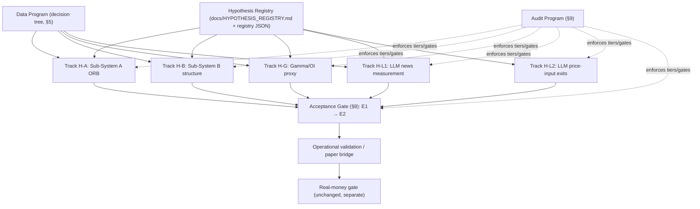

# Higanbana Research Foundation Upgrade Proposal

- **Author**: Fable 5 (chat planning session)
- **Date**: 2026-07-03
- **Repo state reviewed**: `Tusgof/Yuehua-Higanbana` @ main (post gamma-diagnostic commit)
- **Status**: FINAL — all open decisions locked via grill session 2026-07-03 (see §11 Decision Record); ready for Codex implementation
- **Archive reminder**: Per `IMPLEMENT_PLAN.md` Execution Notes archive policy, before Codex replaces `IMPLEMENT_PLAN.md`, the current plan must be archived under `Backup_IMPLEMENT_PLAN\` with a dated filename, and this archiving requires user approval unless the user explicitly instructs replacement in that turn.

---

## 1. The Core Analytical Finding That Reshapes The Roadmap

The Risk-first audit inputs (`reports\risk_first_data_audit.json`: N=90, observed per-trade Sharpe proxy `0.092203`, skewness `1.221374`, kurtosis `3.09085`) imply the following, verified by independent recomputation of the Bailey/López de Prado MinTRL formula (the 285 figure reproduces exactly):

| Null threshold SR0 | MinTRL (trades) | Interpretation |
|--:|--:|:--|
| 0.00 | ~285 | "Better than not trading" — weakest possible claim |
| 0.05 | ~1,356 | Even a trivially positive null makes the target impractical |
| 0.07 | ~4,896 | Quadratic blow-up as SR0 approaches observed SR |
| benchmark / 0.5 | undefined | Observed Sharpe is below the null; no N validates it |

Combined with observed data economics (~$7–8 per Databento month yielding 2–6 closed trades, i.e. roughly $1.5–2.5 per closed trade, ~0.23 trades per trading day), reaching even the weakest MinTRL of 285 requires ~195 more trades ≈ ~40 more calendar months ≈ ~$280–320 of data — far over the ~$60 remaining cost-guard room — and at the end would only prove "better than doing nothing," not "better than SPY."

**Conclusion**: For Sub-System A *as currently configured*, no affordable data purchase can produce validation-grade acceptance. Data spending is only rational for (a) testing a *revised* hypothesis with plausibly higher Sharpe, (b) *falsification* value (killing a hypothesis quickly and cheaply), or (c) *unlocking* a blocked hypothesis (gamma fields, pre-break window, news archive). This principle drives the decision tree in §5 and the milestone rebuild in §6.

**Cost-basis correction (user-reported, 2026-07-03)**: actual provider usage is now approximately **$105**, not the $64.64 recorded in `reports\data_cost\paid_cost_audit.json`. Effective headroom under the current $125 cap is therefore ~$20, not ~$60. Updating the user-reported actual-usage figure in the paid-cost audit is **Codex task zero** — no purchase decision is valid until the audit reflects reality. Budget policy locked by the user: the cap may be extended by **real payment on the existing Databento account only**; opening additional accounts (different phone numbers, friends' identities) to harvest duplicate signup credits is **rejected and prohibited** — it violates provider Terms of Service and risks a ban that would strand the raw-data cache, cost audit trail, and reproducibility of the entire project.

A second, cheaper finding: gamma-family maturation is nearly free. Full intraday quote data for Mar 2023–Dec 2024 is already cached locally; the only missing input per additional date is one full-UTC-day OPRA `statistics` pull at ~$0.35/day (proven by the 2024-01-03 probe). A 12-date pre-registered regime set costs ~$4.30 and directly addresses the failed stability gate and blocked economic-sign gate.

---

## 2. Revised Research Architecture: Hypotheses Own Experiments, Not Vice Versa

### 2.1 The inversion

Current state: experiment IDs (Exp01–Exp10 / M4–M6 families) are the organizing unit, and hypotheses are implicit inside runner scripts. Proposed state: a **hypothesis registry** is the organizing unit. Every experiment run must name the registry hypothesis it serves, and every registry entry pre-declares what would validate or falsify it. Experiment IDs become foreign keys.

### 2.2 Evidence tiers (formalizing what already exists informally)

| Tier | Name | Meaning | Allowed claims | Current examples |
|:--|:--|:--|:--|:--|
| E0 | Infrastructure | Tooling/parser/pipeline evidence, synthetic cases | "The machinery works" | Exp07 prompt matrices v1–v12, fixture pipeline |
| E1 | Diagnostic | Real data, under-sampled/underpowered or gate-blocked | "Hypothesis-generating only"; never cited as edge | All M4/M5 results, gamma diagnostic |
| E2 | Validation-grade | Passes MinTRL/PSR/DSR/regime/robustness gates (§8) | "Edge exists in tested regimes" | none yet |
| E3 | Deployment-grade | E2 + operational validation + account feasibility + launch checklist | "May trade real money after user approval" | none yet |

Rules:
1. Every summary JSON gains a required machine-readable field `evidence_tier: "E0"|"E1"|"E2"|"E3"` plus `tier_blockers: []`.
2. Audits treat any artifact claiming pass/acceptance language without `evidence_tier >= E2` fields as a **blocker**, not a warning (anti-overstatement enforcement, §9).
3. Research logs are only written for E1+ real experiments (unchanged), and must state the tier in the log header.
4. Paper trading may begin only from E2, or as an explicitly labeled **operational dry run** carrying `evidence_tier: E0` operational scope and zero edge claims.

### 2.3 Architecture diagram (replaces the linear pipeline mental model)



---

## 3. Hypothesis Registry

### 3.1 Format

New file `docs\HYPOTHESIS_REGISTRY.md` (human-readable) plus `experiments\hypothesis_registry.json` (machine-readable, schema-validated in the fixture pipeline). Required fields per hypothesis:

```
id:                  H-<track><number>, e.g. H-A2
family:              subsystem_a | subsystem_b | gamma | llm_news | llm_price | portfolio
status:              proposed | active | parked | falsified | validated
statement:           One-sentence testable claim
economic_rationale:  WHY the edge should exist — who is on the other side,
                     what friction/behavior/structural feature creates it,
                     and why it isn't already arbitraged away
testable_predictions: Observable consequences beyond headline PnL
                     (e.g. "edge concentrates on no-macro days",
                     "PnL sign flips in high-VIX bucket")
validation_criteria: Pre-registered: null Sharpe set, PSR threshold,
                     MinTRL method, DSR requirement if searched, regime
                     coverage minimums, big-day survival, implementable-PnL basis
falsification_criteria: Pre-registered conditions that KILL the hypothesis
                     (not merely 'inconclusive'), e.g. "OOS implementable PnL
                     negative across 2 independent regime buckets with
                     N ≥ MinTRL_falsify", or a cheaper early-kill test
required_data:       Named regime/field/window gaps (feeds §5 tree)
mintrl_falsify:      Sample needed to REJECT at chosen power — often far
                     smaller than validation MinTRL; fund this first
evidence:            Links to summaries with their evidence_tier
dependencies:        Other hypothesis IDs or data programs
decision_log:        Dated promote/park/kill entries
```

**Kill/resurrection rule (locked with user, 2026-07-03)**: a hypothesis is killed when its pre-registered statistical falsification criteria are hit **and** a written *mechanism autopsy* explains where the economic rationale broke (not numbers alone — the user's requirement — but numbers cannot be overridden by lingering belief either). Resurrection is always permitted, but only as a **new registry entry with at least one new testable prediction the dead hypothesis did not make**; re-activating the same entry because "the logic still feels right" is forbidden. The same reasoning that killed a hypothesis is itself falsifiable: if future evidence contradicts the autopsy, that contradiction is exactly the new testable prediction a successor entry needs. H-A1 → H-A2 is the template application of this rule.

The registry validator (new `scripts\validate_hypothesis_registry.py`) must reject: entries without falsification criteria, experiment summaries referencing unknown hypothesis IDs, and `status: validated` without an E2 artifact link.

### 3.2 Seed entries (proposed content, for user review)

**H-A1 (legacy, status LOCKED → `falsified-as-stated`; Codex writes the mechanism autopsy per §3.1 rule)** — "Post-2022 SPY 0DTE ORB debit verticals beat SPY buy-and-hold risk-adjusted, unconditionally." Evidence: 90 trades, OOS implementable −$78.44, observed SR below every meaningful null, MinTRL vs benchmark undefined. Under any honest falsification criterion this unconditional form is dead or indefinitely parked; keeping it "active" is what makes blind data-buying look attractive.

**H-A2 (proposed, `active`)** — "The ORB edge, if it exists, is *macro-conditioned*: opening-range breakouts on days without major scheduled macro releases reflect genuine order-flow imbalance rather than pre-positioning noise, so excluding high-importance macro days yields positive risk-adjusted OOS returns."
- Rationale: on scheduled-release days the morning range is dominated by anticipatory positioning and post-release repricing; breakout signals are structurally noisier. This is a *mechanism*, not a fitted filter.
- Supporting E1 evidence: `exclude_high_importance_macro_same_day` retains 64 trades, implementable $820.16, OOS +$240.96 — the only OOS-positive diagnostic in M5.
- Honesty caveat to encode in the registry: this scenario was *observed* in a 9-trial search, so it is contaminated as a selection; H-A2 must be treated as newly pre-registered, validated only on data/periods not used in the M5.5 search (e.g. 2025 OOS, or pre-break window when purchased), with DSR accounting for the original 9 trials.
- Testable predictions: (1) macro-day trades remain negative-EV in new data; (2) no-macro-day edge persists across VIX buckets; (3) effect survives big-day removal.
- Falsification: OOS-new implementable PnL ≤ 0 on no-macro days once N_no-macro ≥ MinTRL_falsify (compute from the 64-trade return distribution; likely ~100–150 trades), or prediction (1) reverses.

**H-B1 (legacy, status → `falsified`)** — "Capped-risk put ratio is feasible and profitable at $300 allocation / $20 risk on a $1,000 account." 412 trades, −$5,973.44, 0 trades fit sizing. Cleanly `ไม่ผ่าน`; record it as a genuine falsification — the registry should celebrate clean kills.

**H-B2 (proposed, `active`)** — "The put-ratio-with-wing *structure* has positive expectancy at realistic institutional-retail scale (simulated $10k–$25k portfolio) where strike granularity and premium-to-account ratios stop binding, because it systematically sells overpriced short-dated downside skew while capping tails."
- Design: rerun the M4.2 engine with simulated capital {$10k, $25k}, wing-width grid pre-registered with search log + DSR, sizing rule pre-registered. Uses *already-cached data* — zero data cost.
- Falsification: implementable PnL and ES95-adjusted return negative at both simulated scales across in-sample + OOS with N ≥ MinTRL_falsify (the 412-trade density means this resolves fast); or cost-drag share > 60% of gross at all wing widths (structure is a fee machine).
- Explicit note: a validated H-B2 does not make B tradable on $1,000; it justifies keeping B alive for future capital, per the user's stated intent.

**H-G1 (proposed, `active`)** — "A signed-OI gamma proxy aggregated per `GAMMA_AGGREGATION_VALIDATION_POLICY.md` carries economic signal: high positive proxy days exhibit attenuated realized intraday volatility."
- This is a *data-validity* hypothesis, prerequisite to any NOVI strategy filter hypothesis (which stays unregistered until H-G1 passes).
- Next action (cheap): pre-register a 12-date regime set spanning {low-VIX, normal-VIX, high-importance-macro, no-macro, up-trend, down-trend, in-sample, OOS} drawn from already-cached quote months; buy only the OPRA statistics days (~$0.35 × 12 ≈ $4.30); rerun enrichment + diagnostic per policy gates.
- Coverage-gate decision (LOCKED, delegated to Fable by user): the v1 gate result (`fail` at 50.17% raw-row coverage) is **permanent record and is never retroactively passed**. Codex issues `GAMMA_AGGREGATION_VALIDATION_POLICY.md` **v2** pre-registered *before* any rerun, redefining coverage on gamma-relevant buckets (ATM ± wings, where deep-OTM near-zero mids that fail the Black–Scholes bracket contribute negligible gamma anyway). Every future gamma report must state both metrics side by side (raw-row and bucket-weighted coverage) and may claim a pass **only under v2, never under v1**. Rationale for the strict form: it preserves the insight while making post-hoc gate loosening structurally impossible.
- Falsification: no monotonic or sign-consistent relation between proxy tercile and realized 10:00–15:45 SPY variance across ≥ 10 dates spanning ≥ 3 regimes.

**LLM usage progression (LOCKED with user)**: overall project priority is **edge first, LLM after** — LLM research proceeds in the background of blocked news capture but never outranks strategy-edge tracks for data budget or attention. When H-L1 runs, the operational form is staged: (i) **research-only signal** — measure stability and outcome correlation, touch nothing in execution; (ii) if (i) passes, test as a **binary skip filter** in the pre-registered ablation (cleanest to interpret); (iii) sizing-modifier and dynamic entry/exit roles belong to H-L2 as a separate branch and are not mixed in. Tail-risk blocking remains an aspirational, contamination-caveated stretch goal, never a near-term claim.

**H-L1 (proposed, `active`, blocked on news)** — "LLM sentiment/impact/volatility-relevance scores over timestamp-clean pre-entry news are (a) stable across repeated calls and prompt families, and (b) correlated with same-day realized volatility / adverse tail outcomes, beyond what VIX + macro calendar already encode."
- Two-stage: measurement validity first (stability, §7 design), predictive validity second (incremental correlation). Strategy ablation only after both.

**H-L2 (proposed, `proposed` status)** — "LLM prompts fed chronological price/quote context can improve exit timing vs fixed TP/SL rules." Separate branch, strict chronological controls, never mixed into H-L1 without a pre-registered ablation. Stays `proposed` until H-L1 measurement validity resolves — one live-LLM research front at a time.

---

## 4. Sample And Regime Adequacy Framework

### 4.1 Two MinTRLs per hypothesis

Every registry entry computes **two** sample requirements, and the distinction is the framework's main upgrade:

1. **MinTRL_validate**: observations needed to claim SR > SR0 at 95% confidence with stated power, using the generalized (skew/kurtosis/autocorrelation-adjusted) Sharpe variance — as already implemented in `audit_risk_first_data.py`.
2. **MinTRL_falsify**: observations needed to *reject* the hypothesis at pre-registered power (e.g. 80% power to detect SR ≤ 0 when true SR ≤ −0.05). This is usually far smaller and should be funded first: cheap kills free budget for survivors.

Null Sharpe set per family (formalizing `RISK_FIRST_DATA_PLAN.md`): SR0 ∈ {0, same-period SPY buy-and-hold per-trade-equivalent, pre-registered minimum acceptable}. The middle null must be computed on the *same trade calendar* as the strategy (SPY returns on trade days only) so the units are comparable — add this to the audit.

### 4.2 Regime coverage minimums (pre-registered defaults, user-adjustable)

A hypothesis cannot reach E2 unless its evidence includes, at minimum:

| Regime layer | Minimum for E2 | Current H-A2 status |
|:--|:--|:--|
| Volatility (prev-close VIX) | ≥ 15 trades in ≥ 2 of {<15, 15–25, >25}, and ≥ 5 trades in the third or an explicit scope restriction written into the hypothesis ("validated only for VIX < 25") | 46 / 44 / **0** — high-VIX absent |
| Macro-event | Trade counts reported per bucket; if the hypothesis is macro-conditioned, ≥ MinTRL_falsify in the retained bucket | 64 retained (search-contaminated) |
| Trend | ≥ 10 trades per SMA20 bucket or explicit scope restriction | 53 / 13 / 19 — acceptable |
| Major subperiod | Either pre-break coverage exists, or the hypothesis is explicitly pre-registered as post-2022-only with structural-break test deferred-and-disclosed | post-2022-only path available |
| Gamma/liquidity | Only required for gamma-conditioned hypotheses | n/a until H-G1 |

Scope restriction is a first-class outcome: "validated for VIX < 25, blocked above" is honest and deployable-with-guardrails; silently extrapolating is not.

### 4.3 When to buy data vs revise the hypothesis

Encode as a rule in the registry validator: if MinTRL_validate against the *benchmark* null is undefined or exceeds `(remaining budget) / (observed $ per incremental observation)`, then data purchase for validation is **forbidden** for that hypothesis; only falsification-funded or hypothesis-revision paths remain. This single rule mechanically prevents the "buy 410 more trades" failure mode.

---

## 5. Data Acquisition Decision Tree

To be added as `docs\DATA_ACQUISITION_DECISION_TREE.md` and enforced by the readiness audit's next-action logic:

```
START: a data purchase is proposed
│
├─ Q0. Does it serve a named hypothesis ID and a named gap
│      (regime / field / window / falsification)?
│      NO → REJECT (completionist buying).
│
├─ Q1. Can the gap be filled from already-cached data
│      (re-labeling, enrichment, simulated sizing, re-aggregation)?
│      YES → do that first, $0. (H-B2, most of H-G1, H-A2 re-analysis.)
│
├─ Q2. Is the purchase for FALSIFICATION (reach MinTRL_falsify)?
│      YES → approve if cost ≤ min($15, 25% of remaining guard room)
│             and it stays SPY-only within scope. Cheap kills first.
│
├─ Q3. Is it for VALIDATION?
│      → compute MinTRL_validate vs full null set.
│        Undefined vs benchmark null, or projected cost > remaining room
│        → REJECT; route to hypothesis revision.
│        Else → approve smallest recoverable block that adds a MISSING
│        regime bucket before adding depth to covered buckets.
│        Priority order for H-A2 — LOCKED by user (stress-survival
│        outranks decontamination: "the system must not die when SPY
│        crashes"):
│          (1) FREE FIRST: investigate why the cached Aug 2024 VIX-spike
│              window (Aug 5–8, VIX ~30–65 intraday) produced 0 high-VIX
│              trades in the risk audit — labeling gap, or the ORB signal
│              genuinely goes silent in stress? "Goes silent" is itself
│              first-class survival evidence AND a warning that stress
│              data buys few trades per dollar,
│          (2) targeted 2022 H2 stress block: the 2–3 highest-VIX months
│              only (~$14–21), then a trade-density checkpoint before
│              deciding whether the remaining 2022 months are worth it
│              — full-6-month purchase (~$40–45) explicitly deferred,
│          (3) 2025–2026 fresh OOS for search-decontamination of the
│              macro filter (still required before E2; sequenced after
│              stress evidence),
│          (4) pre-break 2019–2022 block only when a structural-break
│              hypothesis is explicitly promoted to active.
│        User confirmed: real payment beyond the old $125 cap is
│        approved for (2)–(3) if the tree justifies it; multi-account
│        credit harvesting is prohibited (§1).
│
├─ Q4. Is it a FIELD unlock (OI/Greeks/news)?
│      → per-unit probe first (done for OI at ~$0.35/day);
│        buy only the pre-registered set (H-G1: 12 dates ≈ $4.30).
│        News: GDELT API stays primary but under cooldown; Codex should
│        evaluate GDELT's bulk raw-file distribution (15-minute update
│        CSVs served as static files, not the rate-limited doc API) as a
│        free capture path before any provider change; any NEW provider
│        (paid or free-but-new) still requires explicit user approval
│        per M6_NEWS_SOURCE_DECISION_NOTE.
│
└─ POST-PURCHASE CHECKPOINT (unchanged cadence: every 3 months of data
   or 50 new trades): added trades, added regime buckets, cost per
   incremental observation, revised MinTRL projection. If the projection
   worsened, PAUSE and return to hypothesis revision.
```

---

## 6. Revised Milestone Structure

M1–M3 (control, data gate, engine hardening) are genuinely complete and become **standing programs**, not milestones. M4–M5 results are E1 evidence feeding the registry. The forward plan replaces "M6 → M7" with parallel hypothesis tracks plus two cross-cutting programs, because the current single-thread milestone framing is what made "M6 active but blocked" a dead end — with tracks, blocked news work no longer blocks everything.

**Proposed `IMPLEMENT_PLAN.md` v2 skeleton** (Codex writes the full version; archive v1 first):

| Track | Next concrete step | Data cost | Exit to |
|:--|:--|--:|:--|
| P-1 Cost-basis sync (task zero) | Update user-reported actual usage to ~$105 in paid-cost audit; recompute headroom before any purchase | $0 | unblocks all buying decisions |
| P0 Registry & audit upgrade | Build registry + validators + tier enforcement + stale-action fix (§9) | $0 | enables everything |
| H-A2 Macro-conditioned ORB (**top edge priority per user**) | (a) $0 re-analysis as pre-registered hypothesis, DSR-adjusted for 9 M5.5 trials; (b) $0 Aug-2024 VIX-spike investigation (why 0 high-VIX trades?); (c) 2022 H2 top-2–3 VIX months (~$14–21) + density checkpoint | $0 then ~$14–21 | first plausible E2 candidate |
| H-B2 Sub-System B at scale | Rerun feasibility engine at simulated $10k/$25k, wing grid, search log + DSR | $0 | validate/falsify fast (412-trade density) |
| H-G1 Gamma proxy validity | Issue policy v2 (pre-registered, v1 fail preserved); pre-register 12-date regime set; buy OI days; rerun diagnostic | ~$4.30 | unlocks/kills NOVI family |
| H-L1 LLM measurement | Blocked on news archive; meanwhile finalize §7 design doc + contamination probe protocol (no live calls) | $0 (design) | prompt experiments when news lands |
| News unblock | Cooldown-respecting GDELT retries on schedule; Codex evaluates GDELT bulk raw files; provider change = user decision | $0 | unblocks H-L1 |
| Acceptance & ops (old M7) | Unchanged in substance; gate now defined numerically in §8; paper trading appears only after gate or as labeled E0 dry run | — | E3 path |

Explicitly retired framings: "finishing M7 means real-money ready" (already disclaimed, now structurally impossible since E3 requires the separate launch checklist); experiment numbers as sequence (registry IDs replace them; Exp01–Exp10 remain as legacy aliases in the control plane table).

---

## 7. LLM Research Design (H-L1 / H-L2)

### 7.1 Factorial prompt experiment (replaces rule-pile iteration v1–v12)

The v1–v12 arc proved the right negative result: raw LLM decisions are unstable and the deterministic guard layer does the real work — i.e. the LLM was being used as a worse rule engine. `EXP07_PROMPT_REDESIGN.md` already states the correct question; this design operationalizes it.

**Independent variables** (full or fractional factorial, pre-registered):

| Factor | Levels |
|:--|:--|
| Template family | role-only · structured-JSON · evidence-first (quote-then-judge) · few-shot (k=3) · scenario-branching · self-consistency (k=5 samples, majority/mean) |
| Masking policy | none · entity-masked · entity+date-masked · full anonymization |
| Context size | headline-only · headline+lede · full snapshot set for the morning |

**Dependent variables per case × condition** (all continuous or ordinal — no Go/No-Go):
sentiment ∈ [−1, 1]; market-impact ∈ {0..3}; volatility-relevance ∈ {0..3}; strategy-suitability per subsystem ∈ {0..3}; self-reported confidence; parse validity; latency; USD cost.

**Repeated calls**: 5 per case × condition (per PROJECT_BRAIN policy, cost-permitting; DeepSeek smoke cost of ~$0.00016/call means a 70-case × 6-template × 2-masking × 5-repeat design is ≈ 4,200 calls ≈ **under $1** — stability measurement is essentially free once news exists).

**Metrics**: within-condition dispersion (SD / IQR per case), cross-template agreement (Krippendorff's α or ICC), score–outcome correlation vs realized 10:00–15:45 volatility and worst-day tails (correlational only, chronologically clean), incremental information vs VIX + macro-calendar baselines (partial correlation / ΔR²), cost/latency. A template family "wins" on stability + incremental information, never on matching a hand-written expected answer.

### 7.2 Contamination controls (upgrade from recording to measuring)

Keep the required metadata fields (model id, claimed cutoff, doc timestamps, fetch window, masking, leakage caveat). Add a **memorization probe** as a pre-registered sub-experiment: for each historical case, ask the masked and unmasked variants "what happened to SPY in the following session?" — if unmasked accuracy significantly exceeds masked accuracy and chance, the case set is contaminated and all outcome-correlation results for unmasked conditions carry a mandatory contamination flag in the report. This converts the caveat into a measurement. Tail-risk-blocking claims remain caveated as untestable for unseen black swans regardless (existing policy, kept verbatim).

### 7.3 Price-input branch (H-L2)

Separate registry entry, separate pre-registered design doc before any run: inputs strictly limited to information at decision timestamp (bars/quotes up to t, no same-day future aggregates); ablation vs fixed TP/SL grid from M5.4 with search logs; forbidden from sharing prompts, cases, or result files with H-L1; stop condition if parse validity < 99% or cost projection exceeds guard room. Stays dormant until H-L1 measurement validity is resolved.

---

## 8. Acceptance Gate: Research → Paper Trading (E1 → E2)

A strategy-family hypothesis reaches E2 when **all** of the following hold, evaluated by an upgraded `scripts\evaluate_research_acceptance.py` (new) reading only machine-readable summaries:

1. **Statistics**: N ≥ MinTRL_validate vs SR0=0 *and* vs same-trade-calendar SPY null; PSR ≥ 0.95 against both; if any parameter/filter was searched (including inherited searches like M5.5), DSR ≥ 0.95 with full trial accounting or the hypothesis is re-validated on data untouched by the search.
2. **Robustness**: big-day dependency check survives (conclusion sign unchanged after top/bottom 5% removal); implementable PnL basis with disclosed fill/fee/latency model; latency stress from M5.1 grid does not flip the sign at the 1-minute scenario.
3. **Regime coverage**: §4.2 minimums met, or explicit scope restrictions written into the registry entry and carried into any operational config.
4. **Discipline**: chronological metadata pass, no-OOS-tuning attestation, search logs complete, strike-mapping disclosed — all already enforced by M3 guardrails.
5. **Benchmark**: OOS Sharpe > same-period SPY buy-and-hold and max drawdown < buy-and-hold (existing PROJECT_BRAIN criteria, unchanged).

Gate outputs: `approved_for_operational_validation` | `blocked(reasons[])` | `scope_restricted(regimes[])`. Paper trading before E2 is permitted **only** as an "operational dry run" whose config file must contain `edge_claim: none` and whose reports are tier E0 — this preserves the user's rule that paper trading validates wiring, never edge.

---

## 9. Audit Automation Requirements

1. **Fix the stale next-action** in `scripts\audit_research_readiness.py` (~line 452): the branch that fires when `GAMMA_AGGREGATION_VALIDATION_POLICY.md` exists still recommends "run a diagnostic gamma aggregation against the policy gates." Add detection of `reports\diagnostics\gamma_aggregation_diagnostic_summary.json`; when present and gate-blocked, the recommended action becomes the targeted menu: expand the pre-registered gamma regime date set (H-G1), choose missing-regime strategy coverage per the §5 tree, or revise the hypothesis. Update `tests\test_audit_research_readiness.py` to assert the new action and reject the now-stale message (same pattern already used for the previous stale action).
2. **Single current-state command**: new `scripts\report_project_state.py` — read-only, no network — emitting one table: per registry hypothesis → status, evidence tier, tier blockers, next safe action, data cost of next action; plus cost-guard room and news/GDELT status. This becomes the Boot Sequence's first command and the answer to "where are we?" in one call.
3. **Anti-overstatement enforcement**: extend `audit_research_logs.py` / add `validate_evidence_tiers.py` so that (a) every experiment summary must carry `evidence_tier` + `hypothesis_id`, (b) any `conclusion: ผ่าน` with tier < E2 is a blocker, (c) the final-research-review generator refuses to render E0/E1 artifacts in the "accepted evidence" section.
4. **Registry validator** per §3.1, wired into `run_fixture_pipeline.py`.
5. **Methodology cross-check** (for Codex on the local machine, since the LLM Wiki is local-only and not in this repo): before implementing MinTRL_falsify and the memorization probe, re-read `minimum-track-record-length.md`, `probabilistic-sharpe-ratio.md`, `deflated-sharpe-ratio.md`, `backtest-validation-protocol.md`, and `llm-training-data-contamination.md` and cite them in the new docs.

---

## 10. Exact Files For Codex To Change

**New files**
- `docs\HYPOTHESIS_REGISTRY.md` — §3 format + seed entries (user-approved versions)
- `experiments\hypothesis_registry.json` — machine-readable registry
- `scripts\validate_hypothesis_registry.py` + `tests\test_validate_hypothesis_registry.py`
- `docs\DATA_ACQUISITION_DECISION_TREE.md` — §5
- `docs\EVIDENCE_TIER_POLICY.md` — §2.2 (or fold into RESEARCH_CONTROL_PLANE.md; Codex's call, one home only)
- `scripts\report_project_state.py` + test — §9.2
- `scripts\evaluate_research_acceptance.py` + test — §8 (may extend `evaluate_exp07_acceptance.py` patterns)
- `scripts\validate_evidence_tiers.py` + test — §9.3
- `docs\LLM_MEASUREMENT_EXPERIMENT_DESIGN.md` — §7 full design (supersedes the experiment-design portion of EXP07_PROMPT_REDESIGN.md; keep that file, add a pointer)
- `docs\H_L2_PRICE_INPUT_DESIGN.md` — §7.3 pre-registration (design only; no runs)

**Modified files**
- `IMPLEMENT_PLAN.md` — replace with v2 per §6 **after archiving current version to `Backup_IMPLEMENT_PLAN\IMPLEMENT_PLAN_2026-07-03.md` with user approval**
- `PROJECT_BRAIN.md` — §2 Research Standards: add evidence tiers, dual MinTRL rule, §4.2 regime minimums; §9 Current Verified State: reflect track structure; Data Decisions: add §5 tree reference and the "validation-purchase forbidden when MinTRL undefined vs benchmark" rule
- `docs\RESEARCH_CONTROL_PLANE.md` — map Exp01–Exp10 → hypothesis IDs; add tier table
- `docs\RISK_FIRST_DATA_PLAN.md` — add MinTRL_falsify concept and same-trade-calendar benchmark null
- `docs\GAMMA_AGGREGATION_VALIDATION_POLICY.md` — issue as v2 per locked decision: v1 fail preserved permanently, coverage redefined on gamma-relevant buckets, dual-metric reporting mandatory, pass claimable under v2 only
- `reports\data_cost\paid_cost_audit.*` inputs / `scripts\audit_paid_costs.py` — task zero: update user-reported actual usage to ~$105, recompute headroom; add the "single-account, real-payment-only" budget rule to the policy text
- `scripts\audit_research_readiness.py` + `tests\test_audit_research_readiness.py` — §9.1 stale-action fix; wire registry/tier checks into aggregate readiness
- `scripts\audit_risk_first_data.py` — add benchmark-null-on-trade-calendar and MinTRL_falsify outputs
- `scripts\run_fixture_pipeline.py` — add new validators
- `RESEARCH_LOG_FORMAT.md` — require `evidence_tier` and `hypothesis_id` in log headers (next log remains `011-higanbana-…`)

**Explicitly unchanged at proposal time**: raw/normalized `data\` exclusions, cost-guard policy, hard boundaries, Thai report language, and `RESEARCH_LOG_FORMAT.md` numbering. The nested `research_log` arrangement was superseded by the user's 2026-07-15 decision to publish the logs inside `Tusgof/Yuehua-Higanbana`.

---

## 11. Decision Record (grill session, 2026-07-03)

| # | Decision | Outcome |
|:--|:--|:--|
| 1 | H-A1 disposition | `falsified-as-stated`; H-A2 is the codified-rule resurrection with new testable predictions |
| 2 | Kill/resurrection rule | Accepted: statistical criteria + mechanism autopsy to kill; resurrection only as new entry with new testable predictions; autopsies themselves falsifiable |
| 3 | Budget | Cap extendable by **real payment on existing account only**; multi-account signup-credit harvesting rejected/prohibited; actual usage corrected to ~$105 (headroom ~$20 until top-up) |
| 4 | Overall priority | Edge first, LLM after — find a strategy foundation sufficient for long-term profitability, then research LLM dimensions |
| 5 | H-A2 regime priority | Stress-survival over decontamination ("system must not die when SPY crashes"): free Aug-2024 spike investigation → 2022 H2 top-2–3 VIX months (~$14–21) → density checkpoint → fresh OOS later; full 6-month stress block deferred |
| 6 | Gamma coverage gate | Delegated to Fable; strict form chosen: v1 fail permanent, policy v2 pre-registered before rerun, dual-metric reporting, pass under v2 only |
| 7 | LLM operational form | Staged: research-only signal → binary skip filter ablation → sizing/dynamic roles in separate H-L2 branch |
| 8 | H-B2 scales | $10k/$25k defaults stand (no objection raised) |
| 9 | GDELT bulk raw files | Remains a Codex *evaluation* task, low priority under edge-first posture; any actual capture via a new access method still needs user sign-off per M6 note |
| 10 | Archive approval | Granted implicitly by instructing finalization; Codex must still archive `IMPLEMENT_PLAN.md` to `Backup_IMPLEMENT_PLAN\` before replacement per policy |

## 12. Codex Execution Order

1. Task zero: cost-basis sync (~$105) in paid-cost audit + budget-rule text.
2. Archive `IMPLEMENT_PLAN.md` → write v2 per §6.
3. P0: hypothesis registry (with §3.1 kill/resurrection rule), validators, evidence-tier enforcement, stale next-action fix, `report_project_state.py`.
4. H-A2 free work: pre-registered re-analysis + Aug-2024 VIX-spike investigation; write research log `011-higanbana-…` if it completes as a real experiment.
5. H-B2 simulated-scale rerun ($0).
6. Gamma policy v2 + 12-date regime set plan (purchase ~$4.30 fits current headroom).
7. 2022 H2 stress purchase (~$14–21) only after task zero confirms headroom or the user tops up by real payment.
8. LLM design docs (`LLM_MEASUREMENT_EXPERIMENT_DESIGN.md`, `H_L2_PRICE_INPUT_DESIGN.md`) — design only, no live calls until real news cases exist.
