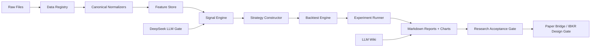

# SPY 0DTE Research Architecture

## Objective
Design the project so strategy research is reproducible, report-driven, and strong enough to block or approve later real-money IBKR implementation.

## Inputs
| Input | Baseline Source | Required Fields |
|:--|:--|:--|
| SPY intraday bars | Historical data provider | timestamp ET, open, high, low, close, volume |
| SPY 0DTE option quotes | OptionsDX baseline | timestamp ET, expiry, strike, call/put, bid, ask, sizes, volume, underlying |
| VIX/VXV | Cboe official VIX and VIX3M CSVs | date, VIX close, VIX3M close mapped to `vxv_close` |
| Macro calendar | economic calendar provider | event name, release time ET, importance |
| News | GDELT primary candidate; Alpha Vantage/NewsAPI deferred | headline, source, url, published_at, fetched_at |
| LLM | DeepSeek via OpenRouter baseline | prompt, input, output, model id, risk assessment, timestamp |
| LLM Wiki | local wiki | concept/source references for report rationale |

## Pipeline

## Report Contract
Every Markdown report must include:
- Experiment id and hypothesis.
- Input data coverage and exclusions.
- Exact parameter manifest.
- Timestamp assumptions and lookahead checks.
- Mid-price PnL and implementable PnL.
- Sharpe, Sortino, MDD, ES95, ES99, worst-day loss, win rate, trade count.
- Benchmark comparison to SPY/S&P 500 buy-and-hold.
- References to relevant local LLM Wiki pages.
- Decision: `ผ่าน`, `ไม่ผ่าน`, or `ยังสรุปไม่ได้`.
- What would invalidate the conclusion later.
- If failed: revised hypothesis and new success criteria.

## LLM Wiki Usage
The local wiki is not a live data source. It is the knowledge base for:
- Research rationale.
- Source caveats.
- Concept definitions.
- Report citations.
- Explaining why an experiment exists.

The report generator should cite paths such as:
- `wiki/concepts/zero-dte-options.md`
- `wiki/sources/0dte-trading-rules.md`
- `wiki/sources/regime-conditional-alpha-spy-0dte-orb.md`
- `wiki/concepts/market-maker-net-gamma.md`
- `wiki/concepts/backtest-validation-protocol.md`

## Experiment Set
The first experiment batch is defined by `backtest_experiments_plan.md`:
1. Market-maker volatility attenuation filter.
2. LLM hybrid sentiment gatekeeper.
3. Risk parity vs equal weight.
4. Moneyness vs delta strike selection.
5. Pre/post May 11, 2022 structural break.
6. VIX regime range sensitivity.
7. LLM prompt robustness pre-experiment, then transaction cost and latency sensitivity.
8. Intraday entry timing sensitivity.
9. Exit stop-loss and profit-target optimization.
10. Macro-event filter sensitivity.

## Acceptance Gate
The research gate blocks IBKR work unless:
- OOS Sharpe beats same-period SPY/S&P 500 buy-and-hold.
- MDD is lower than same-period SPY/S&P 500 buy-and-hold.
- Implementable PnL remains acceptable after costs.
- Tail risk is acceptable for a $1,000 account.
- Results are not dependent on a single fragile parameter.
- Post-2022 results remain viable or the system explicitly restricts regimes.

## Current Gaps
- Exact OptionsDX export format is not verified.
- Cboe VIX/VIX3M source is selected and imported for 2022-2026 daily close regime filters.
- News source selection v1, a GDELT capture dry-run tool, and an offline `news_item` snapshot importer skeleton exist, but successful real GDELT snapshot capture is still pending after HTTP 429.
- NOVI/net-gamma proxy needs a concrete computable formula from available fields.
- IBKR account permissions and live trading constraints are not verified.
- OpenRouter API key env var is provided as `HIGANBANA_OPENROUTER_API`. The safe DeepSeek/OpenRouter adapter, DeepSeek V4 flash thinking model id, and prompt-variant logging flow are implemented for guarded Experiment 7 runs, but no LLM gate can be used in strategy/live paths until controlled prompt experiments and strategy ablation pass.
