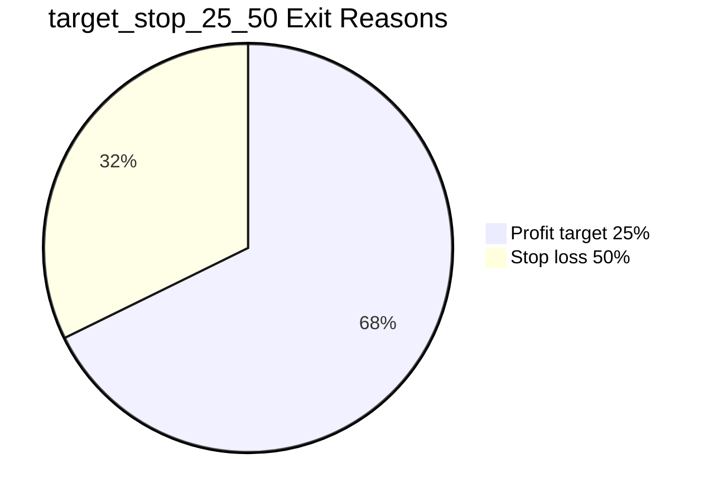

# บันทึกการวิจัย: M4.3 Exit Behavior Diagnostic

## 1. ข้อมูลพื้นฐาน

- Timestamp UTC: `2026-07-01T16:04:08Z`
- โครงการ: SPY 0DTE - Higanbana
- หัวข้อ: เปรียบเทียบ forced-close-only กับ target/stop behavior บนข้อมูลจริง
- ผู้บันทึก: Codex
- สถานะ: เสร็จสิ้น
- เครื่องมือ:
  - Python local scripts
  - Databento normalized local artifacts เท่านั้น
- Artifact หลัก:
  - `scripts/run_m4_exit_behavior_diagnostic.py`
  - `reports/baselines/m4_exit_behavior_diagnostic_summary.json`
  - `reports/baselines/m4_exit_behavior_diagnostic_report.md`
  - `reports/baselines/m4_exit_behavior_components/`

## 2. วัตถุประสงค์

### อ่านแบบเร็ว

บันทึกนี้เปรียบเทียบ forced close กับ target/stop behavior ของ Sub-System A เพื่อดูว่า exit rule เปลี่ยนภาพความเสี่ยงและ PnL อย่างไร
ผลสำคัญคือเป็น diagnostic ของ exit behavior ไม่ใช่ parameter optimization และไม่ใช่การเลือก exit model สำหรับ deployment จาก OOS
ข้อห้ามสรุป: ห้ามมองผลที่ดีที่สุดของ exit rule เป็น edge ที่ผ่านแล้ว


รอบนี้ต้องตอบคำถามว่า exit behavior แบบ `target_stop_25_50` ให้ภาพความเสี่ยงและผลตอบแทนต่างจาก `forced_close_only` อย่างไร เมื่อใช้ candidate days ของ Sub-System A ชุดเดียวกันกับ M4.1 และใช้ข้อมูลจริงที่มีอยู่ในเครื่องเท่านั้น

เหตุผลที่ต้องทำรอบนี้คือ M4.1 ใช้ forced close เป็น baseline แล้วได้ข้อสรุปว่า “ยังสรุปไม่ได้” เพราะ OOS แพ้และ sample ยังน้อย ส่วนแผน M4.3 ระบุให้เปรียบเทียบ forced-close-only กับ target/stop behavior เป็น diagnostic ไม่ใช่การ tune พารามิเตอร์จาก OOS

ความสำเร็จของรอบนี้คือมีรายงานที่แยก `mid_pnl` กับ `implementable_pnl`, มี sample adequacy labels, มี big-day dependency check, ระบุชัดว่าไม่ใช่ parameter optimization และไม่เลือก exit model สำหรับ deployment จากผล OOS

## 3. วิธีการและขั้นตอน

1. อ่านสถานะโครงการจาก `PROJECT_BRAIN.md`, `IMPLEMENT_PLAN.md`, และ `AGENTS.md`
2. ตรวจโค้ดเดิมที่เกี่ยวข้อง:
   - `scripts/run_jan2024_pilot_pnl.py`
   - `scripts/run_m4_subsystem_a_baseline.py`
   - `tests/test_jan2024_pilot_pnl.py`
3. เพิ่ม runner ใหม่ `scripts/run_m4_exit_behavior_diagnostic.py`
4. เพิ่ม test เฉพาะ `tests/test_m4_exit_behavior_diagnostic.py`
5. รัน test เฉพาะก่อนรันข้อมูลจริง:

```powershell
python -m unittest tests.test_m4_exit_behavior_diagnostic
python -m py_compile scripts\run_m4_exit_behavior_diagnostic.py
```

6. รัน diagnostic บนข้อมูลจริง:

```powershell
python scripts\run_m4_exit_behavior_diagnostic.py
```

พารามิเตอร์สำคัญ:
- Strategy: Sub-System A ORB directional debit vertical
- Exit models:
  - `forced_close_only`
  - `target_stop_25_50`
- Fill model: `half_spread`
- Fee: `$0.64` ต่อ contract ต่อขา
- Close fallback: `nearest_1545_window`
- News filter: ปิด
- LLM filter: ปิด
- Chronological policy: 2023-03-01 ถึง 2023-12-29 เป็น in-sample, 2024-01-02 ถึง 2024-12-31 เป็น OOS
- OOS tuning: ห้ามใช้ผล OOS เพื่อเลือก exit model

## 4. ผลการศึกษาและข้อมูลดิบ

### ผลรวม

| Metric | forced_close_only | target_stop_25_50 |
|---|---:|---:|
| Closed trades | 90 | 93 |
| Total implementable PnL | 545.60 | 108.92 |
| Total mid PnL | 1089.50 | 542.00 |
| Cost drag | 543.90 | 433.08 |
| Sharpe proxy | 0.118064 | 0.063578 |
| Max drawdown | -0.370769 | -0.092626 |
| Worst-day loss | -62.56 | -37.56 |
| Win rate | 0.3222 | 0.6774 |

### ผลแยกตามช่วงข้อมูล

| Split | Metric | forced_close_only | target_stop_25_50 |
|---|---|---:|---:|
| in-sample | Closed trades | 41 | 42 |
| in-sample | Implementable PnL | 624.04 | -24.52 |
| in-sample | Sharpe proxy | 0.226229 | -0.028533 |
| in-sample | Max drawdown | -0.170819 | -0.092626 |
| in-sample | Worst-day loss | -57.56 | -37.56 |
| OOS | Closed trades | 49 | 51 |
| OOS | Implementable PnL | -78.44 | 133.44 |
| OOS | Sharpe proxy | 0.015810 | 0.116538 |
| OOS | Max drawdown | -0.550922 | -0.071629 |
| OOS | Worst-day loss | -62.56 | -36.56 |

### Delta ของ target/stop เทียบกับ forced close

| Scope | Implementable PnL delta | Sharpe proxy delta | Max drawdown delta | Worst-day loss delta | Trade count delta |
|---|---:|---:|---:|---:|---:|
| Overall | -436.68 | -0.054486 | 0.278143 | 25.00 | 3 |
| in-sample | -648.56 | -0.254762 | 0.078193 | 20.00 | 1 |
| OOS | 211.88 | 0.100728 | 0.479293 | 26.00 | 2 |

การตีความ: target/stop ลด downside metrics ได้ชัดเจน โดย worst-day loss และ max drawdown ดีขึ้นทั้ง overall และ OOS แต่ผลตอบแทนรวมต่ำกว่า forced close มาก โดยเฉพาะใน in-sample ดังนั้นยังไม่ควรสรุปว่า target/stop ดีกว่า

### Exit reason distribution



### Sample adequacy

- `forced_close_only`: 90 closed trades
- `target_stop_25_50`: 93 closed trades
- Labels: `under-sampled`, `underpowered`
- MinTRL: pending
- PSR: pending
- Minimum prior trade count: 500

### Big-day dependency

| Exit model | Original PnL | Retained PnL after removing top/bottom 5% | Original Sharpe proxy | Retained Sharpe proxy |
|---|---:|---:|---:|---:|
| forced_close_only | 545.60 | 59.20 | 0.092203 | 0.013201 |
| target_stop_25_50 | 108.92 | 19.52 | 0.053941 | 0.015908 |

ผลนี้บอกว่า forced close พึ่งพาวัน extreme มากกว่า เพราะเมื่อเอา top/bottom 5% ออก PnL เหลือ 59.20 จาก 545.60 ส่วน target/stop เหลือ 19.52 จาก 108.92 แต่ทั้งสองยังอ่อนแอเกินกว่าจะใช้เป็น acceptance-grade evidence

## 5. ปัญหา อุปสรรค และการแก้ไข

1. ปัญหา: มี target/stop summary เก่าบางเดือนอยู่แล้ว แต่ไม่ครบทุกช่วงข้อมูล
   - การแก้ไข: ไม่ใช้ผลเก่าปะปนกัน แต่สร้าง runner ใหม่ให้คำนวณทั้งสอง exit model จาก normalized data ชุดเดียวกัน
   - ผลลัพธ์: ได้ comparison ที่เป็นธรรมกว่าและ trace ได้จาก artifact ชุดเดียว

2. ปัญหา: การรันจริงใช้เวลานาน เพราะต้องอ่าน option quote JSONL หลายเดือนและรันสอง exit model
   - การแก้ไข: ใช้ข้อมูล local เท่านั้น ไม่เรียก Databento/OpenRouter และไม่เพิ่มค่าใช้จ่าย
   - ผลลัพธ์: รันสำเร็จและสร้าง summary/report ครบ

3. ปัญหา: คำสั่ง timestamp แบบ `Get-Date -AsUTC` ใช้ไม่ได้กับ PowerShell เวอร์ชันนี้
   - การแก้ไข: ใช้ `(Get-Date).ToUniversalTime().ToString('yyyy-MM-ddTHH:mm:ssZ')`
   - ผลลัพธ์: ได้ timestamp UTC สำหรับ log นี้

### ข้อจำกัดสำคัญ

- ผลนี้เป็น diagnostic เท่านั้น ไม่ใช่หลักฐานเลือก exit model สำหรับ live
- ห้ามใช้ OOS delta ที่ดีขึ้นของ target/stop เป็นเหตุผลในการ tune หรือเลือก deployment behavior
- จำนวน trade ยังต่ำกว่า N >= 500 และยังไม่มี MinTRL/PSR
- ไม่มี news filter, LLM gate, VIX/VXV filter หรือ macro filter ในรอบนี้

## 6. ข้อสรุปและก้าวต่อไป

ข้อสรุป: ยังสรุปไม่ได้ว่า `target_stop_25_50` ดีกว่า `forced_close_only` แม้ OOS และ downside metrics บางตัวดีขึ้น เพราะผลรวมแย่ลงอย่างชัดเจนและ sample ยัง under-sampled/underpowered

- `forced_close_only` ทำ total implementable PnL รวมได้ 545.60 เทียบกับ target/stop ที่ 108.92
- `target_stop_25_50` ลด max drawdown จาก -0.370769 เป็น -0.092626 และลด worst-day loss จาก -62.56 เป็น -37.56
- OOS target/stop ดูดีกว่า forced close แต่ใช้เป็น tuning signal ไม่ได้ตามกติกา chronological/OOS discipline
- ทั้งสองฝั่งยังไม่ผ่าน sample adequacy และ big-day dependency ยังบอกว่าผลลัพธ์เปราะบาง

ก้าวต่อไป:
1. อัปเดต `PROJECT_BRAIN.md` และ `IMPLEMENT_PLAN.md` ให้ระบุว่า M4.3 เสร็จแล้วและยังไม่เลือก exit model จากผลนี้
2. รัน `python scripts\audit_research_logs.py` หลัง push log นี้เพื่อตรวจว่า next prefix เป็น `004-higanbana-`
3. เดิน M4.4 ต่อ: ตรวจ no entry market orders, skipped unfilled entries, และไม่มี position ค้างหลัง 3:45 PM ET
4. ถ้าจะทดสอบ target/stop เพิ่มภายหลัง ต้องตั้งสมมติฐานใหม่ล่วงหน้า พร้อม search log และ DSR policy ก่อนดูผล OOS
